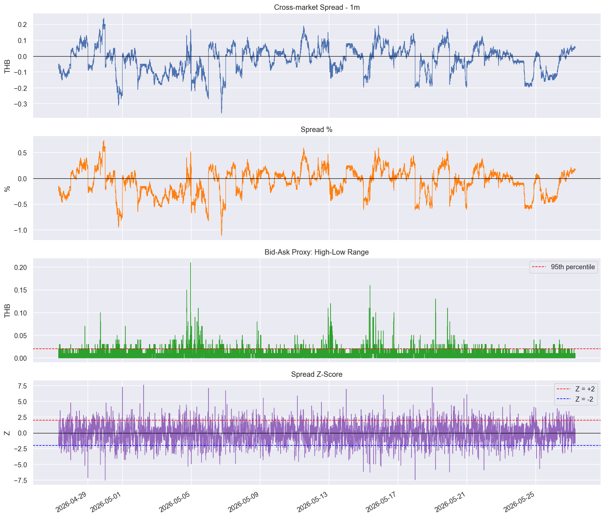
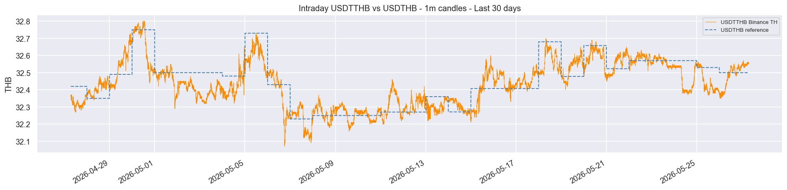
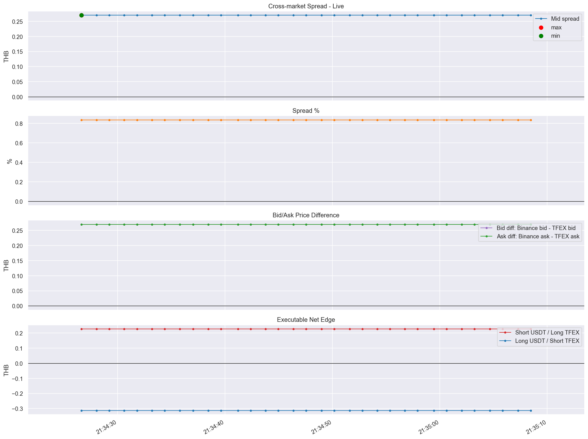

# USDTHB vs USDTTHB 1m Spread - Last 30 Days

Focused notebook for 1-minute USDTTHB/THB spread analysis.

Table of contents:
- Setup and configuration
- Fetch USDTHB reference data
- Fetch Binance TH `USDTTHB` 1m candles
- Build spread DataFrame
- Plot spread, spread percent, high-low range, and z-score
- Optional true TFEX 1m spread
- Optional live bid/offer arbitrage monitor

This notebook is read-only analysis by default. Live subscriptions and TFEX 1m fetches are behind explicit flags.

## Install Libraries

The local project already has these dependencies in `pyproject.toml`. In this workspace, run `uv sync` from the terminal if dependencies are missing.

```python
# !uv sync
# !uv add settrade-v2 python-dotenv yfinance matplotlib seaborn requests numpy pandas ipykernel
```

## Import Libraries


```python
import os
import time
import calendar as cal_module
from datetime import date, datetime, timedelta, timezone
from pathlib import Path

import numpy as np
import pandas as pd
import requests
import yfinance as yf
import matplotlib.pyplot as plt
import matplotlib.dates as mdates
import seaborn as sns
from dotenv import load_dotenv

try:
    from settrade_v2 import Investor
except Exception as exc:
    Investor = None
    print("settrade_v2 import failed:", repr(exc))

sns.set_theme(style="darkgrid")
plt.rcParams["figure.dpi"] = 120
plt.rcParams["figure.figsize"] = (14, 5)
```

## Configuration

This file is intentionally fixed to `1m` candles and the last 30 calendar days.


```python
INTRADAY_INTERVAL = "1m"
INTRADAY_DAYS = 30
ROLL_INTRA = 60          # 60 bars = 60 minutes for 1m candles
ZSCORE_ENTRY = 2

BINANCE_SYMBOL = "USDTTHB"
YAHOO_USDTHB_SYMBOL = "USDTHB=X"

RUN_TFEX_1M_FETCH = False      # live monitor does not need this; set True only for historical TFEX 1m candles
RUN_LIVE_MONITOR = True        # set True only when you want realtime bid/offer monitoring
LIVE_MONITOR_SECONDS = 300
POLL_SECONDS = 1
LIVE_PLOT_EVERY_SECONDS = 2
LIVE_PLOT_TAIL_ROWS = 300
LIVE_PLOT_WINDOW_SECONDS = 300  # plot only the latest current-run window
LIVE_SINGLE_POINT_PAD_SECONDS = 30
LOG_STALE_QUOTES = True       # keep plotting after TFEX stops updating, but mark rows as not tradable
STOP_SETTRADE_SUBSCRIBER_ON_EXIT = False  # Set True only if stop() returns cleanly in your notebook

intraday_end = datetime.today().strftime("%Y-%m-%d")
intraday_start = (datetime.today() - timedelta(days=INTRADAY_DAYS)).strftime("%Y-%m-%d")
intraday_label = f"{intraday_start} -> {intraday_end}"

# Fetch extra daily FX history so the first intraday rows can be forward-filled after weekends/holidays.
usdthb_start = (datetime.today() - timedelta(days=INTRADAY_DAYS + 10)).strftime("%Y-%m-%d")

print(f"1m analysis window: {intraday_label}")
print(f"USDTHB reference fetch starts: {usdthb_start}")
```

    1m analysis window: 2026-04-27 -> 2026-05-27
    USDTHB reference fetch starts: 2026-04-17


## Binance Thailand Helpers

Binance Thailand limits kline requests by both time span and candle count. The paginator below keeps each request inside both limits.


```python
def _interval_to_ms(interval: str) -> int:
    """Convert Binance interval string to milliseconds."""
    units = {"m": 60_000, "h": 3_600_000, "d": 86_400_000, "w": 604_800_000}
    return int(interval[:-1]) * units[interval[-1]]


def _fetch_binanceth_raw(start: str, end: str, interval: str) -> pd.DataFrame:
    """Fetch Binance TH OHLCV data with chunking for API limits."""
    max_span_ms = 7 * 24 * 60 * 60 * 1000
    chunk_ms = min(max_span_ms, 1000 * _interval_to_ms(interval))

    base_url = "https://api.binance.th/api/v1/klines"
    start_ms = int(datetime.strptime(start, "%Y-%m-%d").replace(tzinfo=timezone.utc).timestamp() * 1000)
    end_ms = int(datetime.strptime(end, "%Y-%m-%d").replace(tzinfo=timezone.utc).timestamp() * 1000)

    all_rows = []
    cursor = start_ms
    request_count = 0

    while cursor < end_ms:
        chunk_end = min(cursor + chunk_ms, end_ms)
        params = {
            "symbol": BINANCE_SYMBOL,
            "interval": interval,
            "startTime": cursor,
            "endTime": chunk_end,
            "limit": 1000,
        }
        resp = requests.get(base_url, params=params, timeout=20)
        resp.raise_for_status()
        rows = resp.json()
        if isinstance(rows, dict):
            raise ValueError(f"Binance TH API error: {rows}")
        all_rows.extend(rows)
        request_count += 1
        cursor = chunk_end + 1

    if not all_rows:
        raise ValueError(f"No data returned from Binance TH for {BINANCE_SYMBOL} ({start} -> {end}, {interval})")

    df = pd.DataFrame(all_rows, columns=[
        "OpenTime", "Open", "High", "Low", "Close", "Volume",
        "CloseTime", "QuoteVol", "TradeCount", "TakerBase", "TakerQuote", "_",
    ])
    df["OpenTime"] = pd.to_datetime(df["OpenTime"], unit="ms", utc=True)
    df = df.set_index("OpenTime")
    df.index = df.index.tz_convert("Asia/Bangkok").tz_localize(None)

    for col in ["Open", "High", "Low", "Close", "Volume"]:
        df[col] = df[col].astype(float)

    df = df[~df.index.duplicated(keep="last")].sort_index()
    print(f"Binance TH requests: {request_count}")
    return df


def fetch_ohlcv_binanceth(start: str, end: str, interval: str = "1m") -> pd.DataFrame:
    """Return Binance TH full OHLCV DataFrame."""
    return _fetch_binanceth_raw(start, end, interval)
```

## Fetch USDTHB Reference

This uses Yahoo Finance `USDTHB=X` as the USDTHB reference and forward-fills it to every minute. This creates the step-line reference shown in the previous notebooks.


```python
def fetch_usdthb_reference(start: str, end: str) -> pd.Series:
    """Fetch USDTHB spot reference from Yahoo Finance."""
    ticker = yf.Ticker(YAHOO_USDTHB_SYMBOL)
    hist = ticker.history(start=start, end=end, auto_adjust=True)
    if hist.empty:
        raise ValueError(f"No Yahoo Finance data for {YAHOO_USDTHB_SYMBOL} ({start} -> {end})")

    s = hist["Close"].copy()
    s.index = s.index.tz_localize(None).normalize()
    s = s[~s.index.duplicated(keep="last")].sort_index()
    s.name = "USDTHB_TFEX"
    return s


usdthb = fetch_usdthb_reference(usdthb_start, intraday_end)
print(f"USDTHB reference: {len(usdthb):,} rows | {usdthb.index[0].date()} -> {usdthb.index[-1].date()}")
usdthb.tail()
```

    USDTHB reference: 28 rows | 2026-04-17 -> 2026-05-26


    Date
    2026-05-20    32.658001
    2026-05-21    32.522999
    2026-05-22    32.570000
    2026-05-25    32.529999
    2026-05-26    32.500000
    Freq: B, Name: USDTHB_TFEX, dtype: float64


## Fetch Binance TH 1m Candles


```python
intra_ohlcv = fetch_ohlcv_binanceth(intraday_start, intraday_end, interval=INTRADAY_INTERVAL)
print(f"Binance TH {BINANCE_SYMBOL}: {len(intra_ohlcv):,} candles | {intra_ohlcv.index[0]} -> {intra_ohlcv.index[-1]}")
intra_ohlcv[["Open", "High", "Low", "Close", "Volume"]].tail()
```

    Binance TH requests: 44
    Binance TH USDTTHB: 43,200 candles | 2026-04-27 07:00:00 -> 2026-05-27 07:00:00


<div>
<style scoped>
    .dataframe tbody tr th:only-of-type {
        vertical-align: middle;
    }

    .dataframe tbody tr th {
        vertical-align: top;
    }

    .dataframe thead th {
        text-align: right;
    }
</style>
<table border="1" class="dataframe">
  <thead>
    <tr style="text-align: right;">
      <th></th>
      <th>Open</th>
      <th>High</th>
      <th>Low</th>
      <th>Close</th>
      <th>Volume</th>
    </tr>
    <tr>
      <th>OpenTime</th>
      <th></th>
      <th></th>
      <th></th>
      <th></th>
      <th></th>
    </tr>
  </thead>
  <tbody>
    <tr>
      <th>2026-05-27 06:56:00</th>
      <td>32.56</td>
      <td>32.56</td>
      <td>32.55</td>
      <td>32.55</td>
      <td>3128.0</td>
    </tr>
    <tr>
      <th>2026-05-27 06:57:00</th>
      <td>32.55</td>
      <td>32.55</td>
      <td>32.55</td>
      <td>32.55</td>
      <td>300.0</td>
    </tr>
    <tr>
      <th>2026-05-27 06:58:00</th>
      <td>32.55</td>
      <td>32.55</td>
      <td>32.55</td>
      <td>32.55</td>
      <td>438.0</td>
    </tr>
    <tr>
      <th>2026-05-27 06:59:00</th>
      <td>32.56</td>
      <td>32.56</td>
      <td>32.56</td>
      <td>32.56</td>
      <td>24.0</td>
    </tr>
    <tr>
      <th>2026-05-27 07:00:00</th>
      <td>32.56</td>
      <td>32.56</td>
      <td>32.55</td>
      <td>32.55</td>
      <td>1686.0</td>
    </tr>
  </tbody>
</table>
</div>


## Build 1m Spread DataFrame

Spread formula:

```text
spread = Binance TH USDTTHB close - USDTHB reference
```


```python
intra_df = intra_ohlcv[["Open", "High", "Low", "Close", "Volume"]].copy()

intra_df["USDTHB_TFEX"] = usdthb.reindex(intra_df.index, method="ffill")
intra_df = intra_df.dropna(subset=["USDTHB_TFEX"])

intra_df["spread"] = intra_df["Close"] - intra_df["USDTHB_TFEX"]
intra_df["spread_pct"] = intra_df["spread"] / intra_df["USDTHB_TFEX"] * 100
intra_df["hl_range"] = intra_df["High"] - intra_df["Low"]

intra_df["roll_mean"] = intra_df["spread"].rolling(ROLL_INTRA, min_periods=10).mean()
intra_df["roll_std"] = intra_df["spread"].rolling(ROLL_INTRA, min_periods=10).std()
intra_df["zscore"] = (intra_df["spread"] - intra_df["roll_mean"]) / intra_df["roll_std"]

print(f"Intraday spread rows: {len(intra_df):,}")
intra_df[["Close", "USDTHB_TFEX", "spread", "spread_pct", "hl_range", "zscore"]].tail()
```

    Intraday spread rows: 43,200


<div>
<style scoped>
    .dataframe tbody tr th:only-of-type {
        vertical-align: middle;
    }

    .dataframe tbody tr th {
        vertical-align: top;
    }

    .dataframe thead th {
        text-align: right;
    }
</style>
<table border="1" class="dataframe">
  <thead>
    <tr style="text-align: right;">
      <th></th>
      <th>Close</th>
      <th>USDTHB_TFEX</th>
      <th>spread</th>
      <th>spread_pct</th>
      <th>hl_range</th>
      <th>zscore</th>
    </tr>
    <tr>
      <th>OpenTime</th>
      <th></th>
      <th></th>
      <th></th>
      <th></th>
      <th></th>
      <th></th>
    </tr>
  </thead>
  <tbody>
    <tr>
      <th>2026-05-27 06:56:00</th>
      <td>32.55</td>
      <td>32.5</td>
      <td>0.05</td>
      <td>0.153846</td>
      <td>0.01</td>
      <td>-1.577103</td>
    </tr>
    <tr>
      <th>2026-05-27 06:57:00</th>
      <td>32.55</td>
      <td>32.5</td>
      <td>0.05</td>
      <td>0.153846</td>
      <td>0.00</td>
      <td>-1.514742</td>
    </tr>
    <tr>
      <th>2026-05-27 06:58:00</th>
      <td>32.55</td>
      <td>32.5</td>
      <td>0.05</td>
      <td>0.153846</td>
      <td>0.00</td>
      <td>-1.514742</td>
    </tr>
    <tr>
      <th>2026-05-27 06:59:00</th>
      <td>32.56</td>
      <td>32.5</td>
      <td>0.06</td>
      <td>0.184615</td>
      <td>0.00</td>
      <td>0.623506</td>
    </tr>
    <tr>
      <th>2026-05-27 07:00:00</th>
      <td>32.55</td>
      <td>32.5</td>
      <td>0.05</td>
      <td>0.153846</td>
      <td>0.01</td>
      <td>-1.514742</td>
    </tr>
  </tbody>
</table>
</div>


## Main 4-Panel Spread Chart


```python
plot_df = intra_df.copy()

fig, axes = plt.subplots(4, 1, figsize=(14, 12), sharex=True)

axes[0].plot(plot_df.index, plot_df["spread"], linewidth=0.8)
axes[0].axhline(0, color="black", linewidth=0.8)
axes[0].set_title("Cross-market Spread - 1m")
axes[0].set_ylabel("THB")

axes[1].plot(plot_df.index, plot_df["spread_pct"], linewidth=0.8, color="tab:orange")
axes[1].axhline(0, color="black", linewidth=0.8)
axes[1].set_title("Spread %")
axes[1].set_ylabel("%")

hl_95 = plot_df["hl_range"].quantile(0.95)
axes[2].plot(plot_df.index, plot_df["hl_range"], linewidth=0.8, color="tab:green")
axes[2].axhline(hl_95, color="red", linestyle="--", linewidth=1, label="95th percentile")
axes[2].set_title("Bid-Ask Proxy: High-Low Range")
axes[2].set_ylabel("THB")
axes[2].legend(loc="upper right")

axes[3].plot(plot_df.index, plot_df["zscore"], linewidth=0.8, color="tab:purple")
axes[3].axhline(ZSCORE_ENTRY, color="red", linestyle="--", linewidth=1, label=f"Z = +{ZSCORE_ENTRY}")
axes[3].axhline(-ZSCORE_ENTRY, color="blue", linestyle="--", linewidth=1, label=f"Z = -{ZSCORE_ENTRY}")
axes[3].axhline(0, color="black", linewidth=0.8)
axes[3].set_title("Spread Z-Score")
axes[3].set_ylabel("Z")
axes[3].legend(loc="upper right")

axes[3].xaxis.set_major_formatter(mdates.DateFormatter("%Y-%m-%d"))
fig.autofmt_xdate(rotation=30)
plt.tight_layout()
plt.show()
```


    

    


## Optional Price Comparison Chart


```python
fig, ax = plt.subplots(figsize=(16, 4))
ax.plot(intra_df.index, intra_df["Close"], color="darkorange", linewidth=0.6, label="USDTTHB Binance TH")
ax.plot(intra_df.index, intra_df["USDTHB_TFEX"], color="steelblue", linewidth=1.2, linestyle="--", label="USDTHB reference")
ax.set_title(f"Intraday USDTTHB vs USDTHB - 1m candles - Last {INTRADAY_DAYS} days")
ax.set_ylabel("THB")
ax.legend(fontsize=8)
fig.autofmt_xdate(rotation=30)
plt.tight_layout()
plt.show()
```


    

    


## Summary Statistics and Signal Counts


```python
cols = ["spread", "spread_pct", "hl_range", "zscore"]
print(f"=== Intraday Stats - {INTRADAY_INTERVAL} - {intraday_label} ===\n")
print(intra_df[cols].describe().T.to_string(float_format="{:.6f}".format))

above = intra_df["zscore"] > ZSCORE_ENTRY
below = intra_df["zscore"] < -ZSCORE_ENTRY
total = len(intra_df.dropna(subset=["zscore"]))

print("\n=== Z-score Signal Counts ===")
print(f"Z > +{ZSCORE_ENTRY}: {above.sum():,} bars ({above.sum() / total * 100:.1f}%)")
print(f"Z < -{ZSCORE_ENTRY}: {below.sum():,} bars ({below.sum() / total * 100:.1f}%)")
print(f"Avg spread when Z > +{ZSCORE_ENTRY}: {intra_df.loc[above, 'spread'].mean():.4f} THB ({intra_df.loc[above, 'spread_pct'].mean():.4f}%)")
print(f"Avg spread when Z < -{ZSCORE_ENTRY}: {intra_df.loc[below, 'spread'].mean():.4f} THB ({intra_df.loc[below, 'spread_pct'].mean():.4f}%)")

signals = intra_df.loc[above | below, ["Close", "USDTHB_TFEX", "spread", "spread_pct", "hl_range", "zscore"]].copy()
signals["direction"] = np.where(
    signals["zscore"] > 0,
    "USDTTHB expensive: short USDT / long USDTHB ref",
    "USDTTHB cheap: long USDT / short USDTHB ref",
)
signals.sort_index(ascending=False).head(20)
```

    === Intraday Stats - 1m - 2026-04-27 -> 2026-05-27 ===
    
                      count      mean      std       min       25%       50%      75%      max
    spread     43200.000000 -0.020966 0.084361 -0.360000 -0.080000 -0.010000 0.040000 0.239998
    spread_pct 43200.000000 -0.064115 0.259494 -1.110084 -0.245923 -0.030702 0.122813 0.738684
    hl_range   43200.000000  0.008547 0.007811  0.000000  0.000000  0.010000 0.010000 0.210000
    zscore     43191.000000  0.005259 1.303636 -7.530585 -0.973045  0.028248 0.967392 7.616867
    
    === Z-score Signal Counts ===
    Z > +2: 2,331 bars (5.4%)
    Z < -2: 2,370 bars (5.5%)
    Avg spread when Z > +2: 0.0025 THB (0.0080%)
    Avg spread when Z < -2: -0.0496 THB (-0.1523%)


<div>
<style scoped>
    .dataframe tbody tr th:only-of-type {
        vertical-align: middle;
    }

    .dataframe tbody tr th {
        vertical-align: top;
    }

    .dataframe thead th {
        text-align: right;
    }
</style>
<table border="1" class="dataframe">
  <thead>
    <tr style="text-align: right;">
      <th></th>
      <th>Close</th>
      <th>USDTHB_TFEX</th>
      <th>spread</th>
      <th>spread_pct</th>
      <th>hl_range</th>
      <th>zscore</th>
      <th>direction</th>
    </tr>
    <tr>
      <th>OpenTime</th>
      <th></th>
      <th></th>
      <th></th>
      <th></th>
      <th></th>
      <th></th>
      <th></th>
    </tr>
  </thead>
  <tbody>
    <tr>
      <th>2026-05-27 05:42:00</th>
      <td>32.56</td>
      <td>32.5</td>
      <td>0.06</td>
      <td>0.184615</td>
      <td>0.01</td>
      <td>2.004506</td>
      <td>USDTTHB expensive: short USDT / long USDTHB ref</td>
    </tr>
    <tr>
      <th>2026-05-27 05:41:00</th>
      <td>32.56</td>
      <td>32.5</td>
      <td>0.06</td>
      <td>0.184615</td>
      <td>0.01</td>
      <td>2.100463</td>
      <td>USDTTHB expensive: short USDT / long USDTHB ref</td>
    </tr>
    <tr>
      <th>2026-05-27 05:38:00</th>
      <td>32.56</td>
      <td>32.5</td>
      <td>0.06</td>
      <td>0.184615</td>
      <td>0.00</td>
      <td>2.217356</td>
      <td>USDTTHB expensive: short USDT / long USDTHB ref</td>
    </tr>
    <tr>
      <th>2026-05-27 05:37:00</th>
      <td>32.56</td>
      <td>32.5</td>
      <td>0.06</td>
      <td>0.184615</td>
      <td>0.00</td>
      <td>2.339260</td>
      <td>USDTTHB expensive: short USDT / long USDTHB ref</td>
    </tr>
    <tr>
      <th>2026-05-27 05:36:00</th>
      <td>32.56</td>
      <td>32.5</td>
      <td>0.06</td>
      <td>0.184615</td>
      <td>0.00</td>
      <td>2.491817</td>
      <td>USDTTHB expensive: short USDT / long USDTHB ref</td>
    </tr>
    <tr>
      <th>2026-05-27 05:35:00</th>
      <td>32.56</td>
      <td>32.5</td>
      <td>0.06</td>
      <td>0.184615</td>
      <td>0.02</td>
      <td>2.672131</td>
      <td>USDTTHB expensive: short USDT / long USDTHB ref</td>
    </tr>
    <tr>
      <th>2026-05-27 04:55:00</th>
      <td>32.54</td>
      <td>32.5</td>
      <td>0.04</td>
      <td>0.123077</td>
      <td>0.01</td>
      <td>-2.092917</td>
      <td>USDTTHB cheap: long USDT / short USDTHB ref</td>
    </tr>
    <tr>
      <th>2026-05-27 03:34:00</th>
      <td>32.55</td>
      <td>32.5</td>
      <td>0.05</td>
      <td>0.153846</td>
      <td>0.00</td>
      <td>2.082843</td>
      <td>USDTTHB expensive: short USDT / long USDTHB ref</td>
    </tr>
    <tr>
      <th>2026-05-27 03:33:00</th>
      <td>32.55</td>
      <td>32.5</td>
      <td>0.05</td>
      <td>0.153846</td>
      <td>0.00</td>
      <td>2.190222</td>
      <td>USDTTHB expensive: short USDT / long USDTHB ref</td>
    </tr>
    <tr>
      <th>2026-05-27 03:32:00</th>
      <td>32.55</td>
      <td>32.5</td>
      <td>0.05</td>
      <td>0.153846</td>
      <td>0.00</td>
      <td>2.311685</td>
      <td>USDTTHB expensive: short USDT / long USDTHB ref</td>
    </tr>
    <tr>
      <th>2026-05-27 03:31:00</th>
      <td>32.55</td>
      <td>32.5</td>
      <td>0.05</td>
      <td>0.153846</td>
      <td>0.00</td>
      <td>2.450842</td>
      <td>USDTTHB expensive: short USDT / long USDTHB ref</td>
    </tr>
    <tr>
      <th>2026-05-27 03:30:00</th>
      <td>32.55</td>
      <td>32.5</td>
      <td>0.05</td>
      <td>0.153846</td>
      <td>0.00</td>
      <td>2.612749</td>
      <td>USDTTHB expensive: short USDT / long USDTHB ref</td>
    </tr>
    <tr>
      <th>2026-05-27 02:08:00</th>
      <td>32.53</td>
      <td>32.5</td>
      <td>0.03</td>
      <td>0.092308</td>
      <td>0.00</td>
      <td>-2.173807</td>
      <td>USDTTHB cheap: long USDT / short USDTHB ref</td>
    </tr>
    <tr>
      <th>2026-05-27 02:04:00</th>
      <td>32.53</td>
      <td>32.5</td>
      <td>0.03</td>
      <td>0.092308</td>
      <td>0.00</td>
      <td>-2.373774</td>
      <td>USDTTHB cheap: long USDT / short USDTHB ref</td>
    </tr>
    <tr>
      <th>2026-05-27 02:02:00</th>
      <td>32.53</td>
      <td>32.5</td>
      <td>0.03</td>
      <td>0.092308</td>
      <td>0.02</td>
      <td>-2.560812</td>
      <td>USDTTHB cheap: long USDT / short USDTHB ref</td>
    </tr>
    <tr>
      <th>2026-05-27 01:54:00</th>
      <td>32.53</td>
      <td>32.5</td>
      <td>0.03</td>
      <td>0.092308</td>
      <td>0.00</td>
      <td>-3.073087</td>
      <td>USDTTHB cheap: long USDT / short USDTHB ref</td>
    </tr>
    <tr>
      <th>2026-05-27 01:53:00</th>
      <td>32.54</td>
      <td>32.5</td>
      <td>0.04</td>
      <td>0.123077</td>
      <td>0.01</td>
      <td>-2.133905</td>
      <td>USDTTHB cheap: long USDT / short USDTHB ref</td>
    </tr>
    <tr>
      <th>2026-05-27 01:51:00</th>
      <td>32.54</td>
      <td>32.5</td>
      <td>0.04</td>
      <td>0.123077</td>
      <td>0.00</td>
      <td>-2.302541</td>
      <td>USDTTHB cheap: long USDT / short USDTHB ref</td>
    </tr>
    <tr>
      <th>2026-05-27 01:50:00</th>
      <td>32.54</td>
      <td>32.5</td>
      <td>0.04</td>
      <td>0.123077</td>
      <td>0.01</td>
      <td>-2.459546</td>
      <td>USDTTHB cheap: long USDT / short USDTHB ref</td>
    </tr>
    <tr>
      <th>2026-05-27 01:27:00</th>
      <td>32.57</td>
      <td>32.5</td>
      <td>0.07</td>
      <td>0.215385</td>
      <td>0.01</td>
      <td>2.010744</td>
      <td>USDTTHB expensive: short USDT / long USDTHB ref</td>
    </tr>
  </tbody>
</table>
</div>


## Optional: TFEX Contract Helper

Run this before optional true TFEX 1m mode or live bid/offer mode.


```python
TFEX_MONTH_CODES = {
    1: "F", 2: "G", 3: "H", 4: "J", 5: "K", 6: "M",
    7: "N", 8: "Q", 9: "U", 10: "V", 11: "X", 12: "Z",
}


def _last_biz_day(year: int, month: int) -> date:
    last = cal_module.monthrange(year, month)[1]
    d = date(year, month, last)
    while d.weekday() >= 5:
        d -= timedelta(days=1)
    return d


def _prev_biz_day(d: date) -> date:
    d -= timedelta(days=1)
    while d.weekday() >= 5:
        d -= timedelta(days=1)
    return d


def tfex_last_trading_day(year: int, month: int) -> date:
    return _prev_biz_day(_last_biz_day(year, month))


def active_usd_contract(today: date | None = None) -> tuple[str, date]:
    if today is None:
        today = date.today()
    year, month = today.year, today.month
    ltd = tfex_last_trading_day(year, month)
    if today > ltd:
        month += 1
        if month > 12:
            month, year = 1, year + 1
        ltd = tfex_last_trading_day(year, month)
    symbol = f"USD{TFEX_MONTH_CODES[month]}{str(year)[-2:]}"
    return symbol, ltd


CONTRACT, CONTRACT_LTD = active_usd_contract()
print(f"Today: {date.today()}")
print(f"Active TFEX USD contract: {CONTRACT}")
print(f"Last trading day: {CONTRACT_LTD}")
print(f"Days to expiry: {(CONTRACT_LTD - date.today()).days}")
```

    Today: 2026-05-27
    Active TFEX USD contract: USDK26
    Last trading day: 2026-05-28
    Days to expiry: 1


## Optional: True TFEX 1m Spread

This section uses Settrade 1m candlesticks instead of daily USDTHB forward-fill. It is disabled by default because sandbox data can be sparse.

Set `RUN_TFEX_1M_FETCH = True` in the configuration cell to run it.


```python
def connect_settrade_investor() -> Investor:
    if Investor is None:
        raise ImportError("settrade_v2 is not available. Run uv sync first.")

    load_dotenv(dotenv_path=Path.cwd() / ".env", override=True)
    return Investor(
        app_id=os.environ["SETTRADE_APP_ID"],
        app_secret=os.environ["SETTRADE_APP_SECRET"],
        app_code=os.environ["SETTRADE_APP_CODE"],
        broker_id=os.environ["SETTRADE_BROKER_ID"],
        is_auto_queue=False,
    )


def fetch_tfex_candlestick(md, symbol: str, interval: str, days: int) -> pd.DataFrame:
    end_dt = datetime.combine(date.today(), datetime.min.time()).replace(hour=23, minute=59, second=59)
    start_dt = end_dt - timedelta(days=days)

    result = md.get_candlestick(
        symbol=symbol,
        interval=interval,
        start=start_dt.strftime("%Y-%m-%dT%H:%M:%S"),
        end=end_dt.strftime("%Y-%m-%dT%H:%M:%S"),
    )

    if not result.get("time"):
        raise ValueError(f"No TFEX data for {symbol} ({interval})")

    idx = pd.to_datetime(result["time"], unit="s", utc=True).tz_convert("Asia/Bangkok").tz_localize(None)
    df = pd.DataFrame({
        "Open": result["open"],
        "High": result["high"],
        "Low": result["low"],
        "Close": result["close"],
        "Volume": result["volume"],
    }, index=idx)
    df = df[~df.index.duplicated(keep="last")].sort_index()
    for col in ["Open", "High", "Low", "Close", "Volume"]:
        df[col] = df[col].astype(float)
    return df


if RUN_TFEX_1M_FETCH:
    investor = connect_settrade_investor()
    md = investor.MarketData()

    tfex_df = fetch_tfex_candlestick(md, CONTRACT, "1m", INTRADAY_DAYS)
    binance_df = fetch_ohlcv_binanceth(intraday_start, intraday_end, interval="1m")

    spread_df = pd.DataFrame({
        "TFEX_Close": tfex_df["Close"],
        "TFEX_High": tfex_df["High"],
        "TFEX_Low": tfex_df["Low"],
        "Binance_Close": binance_df["Close"],
        "Binance_High": binance_df["High"],
        "Binance_Low": binance_df["Low"],
    }).dropna()

    spread_df["spread"] = spread_df["Binance_Close"] - spread_df["TFEX_Close"]
    spread_df["spread_pct"] = spread_df["spread"] / spread_df["TFEX_Close"] * 100
    spread_df["hl_tfex"] = spread_df["TFEX_High"] - spread_df["TFEX_Low"]
    spread_df["hl_binance"] = spread_df["Binance_High"] - spread_df["Binance_Low"]
    spread_df["roll_mean"] = spread_df["spread"].rolling(ROLL_INTRA, min_periods=10).mean()
    spread_df["roll_std"] = spread_df["spread"].rolling(ROLL_INTRA, min_periods=10).std()
    spread_df["zscore"] = (spread_df["spread"] - spread_df["roll_mean"]) / spread_df["roll_std"]

    print(f"TFEX 1m rows: {len(tfex_df):,}")
    print(f"Overlapping spread rows: {len(spread_df):,}")
    display(spread_df.tail())
else:
    print("RUN_TFEX_1M_FETCH is False. Skipping true TFEX 1m fetch.")
```

    RUN_TFEX_1M_FETCH is False. Skipping true TFEX 1m fetch.


## Optional: Live Bid/Offer Arbitrage Monitor

This is read-only by design. It logs live executable spread estimates and does not place orders.

Live logic:
- TFEX bid/ask: Settrade `subscribe_bid_offer(CONTRACT, on_message=...)`
- Binance TH bid/ask: `GET /api/v1/ticker/bookTicker?symbol=USDTTHB`
- Direction 1: sell USDTTHB at Binance bid, buy/long TFEX at TFEX ask
- Direction 2: buy USDTTHB at Binance ask, sell/short TFEX at TFEX bid

Set `RUN_LIVE_MONITOR = True` in the config cell to run this section.


```python
BINANCE_FEE_RATE = 0.001    # example 0.10%; replace with your real fee tier
TFEX_COST_THB = 0.0         # add brokerage/exchange/VAT estimate per USD equivalent
MIN_NET_EDGE_THB = 0.02     # tune after fee and slippage study
QUOTE_MAX_AGE_SECONDS = 2

try:
    from IPython.display import clear_output, display
except Exception:
    clear_output = None
    display = print

live_state = {
    "tfex": None,
    "binance": None,
    "rows": [],
}

# Global DataFrames available after/during the monitor run.
live_quotes = pd.DataFrame()
live_analytics = pd.DataFrame()


def fetch_binance_book_ticker(symbol: str = "USDTTHB") -> dict:
    url = "https://api.binance.th/api/v1/ticker/bookTicker"
    resp = requests.get(url, params={"symbol": symbol}, timeout=5)
    resp.raise_for_status()
    data = resp.json()
    return {
        "ts": datetime.now(),
        "symbol": data["symbol"],
        "bid": float(data["bidPrice"]),
        "bid_qty": float(data["bidQty"]),
        "ask": float(data["askPrice"]),
        "ask_qty": float(data["askQty"]),
    }


def fetch_binance_depth(symbol: str = "USDTTHB", limit: int = 20) -> tuple[list[tuple[float, float]], list[tuple[float, float]]]:
    url = "https://api.binance.th/api/v1/depth"
    resp = requests.get(url, params={"symbol": symbol, "limit": limit}, timeout=5)
    resp.raise_for_status()
    data = resp.json()
    bids = [(float(price), float(qty)) for price, qty in data["bids"]]
    asks = [(float(price), float(qty)) for price, qty in data["asks"]]
    return bids, asks


def _quote_age_seconds(q: dict) -> float:
    return (datetime.now() - q["ts"]).total_seconds()


def _valid_book(tfex: dict, bn: dict) -> bool:
    if min(tfex["bid"], tfex["ask"], bn["bid"], bn["ask"]) <= 0:
        return False
    if tfex["bid"] > tfex["ask"] or bn["bid"] > bn["ask"]:
        return False
    return True


def evaluate_live_arbitrage() -> dict | None:
    """Append one live snapshot when both markets have quotes.

    If LOG_STALE_QUOTES is True, stale TFEX rows are still logged for analytics,
    but signal generation is disabled with tradable=False.
    """
    tfex = live_state["tfex"]
    bn = live_state["binance"]
    if tfex is None or bn is None:
        return None

    tfex_age_sec = _quote_age_seconds(tfex)
    binance_age_sec = _quote_age_seconds(bn)
    quote_fresh = tfex_age_sec <= QUOTE_MAX_AGE_SECONDS and binance_age_sec <= QUOTE_MAX_AGE_SECONDS
    book_valid = _valid_book(tfex, bn)

    if not book_valid:
        return None
    if not quote_fresh and not LOG_STALE_QUOTES:
        return None

    binance_mid = (bn["bid"] + bn["ask"]) / 2
    tfex_mid = (tfex["bid"] + tfex["ask"]) / 2
    mid_spread = binance_mid - tfex_mid
    mid_spread_pct = mid_spread / tfex_mid * 100

    gross_edge_short_usdt = bn["bid"] - tfex["ask"]
    gross_edge_long_usdt = tfex["bid"] - bn["ask"]

    net_edge_short_usdt = gross_edge_short_usdt - (bn["bid"] * BINANCE_FEE_RATE) - TFEX_COST_THB
    net_edge_long_usdt = gross_edge_long_usdt - (bn["ask"] * BINANCE_FEE_RATE) - TFEX_COST_THB

    tfex_book_width = tfex["ask"] - tfex["bid"]
    binance_book_width = bn["ask"] - bn["bid"]
    bid_diff = bn["bid"] - tfex["bid"]
    ask_diff = bn["ask"] - tfex["ask"]

    tradable = quote_fresh and book_valid
    signal = "none"
    if tradable and net_edge_short_usdt > MIN_NET_EDGE_THB:
        signal = "short_usdt_binance_long_tfex"
    elif tradable and net_edge_long_usdt > MIN_NET_EDGE_THB:
        signal = "long_usdt_binance_short_tfex"

    row = {
        "ts": datetime.now(),
        "tfex_symbol": tfex["symbol"],
        "binance_symbol": bn["symbol"],
        "tfex_bid": tfex["bid"],
        "tfex_ask": tfex["ask"],
        "tfex_mid": tfex_mid,
        "tfex_book_width": tfex_book_width,
        "tfex_bid_qty": tfex["bid_qty"],
        "tfex_ask_qty": tfex["ask_qty"],
        "binance_bid": bn["bid"],
        "binance_ask": bn["ask"],
        "binance_mid": binance_mid,
        "binance_book_width": binance_book_width,
        "binance_bid_qty": bn["bid_qty"],
        "binance_ask_qty": bn["ask_qty"],
        "bid_diff": bid_diff,
        "ask_diff": ask_diff,
        "tfex_age_sec": tfex_age_sec,
        "binance_age_sec": binance_age_sec,
        "quote_fresh": quote_fresh,
        "book_valid": book_valid,
        "tradable": tradable,
        "mid_spread": mid_spread,
        "price_diff_thb": mid_spread,
        "mid_spread_pct": mid_spread_pct,
        "gross_edge_short_usdt": gross_edge_short_usdt,
        "gross_edge_long_usdt": gross_edge_long_usdt,
        "net_edge_short_usdt": net_edge_short_usdt,
        "net_edge_long_usdt": net_edge_long_usdt,
        "signal": signal,
    }
    live_state["rows"].append(row)
    live_quotes_df()
    return row


def on_tfex_bid_offer(result):
    if not result.get("is_success"):
        print("TFEX bid-offer error:", result.get("message"))
        return

    data = result["data"]
    live_state["tfex"] = {
        "ts": datetime.now(),
        "symbol": data["symbol"],
        "bid": float(data.get("bid_price1") or 0),
        "bid_qty": float(data.get("bid_volume1") or 0),
        "ask": float(data.get("ask_price1") or 0),
        "ask_qty": float(data.get("ask_volume1") or 0),
    }
    evaluate_live_arbitrage()


def live_quotes_df() -> pd.DataFrame:
    """Return and refresh the global live_quotes DataFrame."""
    global live_quotes
    live_quotes = pd.DataFrame(live_state["rows"])
    return live_quotes


def build_live_analytics_df(df: pd.DataFrame | None = None) -> pd.DataFrame:
    """Return analytics-ready live quotes and refresh global live_analytics."""
    global live_analytics
    if df is None:
        df = live_quotes_df()
    if df.empty:
        live_analytics = pd.DataFrame()
        return live_analytics

    out = df.copy()
    out["ts"] = pd.to_datetime(out["ts"])
    out = out.drop_duplicates(subset=["ts"]).sort_values("ts").set_index("ts")
    out["mid_spread_roll_mean"] = out["mid_spread"].rolling(20, min_periods=3).mean()
    out["mid_spread_roll_std"] = out["mid_spread"].rolling(20, min_periods=3).std()
    out["mid_spread_zscore"] = (out["mid_spread"] - out["mid_spread_roll_mean"]) / out["mid_spread_roll_std"]
    live_analytics = out
    return live_analytics


def _current_plot_window(data: pd.DataFrame) -> pd.DataFrame:
    """Limit plot to current run window so one live point does not autoscale to years."""
    if data.empty:
        return data

    last_ts = data.index.max()
    cutoff = last_ts - pd.Timedelta(seconds=LIVE_PLOT_WINDOW_SECONDS)
    window = data.loc[data.index >= cutoff]
    if window.empty:
        return data.tail(1)
    return window


def _apply_current_time_axis(axes, data: pd.DataFrame):
    if data.empty:
        return

    start = data.index.min()
    end = data.index.max()
    if start == end:
        start = start - pd.Timedelta(seconds=LIVE_SINGLE_POINT_PAD_SECONDS)
        end = end + pd.Timedelta(seconds=LIVE_SINGLE_POINT_PAD_SECONDS)
    else:
        span = end - start
        pad_seconds = max(5, span.total_seconds() * 0.05)
        start = start - pd.Timedelta(seconds=pad_seconds)
        end = end + pd.Timedelta(seconds=pad_seconds)

    for ax in axes:
        ax.set_xlim(start, end)
        ax.xaxis.set_major_formatter(mdates.DateFormatter("%H:%M:%S"))


def summarize_live_quotes(df: pd.DataFrame | None = None) -> pd.DataFrame:
    """Summary table with max/min spread and executable edge stats."""
    data = build_live_analytics_df(df)
    if data.empty:
        return pd.DataFrame()

    rows = []
    for label, part in [("all_rows", data), ("fresh_tradable", data[data["tradable"]])]:
        if part.empty:
            continue
        max_spread_ts = part["mid_spread"].idxmax()
        min_spread_ts = part["mid_spread"].idxmin()
        latest = part.iloc[-1]
        rows.append({
            "scope": label,
            "rows": len(part),
            "latest_mid_spread": latest["mid_spread"],
            "latest_spread_pct": latest["mid_spread_pct"],
            "latest_bid_diff": latest["bid_diff"],
            "latest_ask_diff": latest["ask_diff"],
            "max_mid_spread": part.loc[max_spread_ts, "mid_spread"],
            "max_mid_spread_ts": max_spread_ts,
            "min_mid_spread": part.loc[min_spread_ts, "mid_spread"],
            "min_mid_spread_ts": min_spread_ts,
            "mean_mid_spread": part["mid_spread"].mean(),
            "max_net_edge_short_usdt": part["net_edge_short_usdt"].max(),
            "max_net_edge_long_usdt": part["net_edge_long_usdt"].max(),
            "signals": int((part["signal"] != "none").sum()),
        })
    return pd.DataFrame(rows)


def current_price_snapshot(df: pd.DataFrame | None = None) -> pd.DataFrame:
    data = build_live_analytics_df(df)
    if data.empty:
        return pd.DataFrame()
    row = data.iloc[-1]
    return pd.DataFrame([{
        "ts": data.index[-1],
        "tfex_bid": row["tfex_bid"],
        "tfex_ask": row["tfex_ask"],
        "tfex_mid": row["tfex_mid"],
        "binance_bid": row["binance_bid"],
        "binance_ask": row["binance_ask"],
        "binance_mid": row["binance_mid"],
        "mid_diff_thb": row["mid_spread"],
        "mid_diff_pct": row["mid_spread_pct"],
        "bid_diff": row["bid_diff"],
        "ask_diff": row["ask_diff"],
        "tfex_age_sec": row["tfex_age_sec"],
        "tradable": row["tradable"],
        "signal": row["signal"],
    }])


def plot_live_spread_analytics(df: pd.DataFrame | None = None, tail_rows: int = 10):
    data = build_live_analytics_df(df)

    if clear_output is not None:
        clear_output(wait=True)

    print(f"Live analytics updated: {datetime.now().strftime('%Y-%m-%d %H:%M:%S')}")
    print(f"TFEX latest   : {live_state['tfex']}")
    print(f"Binance latest: {live_state['binance']}")
    print(f"Rows logged   : {0 if data.empty else len(data):,}")

    if data.empty:
        print("Waiting for live quote rows...")
        return

    display(current_price_snapshot(data.reset_index()))
    summary = summarize_live_quotes(data.reset_index())
    if not summary.empty:
        display(summary)
    display(data.tail(tail_rows).reset_index())

    plot_data = _current_plot_window(data)
    max_ts = plot_data["mid_spread"].idxmax()
    min_ts = plot_data["mid_spread"].idxmin()

    fig, axes = plt.subplots(4, 1, figsize=(16, 12), sharex=True)

    ax = axes[0]
    ax.plot(plot_data.index, plot_data["mid_spread"], marker="o", markersize=3, linewidth=1.2, color="tab:blue", label="Mid spread")
    ax.scatter([max_ts], [plot_data.loc[max_ts, "mid_spread"]], color="red", s=55, zorder=5, label="max")
    ax.scatter([min_ts], [plot_data.loc[min_ts, "mid_spread"]], color="green", s=55, zorder=5, label="min")
    ax.axhline(0, color="black", linewidth=0.8)
    ax.set_title("Cross-market Spread - Live")
    ax.set_ylabel("THB")
    ax.legend(loc="upper right")

    ax = axes[1]
    ax.plot(plot_data.index, plot_data["mid_spread_pct"], marker="o", markersize=3, linewidth=1.2, color="tab:orange")
    ax.axhline(0, color="black", linewidth=0.8)
    ax.set_title("Spread %")
    ax.set_ylabel("%")

    ax = axes[2]
    ax.plot(plot_data.index, plot_data["bid_diff"], marker="o", markersize=3, linewidth=1.1, color="tab:purple", label="Bid diff: Binance bid - TFEX bid")
    ax.plot(plot_data.index, plot_data["ask_diff"], marker="o", markersize=3, linewidth=1.1, color="tab:green", label="Ask diff: Binance ask - TFEX ask")
    ax.axhline(0, color="black", linewidth=0.8)
    ax.set_title("Bid/Ask Price Difference")
    ax.set_ylabel("THB")
    ax.legend(loc="upper right")

    ax = axes[3]
    ax.plot(plot_data.index, plot_data["net_edge_short_usdt"], marker="o", markersize=3, linewidth=1.1, color="tab:red", label="Short USDT / Long TFEX")
    ax.plot(plot_data.index, plot_data["net_edge_long_usdt"], marker="o", markersize=3, linewidth=1.1, color="tab:blue", label="Long USDT / Short TFEX")
    ax.axhline(0, color="black", linewidth=0.8)
    ax.set_title("Executable Net Edge")
    ax.set_ylabel("THB")
    ax.legend(loc="upper right")

    _apply_current_time_axis(axes, plot_data)
    fig.autofmt_xdate(rotation=30)
    plt.tight_layout()
    display(fig)
    plt.close(fig)


def render_live_monitor_plot(live_quotes_arg: pd.DataFrame | None = None, tail_rows: int = 10):
    """Backward-compatible wrapper used by the old plotting cell."""
    return plot_live_spread_analytics(live_quotes_arg, tail_rows=tail_rows)


def run_live_monitor(seconds: int = 300, live_plot: bool = True) -> pd.DataFrame:
    global live_quotes

    investor = connect_settrade_investor()
    realtime = investor.RealtimeDataConnection()
    tfex_sub = realtime.subscribe_bid_offer(CONTRACT, on_message=on_tfex_bid_offer)
    tfex_sub.start()

    end_time = time.time() + seconds
    next_plot_at = 0

    try:
        while time.time() < end_time:
            try:
                live_state["binance"] = fetch_binance_book_ticker(BINANCE_SYMBOL)
                evaluate_live_arbitrage()
            except Exception as exc:
                print("Binance polling error:", repr(exc))

            if live_plot and time.time() >= next_plot_at:
                plot_live_spread_analytics(live_quotes_df(), tail_rows=LIVE_PLOT_TAIL_ROWS)
                next_plot_at = time.time() + LIVE_PLOT_EVERY_SECONDS

            time.sleep(POLL_SECONDS)
    except KeyboardInterrupt:
        print("Live monitor interrupted by user. Returning rows collected so far.")
    finally:
        if STOP_SETTRADE_SUBSCRIBER_ON_EXIT:
            stop = getattr(tfex_sub, "stop", None)
            if callable(stop):
                try:
                    stop()
                except KeyboardInterrupt:
                    print("Interrupted while stopping Settrade subscriber. Restart kernel if the subscriber remains active.")
                except Exception as exc:
                    print("Settrade subscriber stop error:", repr(exc))
        else:
            print("Skipped tfex_sub.stop(); restart the kernel to fully close the realtime subscriber if needed.")

    live_quotes = live_quotes_df()
    if live_plot:
        plot_live_spread_analytics(live_quotes, tail_rows=LIVE_PLOT_TAIL_ROWS)
    return live_quotes


if RUN_LIVE_MONITOR:
    live_quotes = run_live_monitor(seconds=LIVE_MONITOR_SECONDS, live_plot=True)
else:
    print("RUN_LIVE_MONITOR is False. Set it True in the config cell to start live plotting.")
```

    Live analytics updated: 2026-05-27 21:35:09
    TFEX latest   : {'ts': datetime.datetime(2026, 5, 27, 21, 34, 26, 478314), 'symbol': 'USDK26', 'bid': 32.24, 'bid_qty': 19.0, 'ask': 32.25, 'ask_qty': 1.0}
    Binance latest: {'ts': datetime.datetime(2026, 5, 27, 21, 35, 8, 472191), 'symbol': 'USDTTHB', 'bid': 32.51, 'bid_qty': 127372.0, 'ask': 32.52, 'ask_qty': 2533.0}
    Rows logged   : 33


<div>
<style scoped>
    .dataframe tbody tr th:only-of-type {
        vertical-align: middle;
    }

    .dataframe tbody tr th {
        vertical-align: top;
    }

    .dataframe thead th {
        text-align: right;
    }
</style>
<table border="1" class="dataframe">
  <thead>
    <tr style="text-align: right;">
      <th></th>
      <th>ts</th>
      <th>tfex_bid</th>
      <th>tfex_ask</th>
      <th>tfex_mid</th>
      <th>binance_bid</th>
      <th>binance_ask</th>
      <th>binance_mid</th>
      <th>mid_diff_thb</th>
      <th>mid_diff_pct</th>
      <th>bid_diff</th>
      <th>ask_diff</th>
      <th>tfex_age_sec</th>
      <th>tradable</th>
      <th>signal</th>
    </tr>
  </thead>
  <tbody>
    <tr>
      <th>0</th>
      <td>2026-05-27 21:35:08.473051</td>
      <td>32.24</td>
      <td>32.25</td>
      <td>32.245</td>
      <td>32.51</td>
      <td>32.52</td>
      <td>32.515</td>
      <td>0.27</td>
      <td>0.837339</td>
      <td>0.27</td>
      <td>0.27</td>
      <td>41.994707</td>
      <td>False</td>
      <td>none</td>
    </tr>
  </tbody>
</table>
</div>


<div>
<style scoped>
    .dataframe tbody tr th:only-of-type {
        vertical-align: middle;
    }

    .dataframe tbody tr th {
        vertical-align: top;
    }

    .dataframe thead th {
        text-align: right;
    }
</style>
<table border="1" class="dataframe">
  <thead>
    <tr style="text-align: right;">
      <th></th>
      <th>scope</th>
      <th>rows</th>
      <th>latest_mid_spread</th>
      <th>latest_spread_pct</th>
      <th>latest_bid_diff</th>
      <th>latest_ask_diff</th>
      <th>max_mid_spread</th>
      <th>max_mid_spread_ts</th>
      <th>min_mid_spread</th>
      <th>min_mid_spread_ts</th>
      <th>mean_mid_spread</th>
      <th>max_net_edge_short_usdt</th>
      <th>max_net_edge_long_usdt</th>
      <th>signals</th>
    </tr>
  </thead>
  <tbody>
    <tr>
      <th>0</th>
      <td>all_rows</td>
      <td>33</td>
      <td>0.27</td>
      <td>0.837339</td>
      <td>0.27</td>
      <td>0.27</td>
      <td>0.27</td>
      <td>2026-05-27 21:34:26.648406</td>
      <td>0.27</td>
      <td>2026-05-27 21:34:26.648406</td>
      <td>0.27</td>
      <td>0.22749</td>
      <td>-0.31252</td>
      <td>2</td>
    </tr>
    <tr>
      <th>1</th>
      <td>fresh_tradable</td>
      <td>2</td>
      <td>0.27</td>
      <td>0.837339</td>
      <td>0.27</td>
      <td>0.27</td>
      <td>0.27</td>
      <td>2026-05-27 21:34:26.648406</td>
      <td>0.27</td>
      <td>2026-05-27 21:34:26.648406</td>
      <td>0.27</td>
      <td>0.22749</td>
      <td>-0.31252</td>
      <td>2</td>
    </tr>
  </tbody>
</table>
</div>


<div>
<style scoped>
    .dataframe tbody tr th:only-of-type {
        vertical-align: middle;
    }

    .dataframe tbody tr th {
        vertical-align: top;
    }

    .dataframe thead th {
        text-align: right;
    }
</style>
<table border="1" class="dataframe">
  <thead>
    <tr style="text-align: right;">
      <th></th>
      <th>ts</th>
      <th>tfex_symbol</th>
      <th>binance_symbol</th>
      <th>tfex_bid</th>
      <th>tfex_ask</th>
      <th>tfex_mid</th>
      <th>tfex_book_width</th>
      <th>tfex_bid_qty</th>
      <th>tfex_ask_qty</th>
      <th>binance_bid</th>
      <th>...</th>
      <th>price_diff_thb</th>
      <th>mid_spread_pct</th>
      <th>gross_edge_short_usdt</th>
      <th>gross_edge_long_usdt</th>
      <th>net_edge_short_usdt</th>
      <th>net_edge_long_usdt</th>
      <th>signal</th>
      <th>mid_spread_roll_mean</th>
      <th>mid_spread_roll_std</th>
      <th>mid_spread_zscore</th>
    </tr>
  </thead>
  <tbody>
    <tr>
      <th>0</th>
      <td>2026-05-27 21:34:26.648406</td>
      <td>USDK26</td>
      <td>USDTTHB</td>
      <td>32.24</td>
      <td>32.25</td>
      <td>32.245</td>
      <td>0.01</td>
      <td>19.0</td>
      <td>1.0</td>
      <td>32.51</td>
      <td>...</td>
      <td>0.27</td>
      <td>0.837339</td>
      <td>0.26</td>
      <td>-0.28</td>
      <td>0.22749</td>
      <td>-0.31252</td>
      <td>short_usdt_binance_long_tfex</td>
      <td>NaN</td>
      <td>NaN</td>
      <td>NaN</td>
    </tr>
    <tr>
      <th>1</th>
      <td>2026-05-27 21:34:28.051545</td>
      <td>USDK26</td>
      <td>USDTTHB</td>
      <td>32.24</td>
      <td>32.25</td>
      <td>32.245</td>
      <td>0.01</td>
      <td>19.0</td>
      <td>1.0</td>
      <td>32.51</td>
      <td>...</td>
      <td>0.27</td>
      <td>0.837339</td>
      <td>0.26</td>
      <td>-0.28</td>
      <td>0.22749</td>
      <td>-0.31252</td>
      <td>short_usdt_binance_long_tfex</td>
      <td>NaN</td>
      <td>NaN</td>
      <td>NaN</td>
    </tr>
    <tr>
      <th>2</th>
      <td>2026-05-27 21:34:29.223414</td>
      <td>USDK26</td>
      <td>USDTTHB</td>
      <td>32.24</td>
      <td>32.25</td>
      <td>32.245</td>
      <td>0.01</td>
      <td>19.0</td>
      <td>1.0</td>
      <td>32.51</td>
      <td>...</td>
      <td>0.27</td>
      <td>0.837339</td>
      <td>0.26</td>
      <td>-0.28</td>
      <td>0.22749</td>
      <td>-0.31252</td>
      <td>none</td>
      <td>0.27</td>
      <td>0.0</td>
      <td>NaN</td>
    </tr>
    <tr>
      <th>3</th>
      <td>2026-05-27 21:34:30.626469</td>
      <td>USDK26</td>
      <td>USDTTHB</td>
      <td>32.24</td>
      <td>32.25</td>
      <td>32.245</td>
      <td>0.01</td>
      <td>19.0</td>
      <td>1.0</td>
      <td>32.51</td>
      <td>...</td>
      <td>0.27</td>
      <td>0.837339</td>
      <td>0.26</td>
      <td>-0.28</td>
      <td>0.22749</td>
      <td>-0.31252</td>
      <td>none</td>
      <td>0.27</td>
      <td>0.0</td>
      <td>NaN</td>
    </tr>
    <tr>
      <th>4</th>
      <td>2026-05-27 21:34:31.828920</td>
      <td>USDK26</td>
      <td>USDTTHB</td>
      <td>32.24</td>
      <td>32.25</td>
      <td>32.245</td>
      <td>0.01</td>
      <td>19.0</td>
      <td>1.0</td>
      <td>32.51</td>
      <td>...</td>
      <td>0.27</td>
      <td>0.837339</td>
      <td>0.26</td>
      <td>-0.28</td>
      <td>0.22749</td>
      <td>-0.31252</td>
      <td>none</td>
      <td>0.27</td>
      <td>0.0</td>
      <td>NaN</td>
    </tr>
    <tr>
      <th>5</th>
      <td>2026-05-27 21:34:33.216869</td>
      <td>USDK26</td>
      <td>USDTTHB</td>
      <td>32.24</td>
      <td>32.25</td>
      <td>32.245</td>
      <td>0.01</td>
      <td>19.0</td>
      <td>1.0</td>
      <td>32.51</td>
      <td>...</td>
      <td>0.27</td>
      <td>0.837339</td>
      <td>0.26</td>
      <td>-0.28</td>
      <td>0.22749</td>
      <td>-0.31252</td>
      <td>none</td>
      <td>0.27</td>
      <td>0.0</td>
      <td>NaN</td>
    </tr>
    <tr>
      <th>6</th>
      <td>2026-05-27 21:34:34.402229</td>
      <td>USDK26</td>
      <td>USDTTHB</td>
      <td>32.24</td>
      <td>32.25</td>
      <td>32.245</td>
      <td>0.01</td>
      <td>19.0</td>
      <td>1.0</td>
      <td>32.51</td>
      <td>...</td>
      <td>0.27</td>
      <td>0.837339</td>
      <td>0.26</td>
      <td>-0.28</td>
      <td>0.22749</td>
      <td>-0.31252</td>
      <td>none</td>
      <td>0.27</td>
      <td>0.0</td>
      <td>NaN</td>
    </tr>
    <tr>
      <th>7</th>
      <td>2026-05-27 21:34:35.813103</td>
      <td>USDK26</td>
      <td>USDTTHB</td>
      <td>32.24</td>
      <td>32.25</td>
      <td>32.245</td>
      <td>0.01</td>
      <td>19.0</td>
      <td>1.0</td>
      <td>32.51</td>
      <td>...</td>
      <td>0.27</td>
      <td>0.837339</td>
      <td>0.26</td>
      <td>-0.28</td>
      <td>0.22749</td>
      <td>-0.31252</td>
      <td>none</td>
      <td>0.27</td>
      <td>0.0</td>
      <td>NaN</td>
    </tr>
    <tr>
      <th>8</th>
      <td>2026-05-27 21:34:37.029422</td>
      <td>USDK26</td>
      <td>USDTTHB</td>
      <td>32.24</td>
      <td>32.25</td>
      <td>32.245</td>
      <td>0.01</td>
      <td>19.0</td>
      <td>1.0</td>
      <td>32.51</td>
      <td>...</td>
      <td>0.27</td>
      <td>0.837339</td>
      <td>0.26</td>
      <td>-0.28</td>
      <td>0.22749</td>
      <td>-0.31252</td>
      <td>none</td>
      <td>0.27</td>
      <td>0.0</td>
      <td>NaN</td>
    </tr>
    <tr>
      <th>9</th>
      <td>2026-05-27 21:34:38.458297</td>
      <td>USDK26</td>
      <td>USDTTHB</td>
      <td>32.24</td>
      <td>32.25</td>
      <td>32.245</td>
      <td>0.01</td>
      <td>19.0</td>
      <td>1.0</td>
      <td>32.51</td>
      <td>...</td>
      <td>0.27</td>
      <td>0.837339</td>
      <td>0.26</td>
      <td>-0.28</td>
      <td>0.22749</td>
      <td>-0.31252</td>
      <td>none</td>
      <td>0.27</td>
      <td>0.0</td>
      <td>NaN</td>
    </tr>
    <tr>
      <th>10</th>
      <td>2026-05-27 21:34:39.628533</td>
      <td>USDK26</td>
      <td>USDTTHB</td>
      <td>32.24</td>
      <td>32.25</td>
      <td>32.245</td>
      <td>0.01</td>
      <td>19.0</td>
      <td>1.0</td>
      <td>32.51</td>
      <td>...</td>
      <td>0.27</td>
      <td>0.837339</td>
      <td>0.26</td>
      <td>-0.28</td>
      <td>0.22749</td>
      <td>-0.31252</td>
      <td>none</td>
      <td>0.27</td>
      <td>0.0</td>
      <td>NaN</td>
    </tr>
    <tr>
      <th>11</th>
      <td>2026-05-27 21:34:41.209001</td>
      <td>USDK26</td>
      <td>USDTTHB</td>
      <td>32.24</td>
      <td>32.25</td>
      <td>32.245</td>
      <td>0.01</td>
      <td>19.0</td>
      <td>1.0</td>
      <td>32.51</td>
      <td>...</td>
      <td>0.27</td>
      <td>0.837339</td>
      <td>0.26</td>
      <td>-0.28</td>
      <td>0.22749</td>
      <td>-0.31252</td>
      <td>none</td>
      <td>0.27</td>
      <td>0.0</td>
      <td>NaN</td>
    </tr>
    <tr>
      <th>12</th>
      <td>2026-05-27 21:34:42.387574</td>
      <td>USDK26</td>
      <td>USDTTHB</td>
      <td>32.24</td>
      <td>32.25</td>
      <td>32.245</td>
      <td>0.01</td>
      <td>19.0</td>
      <td>1.0</td>
      <td>32.51</td>
      <td>...</td>
      <td>0.27</td>
      <td>0.837339</td>
      <td>0.26</td>
      <td>-0.28</td>
      <td>0.22749</td>
      <td>-0.31252</td>
      <td>none</td>
      <td>0.27</td>
      <td>0.0</td>
      <td>NaN</td>
    </tr>
    <tr>
      <th>13</th>
      <td>2026-05-27 21:34:43.790509</td>
      <td>USDK26</td>
      <td>USDTTHB</td>
      <td>32.24</td>
      <td>32.25</td>
      <td>32.245</td>
      <td>0.01</td>
      <td>19.0</td>
      <td>1.0</td>
      <td>32.51</td>
      <td>...</td>
      <td>0.27</td>
      <td>0.837339</td>
      <td>0.26</td>
      <td>-0.28</td>
      <td>0.22749</td>
      <td>-0.31252</td>
      <td>none</td>
      <td>0.27</td>
      <td>0.0</td>
      <td>NaN</td>
    </tr>
    <tr>
      <th>14</th>
      <td>2026-05-27 21:34:44.971837</td>
      <td>USDK26</td>
      <td>USDTTHB</td>
      <td>32.24</td>
      <td>32.25</td>
      <td>32.245</td>
      <td>0.01</td>
      <td>19.0</td>
      <td>1.0</td>
      <td>32.51</td>
      <td>...</td>
      <td>0.27</td>
      <td>0.837339</td>
      <td>0.26</td>
      <td>-0.28</td>
      <td>0.22749</td>
      <td>-0.31252</td>
      <td>none</td>
      <td>0.27</td>
      <td>0.0</td>
      <td>NaN</td>
    </tr>
    <tr>
      <th>15</th>
      <td>2026-05-27 21:34:46.378271</td>
      <td>USDK26</td>
      <td>USDTTHB</td>
      <td>32.24</td>
      <td>32.25</td>
      <td>32.245</td>
      <td>0.01</td>
      <td>19.0</td>
      <td>1.0</td>
      <td>32.51</td>
      <td>...</td>
      <td>0.27</td>
      <td>0.837339</td>
      <td>0.26</td>
      <td>-0.28</td>
      <td>0.22749</td>
      <td>-0.31252</td>
      <td>none</td>
      <td>0.27</td>
      <td>0.0</td>
      <td>NaN</td>
    </tr>
    <tr>
      <th>16</th>
      <td>2026-05-27 21:34:47.553118</td>
      <td>USDK26</td>
      <td>USDTTHB</td>
      <td>32.24</td>
      <td>32.25</td>
      <td>32.245</td>
      <td>0.01</td>
      <td>19.0</td>
      <td>1.0</td>
      <td>32.51</td>
      <td>...</td>
      <td>0.27</td>
      <td>0.837339</td>
      <td>0.26</td>
      <td>-0.28</td>
      <td>0.22749</td>
      <td>-0.31252</td>
      <td>none</td>
      <td>0.27</td>
      <td>0.0</td>
      <td>NaN</td>
    </tr>
    <tr>
      <th>17</th>
      <td>2026-05-27 21:34:48.981676</td>
      <td>USDK26</td>
      <td>USDTTHB</td>
      <td>32.24</td>
      <td>32.25</td>
      <td>32.245</td>
      <td>0.01</td>
      <td>19.0</td>
      <td>1.0</td>
      <td>32.51</td>
      <td>...</td>
      <td>0.27</td>
      <td>0.837339</td>
      <td>0.26</td>
      <td>-0.28</td>
      <td>0.22749</td>
      <td>-0.31252</td>
      <td>none</td>
      <td>0.27</td>
      <td>0.0</td>
      <td>NaN</td>
    </tr>
    <tr>
      <th>18</th>
      <td>2026-05-27 21:34:50.161009</td>
      <td>USDK26</td>
      <td>USDTTHB</td>
      <td>32.24</td>
      <td>32.25</td>
      <td>32.245</td>
      <td>0.01</td>
      <td>19.0</td>
      <td>1.0</td>
      <td>32.51</td>
      <td>...</td>
      <td>0.27</td>
      <td>0.837339</td>
      <td>0.26</td>
      <td>-0.28</td>
      <td>0.22749</td>
      <td>-0.31252</td>
      <td>none</td>
      <td>0.27</td>
      <td>0.0</td>
      <td>NaN</td>
    </tr>
    <tr>
      <th>19</th>
      <td>2026-05-27 21:34:51.623077</td>
      <td>USDK26</td>
      <td>USDTTHB</td>
      <td>32.24</td>
      <td>32.25</td>
      <td>32.245</td>
      <td>0.01</td>
      <td>19.0</td>
      <td>1.0</td>
      <td>32.51</td>
      <td>...</td>
      <td>0.27</td>
      <td>0.837339</td>
      <td>0.26</td>
      <td>-0.28</td>
      <td>0.22749</td>
      <td>-0.31252</td>
      <td>none</td>
      <td>0.27</td>
      <td>0.0</td>
      <td>NaN</td>
    </tr>
    <tr>
      <th>20</th>
      <td>2026-05-27 21:34:52.791857</td>
      <td>USDK26</td>
      <td>USDTTHB</td>
      <td>32.24</td>
      <td>32.25</td>
      <td>32.245</td>
      <td>0.01</td>
      <td>19.0</td>
      <td>1.0</td>
      <td>32.51</td>
      <td>...</td>
      <td>0.27</td>
      <td>0.837339</td>
      <td>0.26</td>
      <td>-0.28</td>
      <td>0.22749</td>
      <td>-0.31252</td>
      <td>none</td>
      <td>0.27</td>
      <td>0.0</td>
      <td>NaN</td>
    </tr>
    <tr>
      <th>21</th>
      <td>2026-05-27 21:34:54.188605</td>
      <td>USDK26</td>
      <td>USDTTHB</td>
      <td>32.24</td>
      <td>32.25</td>
      <td>32.245</td>
      <td>0.01</td>
      <td>19.0</td>
      <td>1.0</td>
      <td>32.51</td>
      <td>...</td>
      <td>0.27</td>
      <td>0.837339</td>
      <td>0.26</td>
      <td>-0.28</td>
      <td>0.22749</td>
      <td>-0.31252</td>
      <td>none</td>
      <td>0.27</td>
      <td>0.0</td>
      <td>NaN</td>
    </tr>
    <tr>
      <th>22</th>
      <td>2026-05-27 21:34:55.353633</td>
      <td>USDK26</td>
      <td>USDTTHB</td>
      <td>32.24</td>
      <td>32.25</td>
      <td>32.245</td>
      <td>0.01</td>
      <td>19.0</td>
      <td>1.0</td>
      <td>32.51</td>
      <td>...</td>
      <td>0.27</td>
      <td>0.837339</td>
      <td>0.26</td>
      <td>-0.28</td>
      <td>0.22749</td>
      <td>-0.31252</td>
      <td>none</td>
      <td>0.27</td>
      <td>0.0</td>
      <td>NaN</td>
    </tr>
    <tr>
      <th>23</th>
      <td>2026-05-27 21:34:56.749576</td>
      <td>USDK26</td>
      <td>USDTTHB</td>
      <td>32.24</td>
      <td>32.25</td>
      <td>32.245</td>
      <td>0.01</td>
      <td>19.0</td>
      <td>1.0</td>
      <td>32.51</td>
      <td>...</td>
      <td>0.27</td>
      <td>0.837339</td>
      <td>0.26</td>
      <td>-0.28</td>
      <td>0.22749</td>
      <td>-0.31252</td>
      <td>none</td>
      <td>0.27</td>
      <td>0.0</td>
      <td>NaN</td>
    </tr>
    <tr>
      <th>24</th>
      <td>2026-05-27 21:34:57.929446</td>
      <td>USDK26</td>
      <td>USDTTHB</td>
      <td>32.24</td>
      <td>32.25</td>
      <td>32.245</td>
      <td>0.01</td>
      <td>19.0</td>
      <td>1.0</td>
      <td>32.51</td>
      <td>...</td>
      <td>0.27</td>
      <td>0.837339</td>
      <td>0.26</td>
      <td>-0.28</td>
      <td>0.22749</td>
      <td>-0.31252</td>
      <td>none</td>
      <td>0.27</td>
      <td>0.0</td>
      <td>NaN</td>
    </tr>
    <tr>
      <th>25</th>
      <td>2026-05-27 21:34:59.452272</td>
      <td>USDK26</td>
      <td>USDTTHB</td>
      <td>32.24</td>
      <td>32.25</td>
      <td>32.245</td>
      <td>0.01</td>
      <td>19.0</td>
      <td>1.0</td>
      <td>32.51</td>
      <td>...</td>
      <td>0.27</td>
      <td>0.837339</td>
      <td>0.26</td>
      <td>-0.28</td>
      <td>0.22749</td>
      <td>-0.31252</td>
      <td>none</td>
      <td>0.27</td>
      <td>0.0</td>
      <td>NaN</td>
    </tr>
    <tr>
      <th>26</th>
      <td>2026-05-27 21:35:00.634819</td>
      <td>USDK26</td>
      <td>USDTTHB</td>
      <td>32.24</td>
      <td>32.25</td>
      <td>32.245</td>
      <td>0.01</td>
      <td>19.0</td>
      <td>1.0</td>
      <td>32.51</td>
      <td>...</td>
      <td>0.27</td>
      <td>0.837339</td>
      <td>0.26</td>
      <td>-0.28</td>
      <td>0.22749</td>
      <td>-0.31252</td>
      <td>none</td>
      <td>0.27</td>
      <td>0.0</td>
      <td>NaN</td>
    </tr>
    <tr>
      <th>27</th>
      <td>2026-05-27 21:35:02.041171</td>
      <td>USDK26</td>
      <td>USDTTHB</td>
      <td>32.24</td>
      <td>32.25</td>
      <td>32.245</td>
      <td>0.01</td>
      <td>19.0</td>
      <td>1.0</td>
      <td>32.51</td>
      <td>...</td>
      <td>0.27</td>
      <td>0.837339</td>
      <td>0.26</td>
      <td>-0.28</td>
      <td>0.22749</td>
      <td>-0.31252</td>
      <td>none</td>
      <td>0.27</td>
      <td>0.0</td>
      <td>NaN</td>
    </tr>
    <tr>
      <th>28</th>
      <td>2026-05-27 21:35:03.214667</td>
      <td>USDK26</td>
      <td>USDTTHB</td>
      <td>32.24</td>
      <td>32.25</td>
      <td>32.245</td>
      <td>0.01</td>
      <td>19.0</td>
      <td>1.0</td>
      <td>32.51</td>
      <td>...</td>
      <td>0.27</td>
      <td>0.837339</td>
      <td>0.26</td>
      <td>-0.28</td>
      <td>0.22749</td>
      <td>-0.31252</td>
      <td>none</td>
      <td>0.27</td>
      <td>0.0</td>
      <td>NaN</td>
    </tr>
    <tr>
      <th>29</th>
      <td>2026-05-27 21:35:04.662138</td>
      <td>USDK26</td>
      <td>USDTTHB</td>
      <td>32.24</td>
      <td>32.25</td>
      <td>32.245</td>
      <td>0.01</td>
      <td>19.0</td>
      <td>1.0</td>
      <td>32.51</td>
      <td>...</td>
      <td>0.27</td>
      <td>0.837339</td>
      <td>0.26</td>
      <td>-0.28</td>
      <td>0.22749</td>
      <td>-0.31252</td>
      <td>none</td>
      <td>0.27</td>
      <td>0.0</td>
      <td>NaN</td>
    </tr>
    <tr>
      <th>30</th>
      <td>2026-05-27 21:35:05.831241</td>
      <td>USDK26</td>
      <td>USDTTHB</td>
      <td>32.24</td>
      <td>32.25</td>
      <td>32.245</td>
      <td>0.01</td>
      <td>19.0</td>
      <td>1.0</td>
      <td>32.51</td>
      <td>...</td>
      <td>0.27</td>
      <td>0.837339</td>
      <td>0.26</td>
      <td>-0.28</td>
      <td>0.22749</td>
      <td>-0.31252</td>
      <td>none</td>
      <td>0.27</td>
      <td>0.0</td>
      <td>NaN</td>
    </tr>
    <tr>
      <th>31</th>
      <td>2026-05-27 21:35:07.276852</td>
      <td>USDK26</td>
      <td>USDTTHB</td>
      <td>32.24</td>
      <td>32.25</td>
      <td>32.245</td>
      <td>0.01</td>
      <td>19.0</td>
      <td>1.0</td>
      <td>32.51</td>
      <td>...</td>
      <td>0.27</td>
      <td>0.837339</td>
      <td>0.26</td>
      <td>-0.28</td>
      <td>0.22749</td>
      <td>-0.31252</td>
      <td>none</td>
      <td>0.27</td>
      <td>0.0</td>
      <td>NaN</td>
    </tr>
    <tr>
      <th>32</th>
      <td>2026-05-27 21:35:08.473051</td>
      <td>USDK26</td>
      <td>USDTTHB</td>
      <td>32.24</td>
      <td>32.25</td>
      <td>32.245</td>
      <td>0.01</td>
      <td>19.0</td>
      <td>1.0</td>
      <td>32.51</td>
      <td>...</td>
      <td>0.27</td>
      <td>0.837339</td>
      <td>0.26</td>
      <td>-0.28</td>
      <td>0.22749</td>
      <td>-0.31252</td>
      <td>none</td>
      <td>0.27</td>
      <td>0.0</td>
      <td>NaN</td>
    </tr>
  </tbody>
</table>
<p>33 rows × 33 columns</p>
</div>


    

    


## Optional: Plot Live Monitor Results

Run this after the live monitor has produced `live_quotes`.


```python
# Static analytics replot of the latest collected live data.
# live_quotes is a global DataFrame updated by the live monitor cell.
if "live_quotes" in globals() and not live_quotes.empty:
    plot_live_spread_analytics(live_quotes, tail_rows=20)
else:
    print("No live_quotes DataFrame to plot. Run the live monitor first.")
```

    Live analytics updated: 2026-05-27 21:35:12
    TFEX latest   : {'ts': datetime.datetime(2026, 5, 27, 21, 34, 26, 478314), 'symbol': 'USDK26', 'bid': 32.24, 'bid_qty': 19.0, 'ask': 32.25, 'ask_qty': 1.0}
    Binance latest: {'ts': datetime.datetime(2026, 5, 27, 21, 35, 8, 472191), 'symbol': 'USDTTHB', 'bid': 32.51, 'bid_qty': 127372.0, 'ask': 32.52, 'ask_qty': 2533.0}
    Rows logged   : 33


<div>
<style scoped>
    .dataframe tbody tr th:only-of-type {
        vertical-align: middle;
    }

    .dataframe tbody tr th {
        vertical-align: top;
    }

    .dataframe thead th {
        text-align: right;
    }
</style>
<table border="1" class="dataframe">
  <thead>
    <tr style="text-align: right;">
      <th></th>
      <th>ts</th>
      <th>tfex_bid</th>
      <th>tfex_ask</th>
      <th>tfex_mid</th>
      <th>binance_bid</th>
      <th>binance_ask</th>
      <th>binance_mid</th>
      <th>mid_diff_thb</th>
      <th>mid_diff_pct</th>
      <th>bid_diff</th>
      <th>ask_diff</th>
      <th>tfex_age_sec</th>
      <th>tradable</th>
      <th>signal</th>
    </tr>
  </thead>
  <tbody>
    <tr>
      <th>0</th>
      <td>2026-05-27 21:35:08.473051</td>
      <td>32.24</td>
      <td>32.25</td>
      <td>32.245</td>
      <td>32.51</td>
      <td>32.52</td>
      <td>32.515</td>
      <td>0.27</td>
      <td>0.837339</td>
      <td>0.27</td>
      <td>0.27</td>
      <td>41.994707</td>
      <td>False</td>
      <td>none</td>
    </tr>
  </tbody>
</table>
</div>


<div>
<style scoped>
    .dataframe tbody tr th:only-of-type {
        vertical-align: middle;
    }

    .dataframe tbody tr th {
        vertical-align: top;
    }

    .dataframe thead th {
        text-align: right;
    }
</style>
<table border="1" class="dataframe">
  <thead>
    <tr style="text-align: right;">
      <th></th>
      <th>scope</th>
      <th>rows</th>
      <th>latest_mid_spread</th>
      <th>latest_spread_pct</th>
      <th>latest_bid_diff</th>
      <th>latest_ask_diff</th>
      <th>max_mid_spread</th>
      <th>max_mid_spread_ts</th>
      <th>min_mid_spread</th>
      <th>min_mid_spread_ts</th>
      <th>mean_mid_spread</th>
      <th>max_net_edge_short_usdt</th>
      <th>max_net_edge_long_usdt</th>
      <th>signals</th>
    </tr>
  </thead>
  <tbody>
    <tr>
      <th>0</th>
      <td>all_rows</td>
      <td>33</td>
      <td>0.27</td>
      <td>0.837339</td>
      <td>0.27</td>
      <td>0.27</td>
      <td>0.27</td>
      <td>2026-05-27 21:34:26.648406</td>
      <td>0.27</td>
      <td>2026-05-27 21:34:26.648406</td>
      <td>0.27</td>
      <td>0.22749</td>
      <td>-0.31252</td>
      <td>2</td>
    </tr>
    <tr>
      <th>1</th>
      <td>fresh_tradable</td>
      <td>2</td>
      <td>0.27</td>
      <td>0.837339</td>
      <td>0.27</td>
      <td>0.27</td>
      <td>0.27</td>
      <td>2026-05-27 21:34:26.648406</td>
      <td>0.27</td>
      <td>2026-05-27 21:34:26.648406</td>
      <td>0.27</td>
      <td>0.22749</td>
      <td>-0.31252</td>
      <td>2</td>
    </tr>
  </tbody>
</table>
</div>


<div>
<style scoped>
    .dataframe tbody tr th:only-of-type {
        vertical-align: middle;
    }

    .dataframe tbody tr th {
        vertical-align: top;
    }

    .dataframe thead th {
        text-align: right;
    }
</style>
<table border="1" class="dataframe">
  <thead>
    <tr style="text-align: right;">
      <th></th>
      <th>ts</th>
      <th>tfex_symbol</th>
      <th>binance_symbol</th>
      <th>tfex_bid</th>
      <th>tfex_ask</th>
      <th>tfex_mid</th>
      <th>tfex_book_width</th>
      <th>tfex_bid_qty</th>
      <th>tfex_ask_qty</th>
      <th>binance_bid</th>
      <th>...</th>
      <th>price_diff_thb</th>
      <th>mid_spread_pct</th>
      <th>gross_edge_short_usdt</th>
      <th>gross_edge_long_usdt</th>
      <th>net_edge_short_usdt</th>
      <th>net_edge_long_usdt</th>
      <th>signal</th>
      <th>mid_spread_roll_mean</th>
      <th>mid_spread_roll_std</th>
      <th>mid_spread_zscore</th>
    </tr>
  </thead>
  <tbody>
    <tr>
      <th>0</th>
      <td>2026-05-27 21:34:43.790509</td>
      <td>USDK26</td>
      <td>USDTTHB</td>
      <td>32.24</td>
      <td>32.25</td>
      <td>32.245</td>
      <td>0.01</td>
      <td>19.0</td>
      <td>1.0</td>
      <td>32.51</td>
      <td>...</td>
      <td>0.27</td>
      <td>0.837339</td>
      <td>0.26</td>
      <td>-0.28</td>
      <td>0.22749</td>
      <td>-0.31252</td>
      <td>none</td>
      <td>0.27</td>
      <td>0.0</td>
      <td>NaN</td>
    </tr>
    <tr>
      <th>1</th>
      <td>2026-05-27 21:34:44.971837</td>
      <td>USDK26</td>
      <td>USDTTHB</td>
      <td>32.24</td>
      <td>32.25</td>
      <td>32.245</td>
      <td>0.01</td>
      <td>19.0</td>
      <td>1.0</td>
      <td>32.51</td>
      <td>...</td>
      <td>0.27</td>
      <td>0.837339</td>
      <td>0.26</td>
      <td>-0.28</td>
      <td>0.22749</td>
      <td>-0.31252</td>
      <td>none</td>
      <td>0.27</td>
      <td>0.0</td>
      <td>NaN</td>
    </tr>
    <tr>
      <th>2</th>
      <td>2026-05-27 21:34:46.378271</td>
      <td>USDK26</td>
      <td>USDTTHB</td>
      <td>32.24</td>
      <td>32.25</td>
      <td>32.245</td>
      <td>0.01</td>
      <td>19.0</td>
      <td>1.0</td>
      <td>32.51</td>
      <td>...</td>
      <td>0.27</td>
      <td>0.837339</td>
      <td>0.26</td>
      <td>-0.28</td>
      <td>0.22749</td>
      <td>-0.31252</td>
      <td>none</td>
      <td>0.27</td>
      <td>0.0</td>
      <td>NaN</td>
    </tr>
    <tr>
      <th>3</th>
      <td>2026-05-27 21:34:47.553118</td>
      <td>USDK26</td>
      <td>USDTTHB</td>
      <td>32.24</td>
      <td>32.25</td>
      <td>32.245</td>
      <td>0.01</td>
      <td>19.0</td>
      <td>1.0</td>
      <td>32.51</td>
      <td>...</td>
      <td>0.27</td>
      <td>0.837339</td>
      <td>0.26</td>
      <td>-0.28</td>
      <td>0.22749</td>
      <td>-0.31252</td>
      <td>none</td>
      <td>0.27</td>
      <td>0.0</td>
      <td>NaN</td>
    </tr>
    <tr>
      <th>4</th>
      <td>2026-05-27 21:34:48.981676</td>
      <td>USDK26</td>
      <td>USDTTHB</td>
      <td>32.24</td>
      <td>32.25</td>
      <td>32.245</td>
      <td>0.01</td>
      <td>19.0</td>
      <td>1.0</td>
      <td>32.51</td>
      <td>...</td>
      <td>0.27</td>
      <td>0.837339</td>
      <td>0.26</td>
      <td>-0.28</td>
      <td>0.22749</td>
      <td>-0.31252</td>
      <td>none</td>
      <td>0.27</td>
      <td>0.0</td>
      <td>NaN</td>
    </tr>
    <tr>
      <th>5</th>
      <td>2026-05-27 21:34:50.161009</td>
      <td>USDK26</td>
      <td>USDTTHB</td>
      <td>32.24</td>
      <td>32.25</td>
      <td>32.245</td>
      <td>0.01</td>
      <td>19.0</td>
      <td>1.0</td>
      <td>32.51</td>
      <td>...</td>
      <td>0.27</td>
      <td>0.837339</td>
      <td>0.26</td>
      <td>-0.28</td>
      <td>0.22749</td>
      <td>-0.31252</td>
      <td>none</td>
      <td>0.27</td>
      <td>0.0</td>
      <td>NaN</td>
    </tr>
    <tr>
      <th>6</th>
      <td>2026-05-27 21:34:51.623077</td>
      <td>USDK26</td>
      <td>USDTTHB</td>
      <td>32.24</td>
      <td>32.25</td>
      <td>32.245</td>
      <td>0.01</td>
      <td>19.0</td>
      <td>1.0</td>
      <td>32.51</td>
      <td>...</td>
      <td>0.27</td>
      <td>0.837339</td>
      <td>0.26</td>
      <td>-0.28</td>
      <td>0.22749</td>
      <td>-0.31252</td>
      <td>none</td>
      <td>0.27</td>
      <td>0.0</td>
      <td>NaN</td>
    </tr>
    <tr>
      <th>7</th>
      <td>2026-05-27 21:34:52.791857</td>
      <td>USDK26</td>
      <td>USDTTHB</td>
      <td>32.24</td>
      <td>32.25</td>
      <td>32.245</td>
      <td>0.01</td>
      <td>19.0</td>
      <td>1.0</td>
      <td>32.51</td>
      <td>...</td>
      <td>0.27</td>
      <td>0.837339</td>
      <td>0.26</td>
      <td>-0.28</td>
      <td>0.22749</td>
      <td>-0.31252</td>
      <td>none</td>
      <td>0.27</td>
      <td>0.0</td>
      <td>NaN</td>
    </tr>
    <tr>
      <th>8</th>
      <td>2026-05-27 21:34:54.188605</td>
      <td>USDK26</td>
      <td>USDTTHB</td>
      <td>32.24</td>
      <td>32.25</td>
      <td>32.245</td>
      <td>0.01</td>
      <td>19.0</td>
      <td>1.0</td>
      <td>32.51</td>
      <td>...</td>
      <td>0.27</td>
      <td>0.837339</td>
      <td>0.26</td>
      <td>-0.28</td>
      <td>0.22749</td>
      <td>-0.31252</td>
      <td>none</td>
      <td>0.27</td>
      <td>0.0</td>
      <td>NaN</td>
    </tr>
    <tr>
      <th>9</th>
      <td>2026-05-27 21:34:55.353633</td>
      <td>USDK26</td>
      <td>USDTTHB</td>
      <td>32.24</td>
      <td>32.25</td>
      <td>32.245</td>
      <td>0.01</td>
      <td>19.0</td>
      <td>1.0</td>
      <td>32.51</td>
      <td>...</td>
      <td>0.27</td>
      <td>0.837339</td>
      <td>0.26</td>
      <td>-0.28</td>
      <td>0.22749</td>
      <td>-0.31252</td>
      <td>none</td>
      <td>0.27</td>
      <td>0.0</td>
      <td>NaN</td>
    </tr>
    <tr>
      <th>10</th>
      <td>2026-05-27 21:34:56.749576</td>
      <td>USDK26</td>
      <td>USDTTHB</td>
      <td>32.24</td>
      <td>32.25</td>
      <td>32.245</td>
      <td>0.01</td>
      <td>19.0</td>
      <td>1.0</td>
      <td>32.51</td>
      <td>...</td>
      <td>0.27</td>
      <td>0.837339</td>
      <td>0.26</td>
      <td>-0.28</td>
      <td>0.22749</td>
      <td>-0.31252</td>
      <td>none</td>
      <td>0.27</td>
      <td>0.0</td>
      <td>NaN</td>
    </tr>
    <tr>
      <th>11</th>
      <td>2026-05-27 21:34:57.929446</td>
      <td>USDK26</td>
      <td>USDTTHB</td>
      <td>32.24</td>
      <td>32.25</td>
      <td>32.245</td>
      <td>0.01</td>
      <td>19.0</td>
      <td>1.0</td>
      <td>32.51</td>
      <td>...</td>
      <td>0.27</td>
      <td>0.837339</td>
      <td>0.26</td>
      <td>-0.28</td>
      <td>0.22749</td>
      <td>-0.31252</td>
      <td>none</td>
      <td>0.27</td>
      <td>0.0</td>
      <td>NaN</td>
    </tr>
    <tr>
      <th>12</th>
      <td>2026-05-27 21:34:59.452272</td>
      <td>USDK26</td>
      <td>USDTTHB</td>
      <td>32.24</td>
      <td>32.25</td>
      <td>32.245</td>
      <td>0.01</td>
      <td>19.0</td>
      <td>1.0</td>
      <td>32.51</td>
      <td>...</td>
      <td>0.27</td>
      <td>0.837339</td>
      <td>0.26</td>
      <td>-0.28</td>
      <td>0.22749</td>
      <td>-0.31252</td>
      <td>none</td>
      <td>0.27</td>
      <td>0.0</td>
      <td>NaN</td>
    </tr>
    <tr>
      <th>13</th>
      <td>2026-05-27 21:35:00.634819</td>
      <td>USDK26</td>
      <td>USDTTHB</td>
      <td>32.24</td>
      <td>32.25</td>
      <td>32.245</td>
      <td>0.01</td>
      <td>19.0</td>
      <td>1.0</td>
      <td>32.51</td>
      <td>...</td>
      <td>0.27</td>
      <td>0.837339</td>
      <td>0.26</td>
      <td>-0.28</td>
      <td>0.22749</td>
      <td>-0.31252</td>
      <td>none</td>
      <td>0.27</td>
      <td>0.0</td>
      <td>NaN</td>
    </tr>
    <tr>
      <th>14</th>
      <td>2026-05-27 21:35:02.041171</td>
      <td>USDK26</td>
      <td>USDTTHB</td>
      <td>32.24</td>
      <td>32.25</td>
      <td>32.245</td>
      <td>0.01</td>
      <td>19.0</td>
      <td>1.0</td>
      <td>32.51</td>
      <td>...</td>
      <td>0.27</td>
      <td>0.837339</td>
      <td>0.26</td>
      <td>-0.28</td>
      <td>0.22749</td>
      <td>-0.31252</td>
      <td>none</td>
      <td>0.27</td>
      <td>0.0</td>
      <td>NaN</td>
    </tr>
    <tr>
      <th>15</th>
      <td>2026-05-27 21:35:03.214667</td>
      <td>USDK26</td>
      <td>USDTTHB</td>
      <td>32.24</td>
      <td>32.25</td>
      <td>32.245</td>
      <td>0.01</td>
      <td>19.0</td>
      <td>1.0</td>
      <td>32.51</td>
      <td>...</td>
      <td>0.27</td>
      <td>0.837339</td>
      <td>0.26</td>
      <td>-0.28</td>
      <td>0.22749</td>
      <td>-0.31252</td>
      <td>none</td>
      <td>0.27</td>
      <td>0.0</td>
      <td>NaN</td>
    </tr>
    <tr>
      <th>16</th>
      <td>2026-05-27 21:35:04.662138</td>
      <td>USDK26</td>
      <td>USDTTHB</td>
      <td>32.24</td>
      <td>32.25</td>
      <td>32.245</td>
      <td>0.01</td>
      <td>19.0</td>
      <td>1.0</td>
      <td>32.51</td>
      <td>...</td>
      <td>0.27</td>
      <td>0.837339</td>
      <td>0.26</td>
      <td>-0.28</td>
      <td>0.22749</td>
      <td>-0.31252</td>
      <td>none</td>
      <td>0.27</td>
      <td>0.0</td>
      <td>NaN</td>
    </tr>
    <tr>
      <th>17</th>
      <td>2026-05-27 21:35:05.831241</td>
      <td>USDK26</td>
      <td>USDTTHB</td>
      <td>32.24</td>
      <td>32.25</td>
      <td>32.245</td>
      <td>0.01</td>
      <td>19.0</td>
      <td>1.0</td>
      <td>32.51</td>
      <td>...</td>
      <td>0.27</td>
      <td>0.837339</td>
      <td>0.26</td>
      <td>-0.28</td>
      <td>0.22749</td>
      <td>-0.31252</td>
      <td>none</td>
      <td>0.27</td>
      <td>0.0</td>
      <td>NaN</td>
    </tr>
    <tr>
      <th>18</th>
      <td>2026-05-27 21:35:07.276852</td>
      <td>USDK26</td>
      <td>USDTTHB</td>
      <td>32.24</td>
      <td>32.25</td>
      <td>32.245</td>
      <td>0.01</td>
      <td>19.0</td>
      <td>1.0</td>
      <td>32.51</td>
      <td>...</td>
      <td>0.27</td>
      <td>0.837339</td>
      <td>0.26</td>
      <td>-0.28</td>
      <td>0.22749</td>
      <td>-0.31252</td>
      <td>none</td>
      <td>0.27</td>
      <td>0.0</td>
      <td>NaN</td>
    </tr>
    <tr>
      <th>19</th>
      <td>2026-05-27 21:35:08.473051</td>
      <td>USDK26</td>
      <td>USDTTHB</td>
      <td>32.24</td>
      <td>32.25</td>
      <td>32.245</td>
      <td>0.01</td>
      <td>19.0</td>
      <td>1.0</td>
      <td>32.51</td>
      <td>...</td>
      <td>0.27</td>
      <td>0.837339</td>
      <td>0.26</td>
      <td>-0.28</td>
      <td>0.22749</td>
      <td>-0.31252</td>
      <td>none</td>
      <td>0.27</td>
      <td>0.0</td>
      <td>NaN</td>
    </tr>
  </tbody>
</table>
<p>20 rows × 33 columns</p>
</div>


    

    


    TFEX bid-offer error: disconnected with rc : 7


## Safety Checklist Before Orders

This notebook does not place orders. Before adding order code:

- Confirm TFEX USD futures contract size and quote units.
- Convert Binance USDT quantity and TFEX contract quantity into the same USD-equivalent notional.
- Include Binance fee, TFEX commission, exchange fee, VAT, and expected slippage.
- Check top-of-book size on both legs.
- Reject stale quotes.
- Reject crossed or zero books.
- Do not compare live Binance quotes to stale TFEX quotes during TFEX market close.
- Put order placement in a separate notebook/script after logging is stable.
