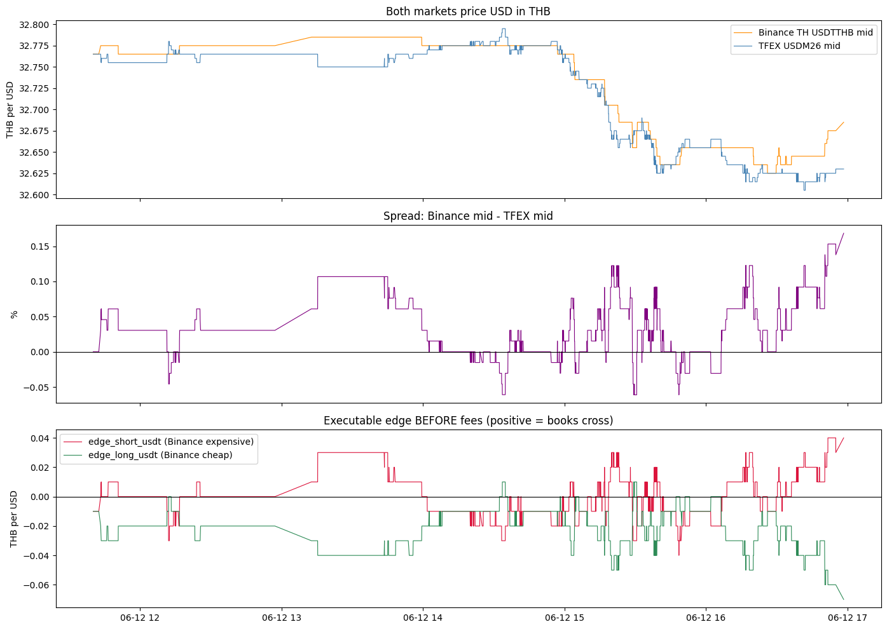
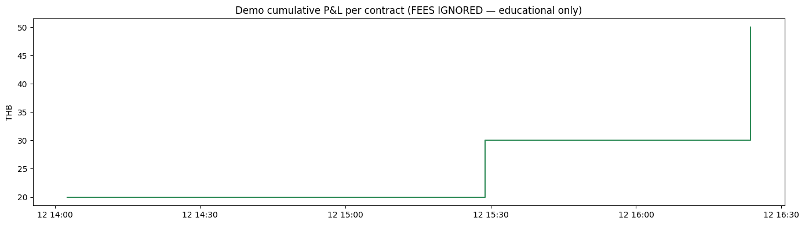
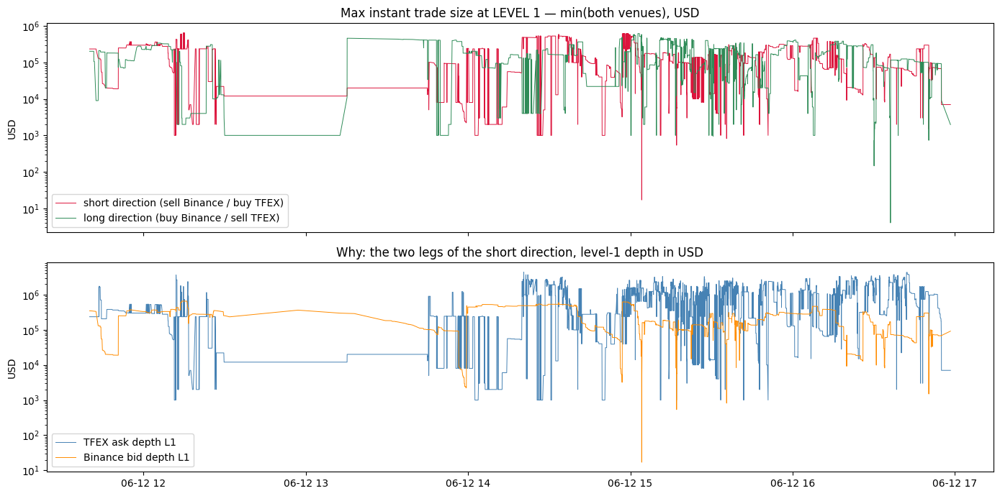

# Simple Spread Strategy — TFEX USD Futures vs Binance TH USDTTHB

**No z-score. No statistics. Only the spread in THB and %, based on your real captured data.**

What this notebook does:

1. Loads **real bid/ask quotes** from your own Railway Postgres logger (`bidask_snapshots` table).
2. Aligns TFEX `USDM26` and Binance TH `USDTTHB` quotes in time.
3. Computes the spread and the **executable edge** (what you could really earn crossing both books).
4. Subtracts **real fees** and shows honestly if any trade was possible.
5. Runs a very simple backtest: *enter when the gap pays more than all costs, exit when the gap is gone.*
6. Studies **orderbook liquidity** (10 levels of depth) to answer: *how much money can this strategy use?*

> **Honest note**: this is statistical arbitrage (a bet on mean-reversion), not risk-free arbitrage.
> See `ARBITRAGE_TUTORIAL.md` for the full risk discussion. This notebook places **no orders**.

## The strategy in plain words

Both markets price the same thing: **USD in THB**.

```text
spread = Binance TH price - TFEX price
```

- Binance **higher** than TFEX → sell USDT on Binance (at the **bid**), buy USD futures on TFEX (at the **ask**).
- Binance **lower** than TFEX → buy USDT on Binance (at the **ask**), sell USD futures on TFEX (at the **bid**).

The money you can actually capture is the **executable edge** (using bid/ask you can really trade,
not mid prices):

```text
edge_short_usdt = binance_bid - tfex_ask    (Binance expensive)
edge_long_usdt  = tfex_bid  - binance_ask   (Binance cheap)
```

**Entry rule**: edge − all round-trip costs > buffer → open the pair trade.
**Exit rule**: the gap is gone (closing the position costs almost nothing) → close both legs.

That is the whole strategy. No z-score needed.

## Setup

Run from the project root. Needs `.env` with `DATABASE_URL=postgresql://...` (your Railway database).

```bash
uv sync
uv run jupyter lab
```


```python
import os
import warnings

import matplotlib.pyplot as plt
import pandas as pd
import psycopg2
from dotenv import load_dotenv

warnings.filterwarnings("ignore", message="pandas only supports SQLAlchemy")
pd.set_option("display.width", 160)
```


```python
# ---------- Configuration (all plain numbers, tune them here) ----------
TFEX_SYMBOL = "USDM26"            # active TFEX USD futures contract
BINANCE_SYMBOL = "USDTTHB"

MAX_QUOTE_AGE_SECONDS = 2         # only compare quotes closer than this in time (project rule)

# Costs, in THB per 1 USD of position (1 TFEX contract = 1,000 USD)
BINANCE_FEE_RATE = 0.0025         # 0.25% per side = Binance TH base tier for USDTTHB. Use your real tier!
TFEX_COST_PER_SIDE_THB = 0.025    # ~THB 25 per contract per side (brokerage + exchange fee + VAT) / 1000 USD

ENTRY_BUFFER_THB = 0.01           # extra edge required on top of costs before entering (slippage safety)
EXIT_TOLERANCE_THB = 0.01         # exit when closing the trade costs less than this per USD
```

## Step 1 — Load real quotes from your database

Your Railway service stores every bid/ask update in `bidask_snapshots` + `bidask_levels`.
We pull the **best bid and best ask (level 1)** for both markets.


```python
load_dotenv()
conn = psycopg2.connect(os.environ["DATABASE_URL"])

QUERY = """
SELECT s.source, s.received_at,
  MAX(l.price) FILTER (WHERE l.side = 'bid' AND l.level = 1) AS bid,
  MAX(l.price) FILTER (WHERE l.side = 'ask' AND l.level = 1) AS ask
FROM bidask_snapshots s
JOIN bidask_levels l ON l.snapshot_id = s.id
WHERE (s.source = 'settrade'   AND s.symbol = %(tfex)s)
   OR (s.source = 'binance_th' AND s.symbol = %(binance)s)
GROUP BY s.id, s.source, s.received_at
ORDER BY s.received_at
"""

raw = pd.read_sql(QUERY, conn, params={"tfex": TFEX_SYMBOL, "binance": BINANCE_SYMBOL})
conn.close()

raw["received_at"] = pd.to_datetime(raw["received_at"], utc=True).dt.tz_convert("Asia/Bangkok")
raw[["bid", "ask"]] = raw[["bid", "ask"]].astype(float)

for source, grp in raw.groupby("source"):
    print(f"{source:>11}: {len(grp):,} quotes | {grp.received_at.min()} -> {grp.received_at.max()}")
```

     binance_th: 17,234 quotes | 2026-06-11 12:47:39.709905+07:00 -> 2026-06-12 17:00:26.364516+07:00
       settrade: 19,298 quotes | 2026-06-11 12:39:39.176473+07:00 -> 2026-06-12 16:58:20.126154+07:00


## Step 2 — Align the two markets in time

The two feeds tick at different moments. For every Binance quote we attach the **most recent**
TFEX quote, but only if it is younger than `MAX_QUOTE_AGE_SECONDS`. Older quotes are dropped —
comparing a fresh price with a stale price creates fake spreads.


```python
tfex = (raw[raw.source == "settrade"]
        .rename(columns={"bid": "tfex_bid", "ask": "tfex_ask"})
        [["received_at", "tfex_bid", "tfex_ask"]]
        .sort_values("received_at"))
binance = (raw[raw.source == "binance_th"]
           .rename(columns={"bid": "binance_bid", "ask": "binance_ask"})
           [["received_at", "binance_bid", "binance_ask"]]
           .sort_values("received_at"))

pairs = pd.merge_asof(
    binance, tfex,
    on="received_at",
    direction="backward",
    tolerance=pd.Timedelta(seconds=MAX_QUOTE_AGE_SECONDS),
).dropna().reset_index(drop=True)

print(f"Matched quote pairs: {len(pairs):,}")
print(f"Window (Bangkok time): {pairs.received_at.min()} -> {pairs.received_at.max()}")
```

    Matched quote pairs: 7,648
    Window (Bangkok time): 2026-06-12 11:40:04.946531+07:00 -> 2026-06-12 16:58:22.029778+07:00


## Step 3 — Compute the spread and the executable edges

| Column | Meaning |
|---|---|
| `mid_spread` | Binance mid − TFEX mid, in THB (general view) |
| `mid_spread_pct` | same, in % of TFEX mid |
| `edge_short_usdt` | THB you capture per USD selling USDT on Binance + buying TFEX, **before fees** |
| `edge_long_usdt` | THB you capture per USD buying USDT on Binance + selling TFEX, **before fees** |

Positive edge = the books really cross. Negative edge = you would pay the spread to enter.


```python
pairs["binance_mid"] = (pairs.binance_bid + pairs.binance_ask) / 2
pairs["tfex_mid"] = (pairs.tfex_bid + pairs.tfex_ask) / 2
pairs["mid_spread"] = pairs.binance_mid - pairs.tfex_mid
pairs["mid_spread_pct"] = pairs.mid_spread / pairs.tfex_mid * 100

pairs["edge_short_usdt"] = pairs.binance_bid - pairs.tfex_ask
pairs["edge_long_usdt"] = pairs.tfex_bid - pairs.binance_ask

print(pairs[["mid_spread", "mid_spread_pct", "edge_short_usdt", "edge_long_usdt"]]
      .describe().round(4).to_string())
pairs.tail(3)
```

           mid_spread  mid_spread_pct  edge_short_usdt  edge_long_usdt
    count   7648.0000       7648.0000        7648.0000       7648.0000
    mean       0.0102          0.0311          -0.0008         -0.0212
    std        0.0138          0.0423           0.0145          0.0135
    min       -0.0200         -0.0612          -0.0400         -0.0700
    25%        0.0000          0.0000          -0.0100         -0.0300
    50%        0.0100          0.0305           0.0000         -0.0200
    75%        0.0200          0.0612           0.0100         -0.0100
    max        0.0550          0.1686           0.0400          0.0100


<div>
<style scoped>
    .dataframe tbody tr th:only-of-type {
        vertical-align: middle;
    }

    .dataframe tbody tr th {
        vertical-align: top;
    }

    .dataframe thead th {
        text-align: right;
    }
</style>
<table border="1" class="dataframe">
  <thead>
    <tr style="text-align: right;">
      <th></th>
      <th>received_at</th>
      <th>binance_bid</th>
      <th>binance_ask</th>
      <th>tfex_bid</th>
      <th>tfex_ask</th>
      <th>binance_mid</th>
      <th>tfex_mid</th>
      <th>mid_spread</th>
      <th>mid_spread_pct</th>
      <th>edge_short_usdt</th>
      <th>edge_long_usdt</th>
    </tr>
  </thead>
  <tbody>
    <tr>
      <th>7645</th>
      <td>2026-06-12 16:55:01.760838+07:00</td>
      <td>32.67</td>
      <td>32.68</td>
      <td>32.62</td>
      <td>32.64</td>
      <td>32.675</td>
      <td>32.63</td>
      <td>0.045</td>
      <td>0.137910</td>
      <td>0.03</td>
      <td>-0.06</td>
    </tr>
    <tr>
      <th>7646</th>
      <td>2026-06-12 16:58:20.795006+07:00</td>
      <td>32.68</td>
      <td>32.69</td>
      <td>32.62</td>
      <td>32.64</td>
      <td>32.685</td>
      <td>32.63</td>
      <td>0.055</td>
      <td>0.168557</td>
      <td>0.04</td>
      <td>-0.07</td>
    </tr>
    <tr>
      <th>7647</th>
      <td>2026-06-12 16:58:22.029778+07:00</td>
      <td>32.68</td>
      <td>32.69</td>
      <td>32.62</td>
      <td>32.64</td>
      <td>32.685</td>
      <td>32.63</td>
      <td>0.055</td>
      <td>0.168557</td>
      <td>0.04</td>
      <td>-0.07</td>
    </tr>
  </tbody>
</table>
</div>


## Step 4 — Look at the data


```python
fig, axes = plt.subplots(3, 1, figsize=(14, 10), sharex=True)
ts = pairs.received_at

axes[0].plot(ts, pairs.binance_mid, color="darkorange", lw=0.8, label=f"Binance TH {BINANCE_SYMBOL} mid")
axes[0].plot(ts, pairs.tfex_mid, color="steelblue", lw=0.8, label=f"TFEX {TFEX_SYMBOL} mid")
axes[0].set_title("Both markets price USD in THB")
axes[0].set_ylabel("THB per USD")
axes[0].legend()

axes[1].plot(ts, pairs.mid_spread_pct, color="purple", lw=0.8)
axes[1].axhline(0, color="black", lw=0.8)
axes[1].set_title("Spread: Binance mid - TFEX mid")
axes[1].set_ylabel("%")

axes[2].plot(ts, pairs.edge_short_usdt, color="crimson", lw=0.8, label="edge_short_usdt (Binance expensive)")
axes[2].plot(ts, pairs.edge_long_usdt, color="seagreen", lw=0.8, label="edge_long_usdt (Binance cheap)")
axes[2].axhline(0, color="black", lw=0.8)
axes[2].set_title("Executable edge BEFORE fees (positive = books cross)")
axes[2].set_ylabel("THB per USD")
axes[2].legend()

plt.tight_layout()
plt.show()
```


    

    


## Step 5 — Costs (this is where most "opportunities" die)

Round trip = open the pair trade + close it later. Per 1 USD of position:

- Binance: fee rate × price, paid **twice** (entry + exit)
- TFEX: fixed THB per contract, paid **twice**, divided by 1,000 USD

**Do not confuse tick size with fees.** The tick size is the *minimum price step* the contract
can move — a market rule, not money you pay. Fees are brokerage + exchange fee + VAT.
Cheat sheet for the TFEX contracts in your database:

| Contract | Quotation | Tick size | Tick value per contract | Size / multiplier |
|---|---|---|---|---|
| USD Futures (`USDM26`) | THB per USD, 2 dp | THB 0.01 | THB 10 | 1,000 USD |
| Mini Gold Online (`MGOM26`) | USD per troy oz, 1 dp | 0.1 USD | THB 3 | 30 (quanto) |
| Gold Online (`GOM26`) | USD per troy oz, 1 dp | 0.1 USD | THB 30 | 300 (quanto) |

For this USD pair: one tick (0.01 THB/USD) = 10 THB per contract. The edges you saw in Step 3
move in exactly these 0.01 steps — that is why `edge` values are always 0.01, 0.02, 0.03 …


```python
avg_price = pairs.binance_mid.mean()
binance_round_trip = 2 * BINANCE_FEE_RATE * avg_price
tfex_round_trip = 2 * TFEX_COST_PER_SIDE_THB
ROUND_TRIP_COST_THB = binance_round_trip + tfex_round_trip

best_edge = max(pairs.edge_short_usdt.max(), pairs.edge_long_usdt.max())

print(f"Average price                 : {avg_price:.2f} THB/USD")
print(f"Binance round trip (2 sides)  : {binance_round_trip:.4f} THB/USD  (fee rate {BINANCE_FEE_RATE:.4%}/side)")
print(f"TFEX round trip (2 sides)     : {tfex_round_trip:.4f} THB/USD")
print(f"TOTAL round-trip cost         : {ROUND_TRIP_COST_THB:.4f} THB/USD "
      f"(= {ROUND_TRIP_COST_THB * 1000:,.0f} THB per contract)")
print()
print(f"Best gross edge in this data  : {best_edge:.4f} THB/USD")
needed = ROUND_TRIP_COST_THB + ENTRY_BUFFER_THB
print(f"Edge needed to enter a trade  : {needed:.4f} THB/USD (costs + buffer)")
print()
if best_edge >= needed:
    print("=> Some moments in this data DID pay more than full costs. The backtest below will trade them.")
else:
    print("=> HONEST RESULT: in this data window, NO moment paid more than full costs.")
    print("   The strategy is correct but the edge was too small at this fee tier. Keep collecting data;")
    print("   the target is episodic spikes (like 27 May 2026), and a better Binance fee tier helps a lot.")
```

    Average price                 : 32.72 THB/USD
    Binance round trip (2 sides)  : 0.1636 THB/USD  (fee rate 0.2500%/side)
    TFEX round trip (2 sides)     : 0.0500 THB/USD
    TOTAL round-trip cost         : 0.2136 THB/USD (= 214 THB per contract)
    
    Best gross edge in this data  : 0.0400 THB/USD
    Edge needed to enter a trade  : 0.2236 THB/USD (costs + buffer)
    
    => HONEST RESULT: in this data window, NO moment paid more than full costs.
       The strategy is correct but the edge was too small at this fee tier. Keep collecting data;
       the target is episodic spikes (like 27 May 2026), and a better Binance fee tier helps a lot.


## Step 6 — Simple backtest (the whole strategy, no z-score)

Rules, exactly as stated at the top:

1. **Flat?** If `edge − round-trip costs ≥ ENTRY_BUFFER_THB` → enter (either direction).
2. **In a trade?** If closing the position costs less than `EXIT_TOLERANCE_THB` per USD → exit.
3. One position at a time. P&L is computed from the **real bid/ask at entry and exit**:

```text
pnl_per_usd = edge_at_entry + closing_edge_at_exit - round_trip_costs
```


```python
def run_backtest(df: pd.DataFrame, round_trip_cost: float, entry_buffer: float,
                 exit_tolerance: float) -> tuple[pd.DataFrame, dict | None]:
    """One-position-at-a-time spread backtest on real quote pairs."""
    position = None
    trades = []
    for row in df.itertuples():
        if position is None:
            if row.edge_short_usdt - round_trip_cost >= entry_buffer:
                position = {"side": "short_usdt_binance_long_tfex",
                            "entry_ts": row.received_at, "entry_edge": row.edge_short_usdt}
            elif row.edge_long_usdt - round_trip_cost >= entry_buffer:
                position = {"side": "long_usdt_binance_short_tfex",
                            "entry_ts": row.received_at, "entry_edge": row.edge_long_usdt}
        else:
            closing_edge = (row.edge_long_usdt if position["side"].startswith("short")
                            else row.edge_short_usdt)
            if closing_edge >= -exit_tolerance:
                pnl = position["entry_edge"] + closing_edge - round_trip_cost
                trades.append({**position, "exit_ts": row.received_at,
                               "exit_edge": closing_edge,
                               "pnl_thb_per_usd": pnl,
                               "pnl_thb_per_contract": pnl * 1000})
                position = None
    return pd.DataFrame(trades), position


trades, still_open = run_backtest(pairs, ROUND_TRIP_COST_THB, ENTRY_BUFFER_THB, EXIT_TOLERANCE_THB)

if trades.empty and still_open is None:
    print("0 trades with REAL costs in this window. That is the honest answer for this sample.")
    print("Below: the 10 best moments that came closest to a real opportunity.")
    top = pairs.assign(best_edge=pairs[["edge_short_usdt", "edge_long_usdt"]].max(axis=1))
    top10 = top.nlargest(10, "best_edge")[["received_at", "binance_bid", "binance_ask",
                                           "tfex_bid", "tfex_ask", "best_edge", "mid_spread_pct"]]
    num_cols = top10.select_dtypes("number").columns
    top10[num_cols] = top10[num_cols].round(4)
    display(top10)
else:
    if still_open is not None:
        print(f"Note: position still open at end of data: {still_open}")
    print(f"Trades: {len(trades)} | total P&L: {trades.pnl_thb_per_contract.sum():,.0f} THB per contract")
    display(trades.round(4))
```

    0 trades with REAL costs in this window. That is the honest answer for this sample.
    Below: the 10 best moments that came closest to a real opportunity.


<div>
<style scoped>
    .dataframe tbody tr th:only-of-type {
        vertical-align: middle;
    }

    .dataframe tbody tr th {
        vertical-align: top;
    }

    .dataframe thead th {
        text-align: right;
    }
</style>
<table border="1" class="dataframe">
  <thead>
    <tr style="text-align: right;">
      <th></th>
      <th>received_at</th>
      <th>binance_bid</th>
      <th>binance_ask</th>
      <th>tfex_bid</th>
      <th>tfex_ask</th>
      <th>best_edge</th>
      <th>mid_spread_pct</th>
    </tr>
  </thead>
  <tbody>
    <tr>
      <th>7580</th>
      <td>2026-06-12 16:51:40.939842+07:00</td>
      <td>32.67</td>
      <td>32.68</td>
      <td>32.62</td>
      <td>32.63</td>
      <td>0.04</td>
      <td>0.1533</td>
    </tr>
    <tr>
      <th>7581</th>
      <td>2026-06-12 16:51:54.270285+07:00</td>
      <td>32.67</td>
      <td>32.68</td>
      <td>32.62</td>
      <td>32.63</td>
      <td>0.04</td>
      <td>0.1533</td>
    </tr>
    <tr>
      <th>7582</th>
      <td>2026-06-12 16:51:55.371428+07:00</td>
      <td>32.67</td>
      <td>32.68</td>
      <td>32.62</td>
      <td>32.63</td>
      <td>0.04</td>
      <td>0.1533</td>
    </tr>
    <tr>
      <th>7583</th>
      <td>2026-06-12 16:52:02.154585+07:00</td>
      <td>32.67</td>
      <td>32.68</td>
      <td>32.62</td>
      <td>32.63</td>
      <td>0.04</td>
      <td>0.1533</td>
    </tr>
    <tr>
      <th>7584</th>
      <td>2026-06-12 16:52:03.254624+07:00</td>
      <td>32.67</td>
      <td>32.68</td>
      <td>32.62</td>
      <td>32.63</td>
      <td>0.04</td>
      <td>0.1533</td>
    </tr>
    <tr>
      <th>7585</th>
      <td>2026-06-12 16:52:14.290018+07:00</td>
      <td>32.67</td>
      <td>32.68</td>
      <td>32.62</td>
      <td>32.63</td>
      <td>0.04</td>
      <td>0.1533</td>
    </tr>
    <tr>
      <th>7586</th>
      <td>2026-06-12 16:52:15.387898+07:00</td>
      <td>32.67</td>
      <td>32.68</td>
      <td>32.62</td>
      <td>32.63</td>
      <td>0.04</td>
      <td>0.1533</td>
    </tr>
    <tr>
      <th>7587</th>
      <td>2026-06-12 16:52:16.542787+07:00</td>
      <td>32.67</td>
      <td>32.68</td>
      <td>32.62</td>
      <td>32.63</td>
      <td>0.04</td>
      <td>0.1533</td>
    </tr>
    <tr>
      <th>7588</th>
      <td>2026-06-12 16:52:26.798580+07:00</td>
      <td>32.67</td>
      <td>32.68</td>
      <td>32.62</td>
      <td>32.63</td>
      <td>0.04</td>
      <td>0.1533</td>
    </tr>
    <tr>
      <th>7589</th>
      <td>2026-06-12 16:52:28.035435+07:00</td>
      <td>32.67</td>
      <td>32.68</td>
      <td>32.62</td>
      <td>32.63</td>
      <td>0.04</td>
      <td>0.1533</td>
    </tr>
  </tbody>
</table>
</div>


## Step 7 — Demo mode: see the mechanics work (fees set to zero)

With real fees the sample above may show zero trades. To **see** how entry/exit behaves on the same
real data, run the identical backtest with costs at zero and a small 0.02 THB entry edge.

> ⚠️ This is **educational only** — these "profits" ignore fees and could never be captured at the
> base fee tier. It exists so you can watch the rules trigger on real quote movements.


```python
demo_trades, demo_open = run_backtest(pairs, round_trip_cost=0.0,
                                      entry_buffer=0.02, exit_tolerance=0.01)
print(f"Demo trades (fees ignored): {len(demo_trades)}")
if not demo_trades.empty:
    demo_trades["cum_pnl_per_contract"] = demo_trades.pnl_thb_per_contract.cumsum()
    show = demo_trades[["side", "entry_ts", "entry_edge", "exit_ts", "exit_edge",
                        "pnl_thb_per_usd", "pnl_thb_per_contract"]].head(20).copy()
    num_cols = show.select_dtypes("number").columns
    show[num_cols] = show[num_cols].round(4)
    display(show)

    fig, ax = plt.subplots(figsize=(14, 4))
    ax.step(demo_trades.exit_ts, demo_trades.cum_pnl_per_contract, where="post", color="seagreen")
    ax.set_title("Demo cumulative P&L per contract (FEES IGNORED — educational only)")
    ax.set_ylabel("THB")
    plt.tight_layout()
    plt.show()
if demo_open is not None:
    print(f"Demo position still open at end of data: {demo_open['side']} since {demo_open['entry_ts']}")
```

    Demo trades (fees ignored): 3


<div>
<style scoped>
    .dataframe tbody tr th:only-of-type {
        vertical-align: middle;
    }

    .dataframe tbody tr th {
        vertical-align: top;
    }

    .dataframe thead th {
        text-align: right;
    }
</style>
<table border="1" class="dataframe">
  <thead>
    <tr style="text-align: right;">
      <th></th>
      <th>side</th>
      <th>entry_ts</th>
      <th>entry_edge</th>
      <th>exit_ts</th>
      <th>exit_edge</th>
      <th>pnl_thb_per_usd</th>
      <th>pnl_thb_per_contract</th>
    </tr>
  </thead>
  <tbody>
    <tr>
      <th>0</th>
      <td>short_usdt_binance_long_tfex</td>
      <td>2026-06-12 13:15:17.692995+07:00</td>
      <td>0.03</td>
      <td>2026-06-12 14:02:31.883007+07:00</td>
      <td>-0.01</td>
      <td>0.02</td>
      <td>20.0</td>
    </tr>
    <tr>
      <th>1</th>
      <td>short_usdt_binance_long_tfex</td>
      <td>2026-06-12 15:19:28.049036+07:00</td>
      <td>0.02</td>
      <td>2026-06-12 15:28:46.604694+07:00</td>
      <td>-0.01</td>
      <td>0.01</td>
      <td>10.0</td>
    </tr>
    <tr>
      <th>2</th>
      <td>short_usdt_binance_long_tfex</td>
      <td>2026-06-12 16:16:45.470089+07:00</td>
      <td>0.03</td>
      <td>2026-06-12 16:23:35.815871+07:00</td>
      <td>-0.01</td>
      <td>0.02</td>
      <td>20.0</td>
    </tr>
  </tbody>
</table>
</div>


    

    


    Demo position still open at end of data: short_usdt_binance_long_tfex since 2026-06-12 16:38:18.537800+07:00


## What-if: how much the fee tier matters

Same strategy, same real data — only the Binance fee rate changes.


```python
rows = []
for fee in [0.0025, 0.0010, 0.0005, 0.0]:
    rt = 2 * fee * avg_price + 2 * TFEX_COST_PER_SIDE_THB
    t, _ = run_backtest(pairs, rt, ENTRY_BUFFER_THB, EXIT_TOLERANCE_THB)
    rows.append({"binance_fee_per_side": f"{fee:.2%}",
                 "round_trip_cost_thb_per_usd": round(rt, 4),
                 "trades": len(t),
                 "total_pnl_thb_per_contract": round(t.pnl_thb_per_contract.sum(), 0) if len(t) else 0})
pd.DataFrame(rows)
```


<div>
<style scoped>
    .dataframe tbody tr th:only-of-type {
        vertical-align: middle;
    }

    .dataframe tbody tr th {
        vertical-align: top;
    }

    .dataframe thead th {
        text-align: right;
    }
</style>
<table border="1" class="dataframe">
  <thead>
    <tr style="text-align: right;">
      <th></th>
      <th>binance_fee_per_side</th>
      <th>round_trip_cost_thb_per_usd</th>
      <th>trades</th>
      <th>total_pnl_thb_per_contract</th>
    </tr>
  </thead>
  <tbody>
    <tr>
      <th>0</th>
      <td>0.25%</td>
      <td>0.2136</td>
      <td>0</td>
      <td>0</td>
    </tr>
    <tr>
      <th>1</th>
      <td>0.10%</td>
      <td>0.1154</td>
      <td>0</td>
      <td>0</td>
    </tr>
    <tr>
      <th>2</th>
      <td>0.05%</td>
      <td>0.0827</td>
      <td>0</td>
      <td>0</td>
    </tr>
    <tr>
      <th>3</th>
      <td>0.00%</td>
      <td>0.0500</td>
      <td>0</td>
      <td>0</td>
    </tr>
  </tbody>
</table>
</div>


## Step 8 — Liquidity: how much money can this strategy use?

The spread tells you **when** to trade. The **orderbook depth** tells you **how big** you can trade.

An orderbook has levels. Level 1 = the best price. Deeper levels = worse prices:

```text
        BID side (buyers)          ASK side (sellers)
level 1: best (highest) bid        best (lowest) ask
level 2: a bit lower               a bit higher
...                                ...
level 10: much lower               much higher
```

Your database saves **10 levels for every snapshot** (`bidask_levels` table, and the
`latest_bidask_10_levels` view you can see in your DB browser).

**Two rules for this pair trade:**

1. **Units are different on each venue.** TFEX volume = *contracts* (1 contract = 1,000 USD).
   Binance volume = *USDT* (≈ 1 USD each). Always convert to USD before comparing.
2. **You trade both venues at the same time**, so your maximum size = the **smaller** side:

```text
max_size_short_usdt = min(Binance bid depth, TFEX ask depth)   # sell Binance, buy TFEX
max_size_long_usdt  = min(Binance ask depth, TFEX bid depth)   # buy Binance, sell TFEX
```


```python
# Latest full 10-level ladder for both venues (same data as the latest_bidask_10_levels view)
conn = psycopg2.connect(os.environ["DATABASE_URL"])
ladder = pd.read_sql("""
SELECT source, symbol, received_at, level,
       bid_price, bid_volume, ask_price, ask_volume
FROM latest_bidask_10_levels
WHERE (source = 'settrade'   AND symbol = %(tfex)s)
   OR (source = 'binance_th' AND symbol = %(binance)s)
ORDER BY source, level
""", conn, params={"tfex": TFEX_SYMBOL, "binance": BINANCE_SYMBOL})
conn.close()

ladder["received_at"] = pd.to_datetime(ladder["received_at"], utc=True).dt.tz_convert("Asia/Bangkok")
for col in ["bid_price", "bid_volume", "ask_price", "ask_volume"]:
    ladder[col] = ladder[col].astype(float)

# Convert raw volume to USD so both venues are comparable
ladder["usd_per_unit"] = ladder.source.map({"settrade": 1000.0, "binance_th": 1.0})
ladder["bid_usd"] = ladder.bid_volume * ladder.usd_per_unit
ladder["ask_usd"] = ladder.ask_volume * ladder.usd_per_unit

for source, grp in ladder.groupby("source"):
    unit = "contracts (1 = 1,000 USD)" if source == "settrade" else "USDT (~1 USD)"
    print(f"\n=== {source} {grp.symbol.iloc[0]} | snapshot: {grp.received_at.iloc[0]} | raw volume unit: {unit} ===")
    view = grp[["level", "bid_usd", "bid_price", "ask_price", "ask_usd"]].set_index("level").round(2)
    display(view)
    print(f"   Total bid depth (10 levels): {grp.bid_usd.sum():>12,.0f} USD")
    print(f"   Total ask depth (10 levels): {grp.ask_usd.sum():>12,.0f} USD")
```

    
    === binance_th USDTTHB | snapshot: 2026-06-12 17:00:27.472116+07:00 | raw volume unit: USDT (~1 USD) ===


<div>
<style scoped>
    .dataframe tbody tr th:only-of-type {
        vertical-align: middle;
    }

    .dataframe tbody tr th {
        vertical-align: top;
    }

    .dataframe thead th {
        text-align: right;
    }
</style>
<table border="1" class="dataframe">
  <thead>
    <tr style="text-align: right;">
      <th></th>
      <th>bid_usd</th>
      <th>bid_price</th>
      <th>ask_price</th>
      <th>ask_usd</th>
    </tr>
    <tr>
      <th>level</th>
      <th></th>
      <th></th>
      <th></th>
      <th></th>
    </tr>
  </thead>
  <tbody>
    <tr>
      <th>1</th>
      <td>73659.0</td>
      <td>32.68</td>
      <td>32.69</td>
      <td>123239.0</td>
    </tr>
    <tr>
      <th>2</th>
      <td>184933.0</td>
      <td>32.67</td>
      <td>32.70</td>
      <td>30730.0</td>
    </tr>
    <tr>
      <th>3</th>
      <td>26410.0</td>
      <td>32.65</td>
      <td>32.71</td>
      <td>91498.0</td>
    </tr>
    <tr>
      <th>4</th>
      <td>256010.0</td>
      <td>32.64</td>
      <td>32.75</td>
      <td>1391.0</td>
    </tr>
    <tr>
      <th>5</th>
      <td>7425.0</td>
      <td>32.63</td>
      <td>32.76</td>
      <td>30926.0</td>
    </tr>
    <tr>
      <th>6</th>
      <td>3320.0</td>
      <td>32.62</td>
      <td>32.77</td>
      <td>237992.0</td>
    </tr>
    <tr>
      <th>7</th>
      <td>64426.0</td>
      <td>32.61</td>
      <td>32.78</td>
      <td>60.0</td>
    </tr>
    <tr>
      <th>8</th>
      <td>11372.0</td>
      <td>32.60</td>
      <td>32.79</td>
      <td>20060.0</td>
    </tr>
    <tr>
      <th>9</th>
      <td>883.0</td>
      <td>32.59</td>
      <td>32.80</td>
      <td>206.0</td>
    </tr>
    <tr>
      <th>10</th>
      <td>20877.0</td>
      <td>32.58</td>
      <td>32.81</td>
      <td>30070.0</td>
    </tr>
  </tbody>
</table>
</div>


       Total bid depth (10 levels):      649,315 USD
       Total ask depth (10 levels):      566,172 USD
    
    === settrade USDM26 | snapshot: 2026-06-12 16:58:20.126154+07:00 | raw volume unit: contracts (1 = 1,000 USD) ===


<div>
<style scoped>
    .dataframe tbody tr th:only-of-type {
        vertical-align: middle;
    }

    .dataframe tbody tr th {
        vertical-align: top;
    }

    .dataframe thead th {
        text-align: right;
    }
</style>
<table border="1" class="dataframe">
  <thead>
    <tr style="text-align: right;">
      <th></th>
      <th>bid_usd</th>
      <th>bid_price</th>
      <th>ask_price</th>
      <th>ask_usd</th>
    </tr>
    <tr>
      <th>level</th>
      <th></th>
      <th></th>
      <th></th>
      <th></th>
    </tr>
  </thead>
  <tbody>
    <tr>
      <th>1</th>
      <td>9000.0</td>
      <td>32.62</td>
      <td>32.64</td>
      <td>7000.0</td>
    </tr>
    <tr>
      <th>2</th>
      <td>65000.0</td>
      <td>32.61</td>
      <td>32.65</td>
      <td>77000.0</td>
    </tr>
    <tr>
      <th>3</th>
      <td>1274000.0</td>
      <td>32.60</td>
      <td>32.66</td>
      <td>4000.0</td>
    </tr>
    <tr>
      <th>4</th>
      <td>46000.0</td>
      <td>32.59</td>
      <td>32.67</td>
      <td>1000.0</td>
    </tr>
    <tr>
      <th>5</th>
      <td>96000.0</td>
      <td>32.58</td>
      <td>32.68</td>
      <td>6000.0</td>
    </tr>
    <tr>
      <th>6</th>
      <td>0.0</td>
      <td>0.00</td>
      <td>0.00</td>
      <td>0.0</td>
    </tr>
    <tr>
      <th>7</th>
      <td>0.0</td>
      <td>0.00</td>
      <td>0.00</td>
      <td>0.0</td>
    </tr>
    <tr>
      <th>8</th>
      <td>0.0</td>
      <td>0.00</td>
      <td>0.00</td>
      <td>0.0</td>
    </tr>
    <tr>
      <th>9</th>
      <td>0.0</td>
      <td>0.00</td>
      <td>0.00</td>
      <td>0.0</td>
    </tr>
    <tr>
      <th>10</th>
      <td>0.0</td>
      <td>0.00</td>
      <td>0.00</td>
      <td>0.0</td>
    </tr>
  </tbody>
</table>
</div>


       Total bid depth (10 levels):    1,490,000 USD
       Total ask depth (10 levels):       95,000 USD


### Depth over time — the real answer to "how much money can I use?"

One snapshot can lie (depth appears and disappears). So we measure the **whole window**:
for every matched moment, the USD depth at level 1 and at the top 5 levels, on the side
each strategy direction must trade.


```python
conn = psycopg2.connect(os.environ["DATABASE_URL"])
DEPTH_QUERY = """
SELECT s.source, s.received_at,
  SUM(l.volume) FILTER (WHERE l.side = 'bid' AND l.level = 1)  AS bid_l1,
  SUM(l.volume) FILTER (WHERE l.side = 'ask' AND l.level = 1)  AS ask_l1,
  SUM(l.volume) FILTER (WHERE l.side = 'bid' AND l.level <= 5) AS bid_l5,
  SUM(l.volume) FILTER (WHERE l.side = 'ask' AND l.level <= 5) AS ask_l5
FROM bidask_snapshots s
JOIN bidask_levels l ON l.snapshot_id = s.id
WHERE (s.source = 'settrade'   AND s.symbol = %(tfex)s)
   OR (s.source = 'binance_th' AND s.symbol = %(binance)s)
GROUP BY s.id, s.source, s.received_at
ORDER BY s.received_at
"""
depth = pd.read_sql(DEPTH_QUERY, conn, params={"tfex": TFEX_SYMBOL, "binance": BINANCE_SYMBOL})
conn.close()

depth["received_at"] = pd.to_datetime(depth["received_at"], utc=True).dt.tz_convert("Asia/Bangkok")
vol_cols = ["bid_l1", "ask_l1", "bid_l5", "ask_l5"]
usd_mult = depth.source.map({"settrade": 1000.0, "binance_th": 1.0})
for c in vol_cols:
    depth[c] = depth[c].astype(float) * usd_mult     # now everything is USD

tfex_depth = (depth[depth.source == "settrade"][["received_at"] + vol_cols]
              .rename(columns={c: f"tfex_{c}" for c in vol_cols}).sort_values("received_at"))
binance_depth = (depth[depth.source == "binance_th"][["received_at"] + vol_cols]
                 .rename(columns={c: f"binance_{c}" for c in vol_cols}).sort_values("received_at"))

depth_pairs = pd.merge_asof(binance_depth, tfex_depth, on="received_at",
                            direction="backward",
                            tolerance=pd.Timedelta(seconds=MAX_QUOTE_AGE_SECONDS)).dropna()

# Max instant size = the smaller venue, per direction
depth_pairs["max_usd_short_l1"] = depth_pairs[["binance_bid_l1", "tfex_ask_l1"]].min(axis=1)
depth_pairs["max_usd_long_l1"]  = depth_pairs[["binance_ask_l1", "tfex_bid_l1"]].min(axis=1)
depth_pairs["max_usd_short_l5"] = depth_pairs[["binance_bid_l5", "tfex_ask_l5"]].min(axis=1)
depth_pairs["max_usd_long_l5"]  = depth_pairs[["binance_ask_l5", "tfex_bid_l5"]].min(axis=1)

size_cols = ["max_usd_short_l1", "max_usd_long_l1", "max_usd_short_l5", "max_usd_long_l5"]
print("Maximum instant trade size, in USD (whole window):\n")
print(depth_pairs[size_cols].describe().round(0).to_string())

typical = depth_pairs[size_cols].median()
avg_px = pairs.binance_mid.mean()
print(f"\nTypical (median) size you can trade instantly:")
print(f"  short direction, level 1 only : {typical.max_usd_short_l1:>10,.0f} USD  (~{typical.max_usd_short_l1 * avg_px:,.0f} THB, ~{typical.max_usd_short_l1 / 1000:.0f} TFEX contracts)")
print(f"  long  direction, level 1 only : {typical.max_usd_long_l1:>10,.0f} USD  (~{typical.max_usd_long_l1 * avg_px:,.0f} THB, ~{typical.max_usd_long_l1 / 1000:.0f} TFEX contracts)")
print(f"  short direction, top 5 levels : {typical.max_usd_short_l5:>10,.0f} USD")
print(f"  long  direction, top 5 levels : {typical.max_usd_long_l5:>10,.0f} USD")

# Which venue is the bottleneck (the smaller side)?
short_bottleneck = (depth_pairs.tfex_ask_l1 < depth_pairs.binance_bid_l1).mean()
long_bottleneck = (depth_pairs.tfex_bid_l1 < depth_pairs.binance_ask_l1).mean()
print(f"\nTFEX is the bottleneck {short_bottleneck:.0%} of the time (short direction) "
      f"and {long_bottleneck:.0%} (long direction).")
```

    Maximum instant trade size, in USD (whole window):
    
           max_usd_short_l1  max_usd_long_l1  max_usd_short_l5  max_usd_long_l5
    count            7648.0           7648.0            7648.0           7648.0
    mean           156743.0         177474.0          583591.0         634455.0
    std            147025.0         138323.0          220422.0         199227.0
    min                17.0              4.0           95000.0         111069.0
    25%             42649.0          66000.0          409680.0         492848.0
    50%            108840.0         159384.0          535071.0         675128.0
    75%            238000.0         285417.0          793182.0         792006.0
    max            653612.0         620150.0         1124574.0         886039.0
    
    Typical (median) size you can trade instantly:
      short direction, level 1 only :    108,840 USD  (~3,560,749 THB, ~109 TFEX contracts)
      long  direction, level 1 only :    159,384 USD  (~5,214,319 THB, ~159 TFEX contracts)
      short direction, top 5 levels :    535,071 USD
      long  direction, top 5 levels :    675,128 USD
    
    TFEX is the bottleneck 36% of the time (short direction) and 43% (long direction).


```python
fig, axes = plt.subplots(2, 1, figsize=(14, 7), sharex=True)
ts = depth_pairs.received_at

axes[0].plot(ts, depth_pairs.max_usd_short_l1, color="crimson", lw=0.7, label="short direction (sell Binance / buy TFEX)")
axes[0].plot(ts, depth_pairs.max_usd_long_l1, color="seagreen", lw=0.7, label="long direction (buy Binance / sell TFEX)")
axes[0].set_title("Max instant trade size at LEVEL 1 — min(both venues), USD")
axes[0].set_ylabel("USD")
axes[0].set_yscale("log")
axes[0].legend()

axes[1].plot(ts, depth_pairs.tfex_ask_l1, color="steelblue", lw=0.7, label="TFEX ask depth L1")
axes[1].plot(ts, depth_pairs.binance_bid_l1, color="darkorange", lw=0.7, label="Binance bid depth L1")
axes[1].set_title("Why: the two legs of the short direction, level-1 depth in USD")
axes[1].set_ylabel("USD")
axes[1].set_yscale("log")
axes[1].legend()

plt.tight_layout()
plt.show()
```


    

    


### Slippage — what happens when your order is bigger than level 1

If your order is bigger than level 1, you "walk the book": part of the order fills at level 2,
3, ... at worse prices. The average fill price moves against you. This is **slippage**, and it is
a real cost just like fees.

Below we walk the latest real ladder with different order sizes.


```python
def walk_book(levels: list[tuple[float, float]], usd_size: float) -> float | None:
    """Average fill price when buying/selling `usd_size` USD into `levels` [(price, usd_depth), ...].
    Returns None if the 10 visible levels are not deep enough."""
    remaining, cost = usd_size, 0.0
    for price, usd_depth in levels:
        take = min(remaining, usd_depth)
        cost += take * price
        remaining -= take
        if remaining <= 0:
            return cost / usd_size
    return None


def ladder_side(source: str, side: str) -> list[tuple[float, float]]:
    g = ladder[ladder.source == source].sort_values("level")
    return list(zip(g[f"{side}_price"], g[f"{side}_usd"]))


SIDES = [
    ("binance_th", "bid", "sell USDT on Binance"),
    ("binance_th", "ask", "buy USDT on Binance"),
    ("settrade", "ask", "buy futures on TFEX"),
    ("settrade", "bid", "sell futures on TFEX"),
]

rows = []
for usd_size in [1_000, 5_000, 10_000, 25_000, 50_000, 100_000]:
    row = {"order_size_usd": f"{usd_size:,}"}
    for source, side, label in SIDES:
        levels = ladder_side(source, side)
        avg = walk_book(levels, usd_size)
        if avg is None:
            row[label] = "not enough depth"
        else:
            best = levels[0][0]
            slip = (avg - best) if side == "ask" else (best - avg)   # always >= 0 = cost
            row[label] = f"{avg:.4f} (slip {slip:.4f})"
    rows.append(row)

print("Average fill price (and slippage in THB per USD) using the LATEST real orderbook:\n")
display(pd.DataFrame(rows).set_index("order_size_usd"))
print("Remember: the typical edge in this data is only 0.01-0.03 THB per USD.")
print("If slippage is 0.01 THB, half or all of the edge is gone before fees.")
```

    Average fill price (and slippage in THB per USD) using the LATEST real orderbook:
    


<div>
<style scoped>
    .dataframe tbody tr th:only-of-type {
        vertical-align: middle;
    }

    .dataframe tbody tr th {
        vertical-align: top;
    }

    .dataframe thead th {
        text-align: right;
    }
</style>
<table border="1" class="dataframe">
  <thead>
    <tr style="text-align: right;">
      <th></th>
      <th>sell USDT on Binance</th>
      <th>buy USDT on Binance</th>
      <th>buy futures on TFEX</th>
      <th>sell futures on TFEX</th>
    </tr>
    <tr>
      <th>order_size_usd</th>
      <th></th>
      <th></th>
      <th></th>
      <th></th>
    </tr>
  </thead>
  <tbody>
    <tr>
      <th>1,000</th>
      <td>32.6800 (slip 0.0000)</td>
      <td>32.6900 (slip 0.0000)</td>
      <td>32.6400 (slip 0.0000)</td>
      <td>32.6200 (slip 0.0000)</td>
    </tr>
    <tr>
      <th>5,000</th>
      <td>32.6800 (slip 0.0000)</td>
      <td>32.6900 (slip 0.0000)</td>
      <td>32.6400 (slip 0.0000)</td>
      <td>32.6200 (slip 0.0000)</td>
    </tr>
    <tr>
      <th>10,000</th>
      <td>32.6800 (slip 0.0000)</td>
      <td>32.6900 (slip 0.0000)</td>
      <td>32.6430 (slip 0.0030)</td>
      <td>32.6190 (slip 0.0010)</td>
    </tr>
    <tr>
      <th>25,000</th>
      <td>32.6800 (slip 0.0000)</td>
      <td>32.6900 (slip 0.0000)</td>
      <td>32.6472 (slip 0.0072)</td>
      <td>32.6136 (slip 0.0064)</td>
    </tr>
    <tr>
      <th>50,000</th>
      <td>32.6800 (slip 0.0000)</td>
      <td>32.6900 (slip 0.0000)</td>
      <td>32.6486 (slip 0.0086)</td>
      <td>32.6118 (slip 0.0082)</td>
    </tr>
    <tr>
      <th>100,000</th>
      <td>32.6774 (slip 0.0026)</td>
      <td>32.6900 (slip 0.0000)</td>
      <td>not enough depth</td>
      <td>32.6083 (slip 0.0117)</td>
    </tr>
  </tbody>
</table>
</div>


    Remember: the typical edge in this data is only 0.01-0.03 THB per USD.
    If slippage is 0.01 THB, half or all of the edge is gone before fees.


### Liquidity lesson for students

1. **The spread tells you *when*, the depth tells you *how much*.** A beautiful 0.1% spread on
   10 USDT of depth is worth almost nothing.
2. **Your max size = the smaller venue, and the bottleneck switches.** In this window TFEX was the
   smaller side ~40% of the time and Binance ~60% — you must check **both** books every time, not
   assume one venue is always deep.
3. **Depth changes second by second.** The median instant size here was large (100,000+ USD), but
   the minimum dropped to almost nothing — liquidity can vanish exactly when the spread spikes.
4. **Convert units first.** TFEX volume is in contracts (×1,000 USD), Binance in USDT. Comparing
   raw numbers gives nonsense.
5. **Slippage is a cost.** Going deeper than level 1 moves your average price against you. Edge
   must beat fees **+ slippage at your size**, not just fees.
6. **TFEX trades in whole contracts.** Minimum size step = 1,000 USD, so your Binance leg should
   be a multiple of ~1,000 USDT to stay matched. (Note: the Settrade feed itself sends levels 6–10
   as zero — verified against the raw payload — so only 5 real TFEX levels are visible.)

## Honest conclusion

- The strategy itself is simple and correct: **enter when the gap pays more than all costs, exit
  when the gap is gone.** No z-score, no statistics — just THB, % and fees.
- Whether it makes money depends on two things only:
  1. **Your Binance fee tier** — at 0.25%/side the round-trip cost (~0.21 THB/USD) is far bigger
     than the typical gap (~0.01–0.03 THB/USD). At maker/VIP rates the math changes completely.
  2. **Episodic spikes** — the quiet state is near-zero spread. The opportunity is the rare wide
     moment (your 27 May 2026 chart). You need the logger running so the data is there when it happens.
- **Liquidity caps your size**: the strategy can only be as big as the smaller orderbook side at
  that moment — typically 100,000+ USD in this window, but sometimes almost zero. Check both
  books before sizing; bigger orders pay slippage on top of fees.
- Keep the Railway logger running. Re-run this notebook after a few days/weeks of data —
  every cell adapts automatically to the longer window.
- Before any real order: read the checklist in `ARBITRAGE_TUTORIAL.md`, confirm your real fee tier,
  and start with 1 contract maximum.
