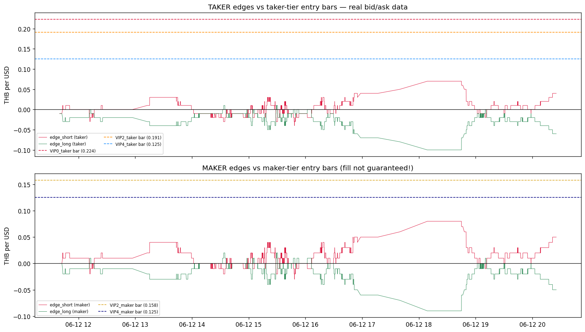
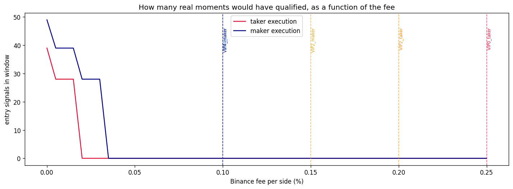

# VIP Fee Tiers on REAL Captured Bid/Ask Data — A Real-Case Showcase

**This is the real-data version of `vip_fee_strategy_1m_30d.ipynb`.**

That notebook used 1-minute *candles* and had to approximate the bid/ask with a typical book
width. This one uses **your own captured level-1 bid/ask quotes** from the Railway Postgres
logger (`bidask_snapshots` table) — the same data source as `simple_spread_strategy.ipynb`:

- TFEX `USDM26` real bid/ask (Settrade feed)
- Binance TH `USDTTHB` real bid/ask

Because the quotes are real, **nothing is approximated**:

| | 1m candle notebook | this notebook |
|---|---|---|
| Prices | close of each minute | real best bid / best ask |
| Bid-ask cost | assumed width (0.01 / 0.02 THB) | already inside the prices |
| TFEX leg | Yahoo daily proxy (midnight-step artifact!) | real TFEX futures quotes |
| Maker modelling | width discount | post at the real opposite quote |

The question stays the same: **how does the Binance TH fee tier (VIP 0 / VIP 2 / VIP 4) change
what this strategy can capture — on real data?**

> No orders are placed. Needs `.env` with `DATABASE_URL` (your Railway database).
> The window grows every day the logger runs — re-run this notebook any time.

## Step 0 — Fee tiers under test

From the [Binance TH FAQ](https://www.binance.th/en/faq/spot-trading/4900a0792af24f5e853e2373b84f94e7):
`USDTTHB` is an **exchange pair**, so the relevant per-side rates are:

| Scenario | Binance fee per side | 30-day volume needed |
|---|---|---|
| VIP 0 taker (base) | 0.25% | — |
| VIP 2 taker | 0.20% | ≥ 500,000 USD |
| VIP 2 maker | 0.15% | ≥ 500,000 USD |
| VIP 4 taker | 0.10% | ≥ 3,000,000 USD |
| VIP 4 maker | 0.10% | ≥ 3,000,000 USD |

With real bid/ask data, *maker vs taker* is no longer just a fee discount — it changes **which
price you trade at** (Step 3).


```python
import os
import warnings

import matplotlib.pyplot as plt
import numpy as np
import pandas as pd
import psycopg2
from dotenv import load_dotenv

warnings.filterwarnings("ignore", message="pandas only supports SQLAlchemy")
pd.set_option("display.width", 160)
plt.rcParams["figure.dpi"] = 120
```


```python
# ---------- Configuration ----------
TFEX_SYMBOL = "USDM26"
BINANCE_SYMBOL = "USDTTHB"
MAX_QUOTE_AGE_SECONDS = 2        # only pair quotes closer than this in time

# Binance TH EXCHANGE-pair rates for USDTTHB (per side)
FEE_SCENARIOS = {
    "VIP0_taker": {"binance_fee": 0.0025, "maker": False},
    "VIP2_taker": {"binance_fee": 0.0020, "maker": False},
    "VIP2_maker": {"binance_fee": 0.0015, "maker": True},
    "VIP4_taker": {"binance_fee": 0.0010, "maker": False},
    "VIP4_maker": {"binance_fee": 0.0010, "maker": True},
}
VIP_VOLUME_REQ_USD = {"VIP2": 500_000, "VIP4": 3_000_000}

TFEX_COST_PER_SIDE_THB = 0.025   # ~THB 25 per contract per side / 1,000 USD
ENTRY_BUFFER_THB = 0.01          # extra edge required on top of costs
EXIT_TOLERANCE_THB = 0.01        # exit when closing costs less than this per USD
```

## Step 1 — Load and align the real quotes

Same as `simple_spread_strategy.ipynb`: pull every level-1 bid/ask from the database, then for
every Binance quote attach the most recent TFEX quote — but only if it is younger than
`MAX_QUOTE_AGE_SECONDS`, because comparing a fresh price with a stale one creates fake spreads.


```python
load_dotenv()
conn = psycopg2.connect(os.environ["DATABASE_URL"])

QUERY = """
SELECT s.source, s.received_at,
  MAX(l.price) FILTER (WHERE l.side = 'bid' AND l.level = 1) AS bid,
  MAX(l.price) FILTER (WHERE l.side = 'ask' AND l.level = 1) AS ask
FROM bidask_snapshots s
JOIN bidask_levels l ON l.snapshot_id = s.id
WHERE (s.source = 'settrade'   AND s.symbol = %(tfex)s)
   OR (s.source = 'binance_th' AND s.symbol = %(binance)s)
GROUP BY s.id, s.source, s.received_at
ORDER BY s.received_at
"""
raw = pd.read_sql(QUERY, conn, params={"tfex": TFEX_SYMBOL, "binance": BINANCE_SYMBOL})
conn.close()

raw["received_at"] = pd.to_datetime(raw["received_at"], utc=True).dt.tz_convert("Asia/Bangkok")
raw[["bid", "ask"]] = raw[["bid", "ask"]].astype(float)

for source, grp in raw.groupby("source"):
    print(f"{source:>11}: {len(grp):,} quotes | {grp.received_at.min()} -> {grp.received_at.max()}")

tfex = (raw[raw.source == "settrade"]
        .rename(columns={"bid": "tfex_bid", "ask": "tfex_ask"})
        [["received_at", "tfex_bid", "tfex_ask"]].sort_values("received_at"))
binance = (raw[raw.source == "binance_th"]
           .rename(columns={"bid": "binance_bid", "ask": "binance_ask"})
           [["received_at", "binance_bid", "binance_ask"]].sort_values("received_at"))

pairs = pd.merge_asof(binance, tfex, on="received_at", direction="backward",
                      tolerance=pd.Timedelta(seconds=MAX_QUOTE_AGE_SECONDS)).dropna().reset_index(drop=True)

print(f"\nMatched quote pairs: {len(pairs):,}")
print(f"Window (Bangkok time): {pairs.received_at.min()} -> {pairs.received_at.max()}")
```

     binance_th: 28,043 quotes | 2026-06-11 12:47:39.709905+07:00 -> 2026-06-12 20:25:20.614129+07:00
       settrade: 21,025 quotes | 2026-06-11 12:39:39.176473+07:00 -> 2026-06-12 20:25:20.647635+07:00
    
    Matched quote pairs: 9,998
    Window (Bangkok time): 2026-06-12 11:40:04.946531+07:00 -> 2026-06-12 20:25:20.614129+07:00


## Step 2 — Executable edges: taker AND maker, from real quotes

This is the key upgrade over the candle notebook. With real bid/ask we can price *both*
execution styles exactly:

```text
                       TAKER (cross the book now)        MAKER (post and wait for a fill)
short USDT direction:  sell at binance_bid               post your sell at binance_ask
  edge_short         = binance_bid - tfex_ask          = binance_ask - tfex_ask

long USDT direction:   buy at binance_ask                post your buy at binance_bid
  edge_long          = tfex_bid - binance_ask          = tfex_bid - binance_bid
```

The maker edge is better by exactly the Binance book width — **but the fill is not guaranteed**
(discussed at the end). The TFEX leg is always priced as taker (you cross its book), the
realistic assumption for the smaller venue.


```python
pairs["binance_mid"] = (pairs.binance_bid + pairs.binance_ask) / 2
pairs["tfex_mid"] = (pairs.tfex_bid + pairs.tfex_ask) / 2
pairs["mid_spread"] = pairs.binance_mid - pairs.tfex_mid
pairs["mid_spread_pct"] = pairs.mid_spread / pairs.tfex_mid * 100

# Taker edges (identical to simple_spread_strategy.ipynb)
pairs["edge_short_taker"] = pairs.binance_bid - pairs.tfex_ask
pairs["edge_long_taker"] = pairs.tfex_bid - pairs.binance_ask
# Maker edges (post at the opposite Binance quote)
pairs["edge_short_maker"] = pairs.binance_ask - pairs.tfex_ask
pairs["edge_long_maker"] = pairs.tfex_bid - pairs.binance_bid

edge_cols = ["edge_short_taker", "edge_long_taker", "edge_short_maker", "edge_long_maker"]
print(pairs[["mid_spread_pct"] + edge_cols].describe().round(4).to_string())

binance_width = (pairs.binance_ask - pairs.binance_bid).median()
print(f"\nMedian Binance book width: {binance_width:.4f} THB "
      f"(= exactly how much better the maker edge is)")
```

           mid_spread_pct  edge_short_taker  edge_long_taker  edge_short_maker  edge_long_maker
    count       9998.0000         9998.0000        9998.0000         9998.0000        9998.0000
    mean           0.0377            0.0014          -0.0232            0.0115          -0.0131
    std            0.0441            0.0150           0.0142            0.0151           0.0141
    min           -0.0612           -0.0400          -0.1000           -0.0300          -0.0900
    25%            0.0000           -0.0100          -0.0300            0.0000          -0.0200
    50%            0.0306            0.0000          -0.0200            0.0100          -0.0100
    75%            0.0612            0.0100          -0.0100            0.0200           0.0000
    max            0.2605            0.0700           0.0100            0.0800           0.0200
    
    Median Binance book width: 0.0100 THB (= exactly how much better the maker edge is)


## Step 3 — Round-trip cost per tier (no width adders this time)

Because the edges already use the *executable* prices, the only costs left are the actual fees:

```text
round_trip = 2 x binance_fee x price + 2 x TFEX_COST_PER_SIDE
```

Compare each tier's entry bar against the best edge that actually occurred in your data:


```python
avg_price = pairs.binance_mid.mean()

cost_rows = []
for name, sc in FEE_SCENARIOS.items():
    rt = 2 * sc["binance_fee"] * avg_price + 2 * TFEX_COST_PER_SIDE_THB
    sc["round_trip_cost"] = rt
    style = "maker" if sc["maker"] else "taker"
    best = pairs[[f"edge_short_{style}", f"edge_long_{style}"]].max().max()
    bar = rt + ENTRY_BUFFER_THB
    cost_rows.append({
        "scenario": name,
        "fee_per_side": f"{sc['binance_fee']:.2%}",
        "round_trip_thb_per_usd": round(rt, 4),
        "entry_bar_with_buffer": round(bar, 4),
        "best_edge_in_data": round(best, 4),
        "gap_to_first_trade": round(bar - best, 4),
        "could_trade": "YES" if best >= bar else "no",
    })

cost_table = pd.DataFrame(cost_rows).set_index("scenario")
print(f"Average price in window: {avg_price:.2f} THB/USD\n")
display(cost_table)
print("gap_to_first_trade = how many THB/USD of extra edge were still missing at the very best moment.")
```

    Average price in window: 32.72 THB/USD
    


<div>
<style scoped>
    .dataframe tbody tr th:only-of-type {
        vertical-align: middle;
    }

    .dataframe tbody tr th {
        vertical-align: top;
    }

    .dataframe thead th {
        text-align: right;
    }
</style>
<table border="1" class="dataframe">
  <thead>
    <tr style="text-align: right;">
      <th></th>
      <th>fee_per_side</th>
      <th>round_trip_thb_per_usd</th>
      <th>entry_bar_with_buffer</th>
      <th>best_edge_in_data</th>
      <th>gap_to_first_trade</th>
      <th>could_trade</th>
    </tr>
    <tr>
      <th>scenario</th>
      <th></th>
      <th></th>
      <th></th>
      <th></th>
      <th></th>
      <th></th>
    </tr>
  </thead>
  <tbody>
    <tr>
      <th>VIP0_taker</th>
      <td>0.25%</td>
      <td>0.2136</td>
      <td>0.2236</td>
      <td>0.07</td>
      <td>0.1536</td>
      <td>no</td>
    </tr>
    <tr>
      <th>VIP2_taker</th>
      <td>0.20%</td>
      <td>0.1809</td>
      <td>0.1909</td>
      <td>0.07</td>
      <td>0.1209</td>
      <td>no</td>
    </tr>
    <tr>
      <th>VIP2_maker</th>
      <td>0.15%</td>
      <td>0.1481</td>
      <td>0.1581</td>
      <td>0.08</td>
      <td>0.0781</td>
      <td>no</td>
    </tr>
    <tr>
      <th>VIP4_taker</th>
      <td>0.10%</td>
      <td>0.1154</td>
      <td>0.1254</td>
      <td>0.07</td>
      <td>0.0554</td>
      <td>no</td>
    </tr>
    <tr>
      <th>VIP4_maker</th>
      <td>0.10%</td>
      <td>0.1154</td>
      <td>0.1254</td>
      <td>0.08</td>
      <td>0.0454</td>
      <td>no</td>
    </tr>
  </tbody>
</table>
</div>


    gap_to_first_trade = how many THB/USD of extra edge were still missing at the very best moment.


```python
fig, axes = plt.subplots(2, 1, figsize=(14, 8), sharex=True)
ts = pairs.received_at
colors = {"VIP0_taker": "crimson", "VIP2_taker": "darkorange", "VIP2_maker": "goldenrod",
          "VIP4_taker": "dodgerblue", "VIP4_maker": "navy"}

axes[0].plot(ts, pairs.edge_short_taker, color="crimson", lw=0.6, label="edge_short (taker)")
axes[0].plot(ts, pairs.edge_long_taker, color="seagreen", lw=0.6, label="edge_long (taker)")
for name in ["VIP0_taker", "VIP2_taker", "VIP4_taker"]:
    bar = FEE_SCENARIOS[name]["round_trip_cost"] + ENTRY_BUFFER_THB
    axes[0].axhline(bar, color=colors[name], lw=1.0, ls="--", label=f"{name} bar ({bar:.3f})")
axes[0].axhline(0, color="black", lw=0.8)
axes[0].set_title("TAKER edges vs taker-tier entry bars — real bid/ask data")
axes[0].set_ylabel("THB per USD")
axes[0].legend(fontsize=7, ncol=2)

axes[1].plot(ts, pairs.edge_short_maker, color="crimson", lw=0.6, label="edge_short (maker)")
axes[1].plot(ts, pairs.edge_long_maker, color="seagreen", lw=0.6, label="edge_long (maker)")
for name in ["VIP2_maker", "VIP4_maker"]:
    bar = FEE_SCENARIOS[name]["round_trip_cost"] + ENTRY_BUFFER_THB
    axes[1].axhline(bar, color=colors[name], lw=1.0, ls="--", label=f"{name} bar ({bar:.3f})")
axes[1].axhline(0, color="black", lw=0.8)
axes[1].set_title("MAKER edges vs maker-tier entry bars (fill not guaranteed!)")
axes[1].set_ylabel("THB per USD")
axes[1].legend(fontsize=7, ncol=2)

plt.tight_layout()
plt.show()
```


    

    


## Step 4 — Backtest each tier on the real quotes

Identical rules to `simple_spread_strategy.ipynb`, with the edge columns matching the execution
style of the scenario (taker scenarios trade taker edges, maker scenarios maker edges —
entry *and* exit):

1. **Flat?** `edge - round_trip_cost >= ENTRY_BUFFER_THB` -> enter (either direction).
2. **In a trade?** closing edge `>= -EXIT_TOLERANCE_THB` -> close both legs.
3. One position at a time; P&L per USD = `entry_edge + closing_edge - round_trip_cost`.


```python
def run_backtest(df: pd.DataFrame, round_trip_cost: float, style: str,
                 entry_buffer: float, exit_tolerance: float) -> pd.DataFrame:
    """One-position-at-a-time spread backtest on real quote pairs."""
    short_col, long_col = f"edge_short_{style}", f"edge_long_{style}"
    position = None
    trades = []
    for row in df.itertuples():
        edge_short = getattr(row, short_col)
        edge_long = getattr(row, long_col)
        if position is None:
            if edge_short - round_trip_cost >= entry_buffer:
                position = {"side": "short_usdt_binance_long_tfex",
                            "entry_ts": row.received_at, "entry_edge": edge_short}
            elif edge_long - round_trip_cost >= entry_buffer:
                position = {"side": "long_usdt_binance_short_tfex",
                            "entry_ts": row.received_at, "entry_edge": edge_long}
        else:
            closing_edge = edge_long if position["side"].startswith("short") else edge_short
            if closing_edge >= -exit_tolerance:
                pnl = position["entry_edge"] + closing_edge - round_trip_cost
                trades.append({**position, "exit_ts": row.received_at, "exit_edge": closing_edge,
                               "hold_minutes": (row.received_at - position["entry_ts"]).total_seconds() / 60,
                               "pnl_thb_per_usd": pnl, "pnl_thb_per_contract": pnl * 1000})
                position = None
    return pd.DataFrame(trades)


results = {}
summary_rows = []
for name, sc in FEE_SCENARIOS.items():
    style = "maker" if sc["maker"] else "taker"
    t = run_backtest(pairs, sc["round_trip_cost"], style, ENTRY_BUFFER_THB, EXIT_TOLERANCE_THB)
    results[name] = t
    summary_rows.append({
        "scenario": name,
        "round_trip_cost": round(sc["round_trip_cost"], 4),
        "trades": len(t),
        "win_rate": f"{(t.pnl_thb_per_usd > 0).mean():.0%}" if len(t) else "-",
        "median_hold_min": round(t.hold_minutes.median(), 1) if len(t) else "-",
        "total_pnl_per_contract_thb": round(t.pnl_thb_per_contract.sum(), 0) if len(t) else 0,
    })

summary = pd.DataFrame(summary_rows).set_index("scenario")
display(summary)

any_trades = any(len(t) for t in results.values())
if any_trades:
    fig, ax = plt.subplots(figsize=(14, 4))
    for name, t in results.items():
        if t.empty:
            continue
        ax.step(t["exit_ts"], t["pnl_thb_per_contract"].cumsum(), where="post",
                color=colors[name], lw=1.4, label=f"{name} ({len(t)} trades)")
    ax.axhline(0, color="black", lw=0.8)
    ax.set_title("Cumulative P&L per 1 TFEX contract — REAL bid/ask data")
    ax.set_ylabel("THB")
    ax.legend()
    plt.tight_layout()
    plt.show()
else:
    print("\nHONEST RESULT: zero trades at every tier in this window — even VIP 4 maker.")
    print("That is not a bug; it is the real answer for this data sample. Step 5 quantifies")
    print("exactly how far away each tier was, and what would have to change.")
```


<div>
<style scoped>
    .dataframe tbody tr th:only-of-type {
        vertical-align: middle;
    }

    .dataframe tbody tr th {
        vertical-align: top;
    }

    .dataframe thead th {
        text-align: right;
    }
</style>
<table border="1" class="dataframe">
  <thead>
    <tr style="text-align: right;">
      <th></th>
      <th>round_trip_cost</th>
      <th>trades</th>
      <th>win_rate</th>
      <th>median_hold_min</th>
      <th>total_pnl_per_contract_thb</th>
    </tr>
    <tr>
      <th>scenario</th>
      <th></th>
      <th></th>
      <th></th>
      <th></th>
      <th></th>
    </tr>
  </thead>
  <tbody>
    <tr>
      <th>VIP0_taker</th>
      <td>0.2136</td>
      <td>0</td>
      <td>-</td>
      <td>-</td>
      <td>0</td>
    </tr>
    <tr>
      <th>VIP2_taker</th>
      <td>0.1809</td>
      <td>0</td>
      <td>-</td>
      <td>-</td>
      <td>0</td>
    </tr>
    <tr>
      <th>VIP2_maker</th>
      <td>0.1481</td>
      <td>0</td>
      <td>-</td>
      <td>-</td>
      <td>0</td>
    </tr>
    <tr>
      <th>VIP4_taker</th>
      <td>0.1154</td>
      <td>0</td>
      <td>-</td>
      <td>-</td>
      <td>0</td>
    </tr>
    <tr>
      <th>VIP4_maker</th>
      <td>0.1154</td>
      <td>0</td>
      <td>-</td>
      <td>-</td>
      <td>0</td>
    </tr>
  </tbody>
</table>
</div>


    
    HONEST RESULT: zero trades at every tier in this window — even VIP 4 maker.
    That is not a bug; it is the real answer for this data sample. Step 5 quantifies
    exactly how far away each tier was, and what would have to change.


### The near misses — the 10 best real moments

Whether or not trades fired, always look at the closest calls: real timestamps, real quotes,
and the maker edge they offered.


```python
top = pairs.assign(best_maker_edge=pairs[["edge_short_maker", "edge_long_maker"]].max(axis=1),
                   best_taker_edge=pairs[["edge_short_taker", "edge_long_taker"]].max(axis=1))
top10 = top.nlargest(10, "best_maker_edge")[
    ["received_at", "binance_bid", "binance_ask", "tfex_bid", "tfex_ask",
     "best_taker_edge", "best_maker_edge", "mid_spread_pct"]]
num_cols = top10.select_dtypes("number").columns
top10[num_cols] = top10[num_cols].round(4)
display(top10)

vip4_bar = FEE_SCENARIOS["VIP4_maker"]["round_trip_cost"] + ENTRY_BUFFER_THB
print(f"VIP4 maker entry bar: {vip4_bar:.4f} THB/USD — compare with best_maker_edge above.")
```


<div>
<style scoped>
    .dataframe tbody tr th:only-of-type {
        vertical-align: middle;
    }

    .dataframe tbody tr th {
        vertical-align: top;
    }

    .dataframe thead th {
        text-align: right;
    }
</style>
<table border="1" class="dataframe">
  <thead>
    <tr style="text-align: right;">
      <th></th>
      <th>received_at</th>
      <th>binance_bid</th>
      <th>binance_ask</th>
      <th>tfex_bid</th>
      <th>tfex_ask</th>
      <th>best_taker_edge</th>
      <th>best_maker_edge</th>
      <th>mid_spread_pct</th>
    </tr>
  </thead>
  <tbody>
    <tr>
      <th>7652</th>
      <td>2026-06-12 18:08:50.794955+07:00</td>
      <td>32.71</td>
      <td>32.72</td>
      <td>32.62</td>
      <td>32.64</td>
      <td>0.07</td>
      <td>0.08</td>
      <td>0.2605</td>
    </tr>
    <tr>
      <th>7653</th>
      <td>2026-06-12 18:08:52.039324+07:00</td>
      <td>32.71</td>
      <td>32.72</td>
      <td>32.62</td>
      <td>32.64</td>
      <td>0.07</td>
      <td>0.08</td>
      <td>0.2605</td>
    </tr>
    <tr>
      <th>7654</th>
      <td>2026-06-12 18:08:53.145831+07:00</td>
      <td>32.71</td>
      <td>32.72</td>
      <td>32.62</td>
      <td>32.64</td>
      <td>0.07</td>
      <td>0.08</td>
      <td>0.2605</td>
    </tr>
    <tr>
      <th>7655</th>
      <td>2026-06-12 18:08:54.388957+07:00</td>
      <td>32.71</td>
      <td>32.72</td>
      <td>32.62</td>
      <td>32.64</td>
      <td>0.07</td>
      <td>0.08</td>
      <td>0.2605</td>
    </tr>
    <tr>
      <th>7656</th>
      <td>2026-06-12 18:12:41.087327+07:00</td>
      <td>32.71</td>
      <td>32.72</td>
      <td>32.62</td>
      <td>32.64</td>
      <td>0.07</td>
      <td>0.08</td>
      <td>0.2605</td>
    </tr>
    <tr>
      <th>7657</th>
      <td>2026-06-12 18:12:41.771534+07:00</td>
      <td>32.71</td>
      <td>32.72</td>
      <td>32.62</td>
      <td>32.64</td>
      <td>0.07</td>
      <td>0.08</td>
      <td>0.2605</td>
    </tr>
    <tr>
      <th>7658</th>
      <td>2026-06-12 18:12:42.193399+07:00</td>
      <td>32.71</td>
      <td>32.72</td>
      <td>32.62</td>
      <td>32.64</td>
      <td>0.07</td>
      <td>0.08</td>
      <td>0.2605</td>
    </tr>
    <tr>
      <th>7659</th>
      <td>2026-06-12 18:12:43.302003+07:00</td>
      <td>32.71</td>
      <td>32.72</td>
      <td>32.62</td>
      <td>32.64</td>
      <td>0.07</td>
      <td>0.08</td>
      <td>0.2605</td>
    </tr>
    <tr>
      <th>7660</th>
      <td>2026-06-12 18:12:43.944117+07:00</td>
      <td>32.71</td>
      <td>32.72</td>
      <td>32.62</td>
      <td>32.64</td>
      <td>0.07</td>
      <td>0.08</td>
      <td>0.2605</td>
    </tr>
    <tr>
      <th>7661</th>
      <td>2026-06-12 18:12:44.548949+07:00</td>
      <td>32.71</td>
      <td>32.72</td>
      <td>32.62</td>
      <td>32.64</td>
      <td>0.07</td>
      <td>0.08</td>
      <td>0.2605</td>
    </tr>
  </tbody>
</table>
</div>


    VIP4 maker entry bar: 0.1254 THB/USD — compare with best_maker_edge above.


## Step 5 — The break-even question: what fee would the best moment have needed?

For the showcase, this is the punchline chart. We sweep the Binance fee from 0% to 0.25% and
ask, at every level: *how many entry signals would the data have produced?* And we solve the
break-even fee for the single best moment:

```text
edge >= 2 x fee x price + 2 x TFEX_COST + buffer
fee  <= (edge - 2 x TFEX_COST - buffer) / (2 x price)
```


```python
fees = np.linspace(0, 0.0025, 51)
sweep_rows = []
for fee in fees:
    rt = 2 * fee * avg_price + 2 * TFEX_COST_PER_SIDE_THB
    bar = rt + ENTRY_BUFFER_THB
    n_taker = int(((pairs.edge_short_taker >= bar) | (pairs.edge_long_taker >= bar)).sum())
    n_maker = int(((pairs.edge_short_maker >= bar) | (pairs.edge_long_maker >= bar)).sum())
    sweep_rows.append({"fee": fee, "signals_taker": n_taker, "signals_maker": n_maker})
sweep = pd.DataFrame(sweep_rows)

fig, ax = plt.subplots(figsize=(12, 4.5))
ax.plot(sweep.fee * 100, sweep.signals_taker, color="crimson", lw=1.5, label="taker execution")
ax.plot(sweep.fee * 100, sweep.signals_maker, color="navy", lw=1.5, label="maker execution")
for name, sc in FEE_SCENARIOS.items():
    ax.axvline(sc["binance_fee"] * 100, color=colors[name], lw=1.0, ls="--", alpha=0.7)
    ax.text(sc["binance_fee"] * 100, ax.get_ylim()[1] * 0.9, f" {name}", rotation=90,
            fontsize=7, color=colors[name], va="top")
ax.set_xlabel("Binance fee per side (%)")
ax.set_ylabel("entry signals in window")
ax.set_title("How many real moments would have qualified, as a function of the fee")
ax.legend()
plt.tight_layout()
plt.show()

for style in ["taker", "maker"]:
    best = pairs[[f"edge_short_{style}", f"edge_long_{style}"]].max().max()
    be = (best - 2 * TFEX_COST_PER_SIDE_THB - ENTRY_BUFFER_THB) / (2 * avg_price)
    be0 = (best - 2 * TFEX_COST_PER_SIDE_THB) / (2 * avg_price)
    print(f"{style:>6}: best edge {best:.4f} THB/USD -> break-even fee "
          f"{be:.4%}/side (with buffer) | {be0:.4%}/side (no buffer)")
print("\nNegative break-even fee = even at 0% fees that moment would not have paid;")
print("the gross edge was smaller than the TFEX costs alone. The opportunity you are")
print("waiting for is an episodic spike (like 27 May 2026), not the quiet state.")
```


    

    


     taker: best edge 0.0700 THB/USD -> break-even fee 0.0153%/side (with buffer) | 0.0306%/side (no buffer)
     maker: best edge 0.0800 THB/USD -> break-even fee 0.0306%/side (with buffer) | 0.0458%/side (no buffer)
    
    Negative break-even fee = even at 0% fees that moment would not have paid;
    the gross edge was smaller than the TFEX costs alone. The opportunity you are
    waiting for is an episodic spike (like 27 May 2026), not the quiet state.


## Step 6 — Keeping the tier: the volume requirement

Reminder from the candle notebook, now with the real trade counts: VIP 2 requires
**≥ 500,000 USD** and VIP 4 **≥ 3,000,000 USD** of 30-day Binance volume (refreshed daily at
01:00 TH time). Each round trip of 1 contract = 2,000 USD of qualifying volume.


```python
vol_rows = []
for name in ["VIP2_taker", "VIP2_maker", "VIP4_taker", "VIP4_maker"]:
    tier = name.split("_")[0]
    req = VIP_VOLUME_REQ_USD[tier]
    n = len(results[name])
    vol_rows.append({
        "scenario": name,
        "trades_in_window": n,
        "binance_volume_at_1_contract_usd": f"{n * 2000:,}",
        "required_30d_volume_usd": f"{req:,}",
        "verdict": "self-sustaining" if n * 2000 >= req else
                   ("no trades at all" if n == 0 else "needs other volume"),
    })
display(pd.DataFrame(vol_rows).set_index("scenario"))
print("Window so far is short — the verdict matters once the logger has captured a spike period.")
```


<div>
<style scoped>
    .dataframe tbody tr th:only-of-type {
        vertical-align: middle;
    }

    .dataframe tbody tr th {
        vertical-align: top;
    }

    .dataframe thead th {
        text-align: right;
    }
</style>
<table border="1" class="dataframe">
  <thead>
    <tr style="text-align: right;">
      <th></th>
      <th>trades_in_window</th>
      <th>binance_volume_at_1_contract_usd</th>
      <th>required_30d_volume_usd</th>
      <th>verdict</th>
    </tr>
    <tr>
      <th>scenario</th>
      <th></th>
      <th></th>
      <th></th>
      <th></th>
    </tr>
  </thead>
  <tbody>
    <tr>
      <th>VIP2_taker</th>
      <td>0</td>
      <td>0</td>
      <td>500,000</td>
      <td>no trades at all</td>
    </tr>
    <tr>
      <th>VIP2_maker</th>
      <td>0</td>
      <td>0</td>
      <td>500,000</td>
      <td>no trades at all</td>
    </tr>
    <tr>
      <th>VIP4_taker</th>
      <td>0</td>
      <td>0</td>
      <td>3,000,000</td>
      <td>no trades at all</td>
    </tr>
    <tr>
      <th>VIP4_maker</th>
      <td>0</td>
      <td>0</td>
      <td>3,000,000</td>
      <td>no trades at all</td>
    </tr>
  </tbody>
</table>
</div>


    Window so far is short — the verdict matters once the logger has captured a spike period.


## Maker fill risk — say it in the showcase

The maker rows look better in every table, by exactly the Binance book width. The audience
must hear the catch:

1. **No guaranteed fill.** Your resting order fills only if someone crosses to you — and at
   the exact moment the edge is widest, price is running *away* from your quote.
2. **Adverse selection.** Instant fills tend to happen because price is blowing through you.
3. **Leg risk.** Binance maker leg fills first, then you chase TFEX as taker; the TFEX price
   can move in between. A partial fill leaves you unhedged.

The truth lives between the maker and taker rows.

## Honest conclusion for the real case

- **Real data, real prices, real fees — zero approximations.** Whatever this notebook shows
  *is* what was executable in your captured window.
- If the summary shows **zero trades even at VIP 4**, that is the genuine state of the quiet
  market: the typical gross edge (0.01-0.04 THB/USD) is smaller than even the TFEX-only costs.
  The strategy's whole thesis is the **episodic spike** — keep the Railway logger running so the
  data is there when it happens, then re-run this notebook unchanged.
- The fee tier decides **how small a spike you can monetize**: every step down in fee lowers
  the entry bar by `2 x Δfee x ~32.6` THB/USD (~0.03 THB per 0.05 percentage points).
- Next steps for the showcase: run this live alongside `spread_usdthb_1m_30d.ipynb`'s monitor,
  and when a spike day is captured, this notebook becomes the before/after proof.
