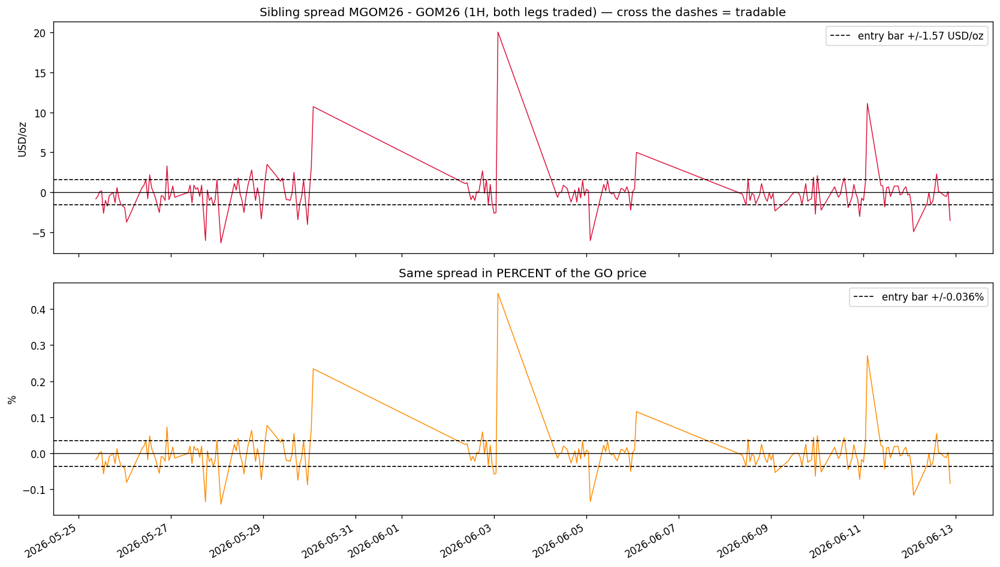
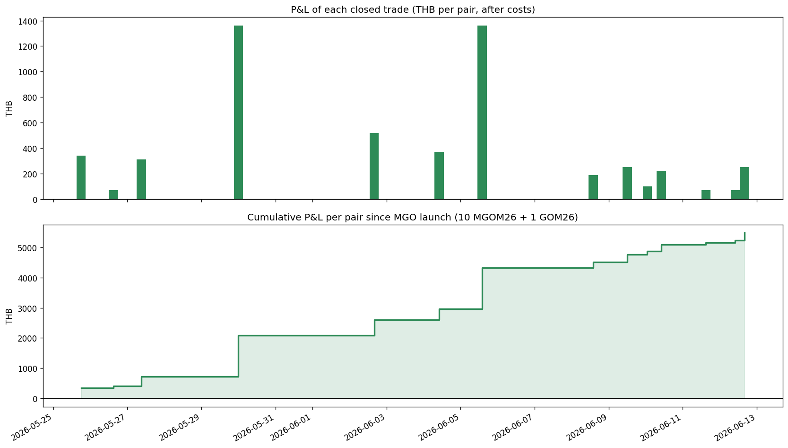
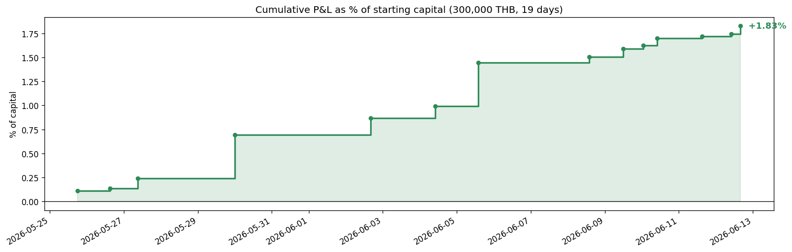

# Tutorial: MGO vs GO Gold Arbitrage — From Zero to Simulation

**A complete, runnable, step-by-step guide.** By the end you will have:

1. A working `uv` project connected to the **Settrade Open API**.
2. An understanding of the cleanest arbitrage on TFEX:

```text
10 x MGOM26  ==  1 x GOM26
(same gold, same June expiry, both cash-settle on the SAME LBMA price, the SAME day)
```

3. A running simulation of the strategy since the MGO launch (25 May 2026).
4. An honest answer to: **how much capital do I need to start?**

> Every code cell below actually runs. No orders are ever placed.

## Step 1 — Accounts and API access

You need two things before any code:

| # | What | Where |
|---|---|---|
| 1 | TFEX derivatives account | your broker |
| 2 | Settrade Open API app | [official Python quick start](https://developer.settrade.com/open-api/document/reference/sdkv2/introduction/python/quick-start) |

Creating the app on the Settrade Open API portal (registered through your broker) gives you
four values: **`app_id`**, **`app_secret`**, **`app_code`**, and your broker's **`broker_id`**.
Choose the **Investor** app type — that is what the SDK's `Investor` class logs in as.

> ⚠️ **API etiquette (this project learned it the hard way):**
> - Market data allows roughly **10 requests/minute**. Burst past it and the API **kicks the
>   session** (`Session unavailable. Status[Kicked]`) and locks the app out for 10+ minutes
>   (`Service is not ready yet`).
> - Keep ~6 seconds between requests and **cache every fetch to disk**.
> - If one credential set also feeds a 24/7 logger (like this project's Railway service),
>   be extra gentle.

## Step 2 — Project setup with `uv`

```bash
# 1. install uv (once per machine)
curl -LsSf https://astral.sh/uv/install.sh | sh

# 2. this repo: install all dependencies from pyproject.toml
cd set-bot-lab
uv sync

# (starting from scratch instead?)
# uv init my-gold-arb && cd my-gold-arb
# uv add settrade-v2 python-dotenv pandas numpy matplotlib jupyterlab ipykernel
```

Create a `.env` file in the project root — **never commit it**:

```text
SETTRADE_APP_ID=your_app_id
SETTRADE_APP_SECRET=your_app_secret
SETTRADE_APP_CODE=your_app_code
SETTRADE_BROKER_ID=your_broker_id
```

## Step 3 — Start Jupyter

```bash
uv run jupyter lab
```

Open this notebook, keep the default Python 3 (ipykernel) kernel — `uv run` guarantees the
project venv. Candles are cached in `gold_candles_cache/` (CSV), so the first run makes
2 API requests and same-day re-runs make **zero**.

## Step 4 — Verify the API connection

One throttled request. If it fails with a kick/lockout message, wait 10-15 minutes —
do **not** retry in a loop.


```python
import os
from datetime import date, timedelta
from pathlib import Path

import matplotlib.pyplot as plt
import numpy as np
import pandas as pd
from dotenv import load_dotenv
from settrade_v2 import Investor

pd.set_option("display.width", 160)
plt.rcParams["figure.dpi"] = 120

load_dotenv()
investor = Investor(
    app_id=os.environ["SETTRADE_APP_ID"],
    app_secret=os.environ["SETTRADE_APP_SECRET"],
    app_code=os.environ["SETTRADE_APP_CODE"],
    broker_id=os.environ["SETTRADE_BROKER_ID"],
    is_auto_queue=False,
)
md_api = investor.MarketData()

try:
    probe = md_api.get_candlestick(symbol="GOM26", interval="60m",
                                   start=f"{date.today()}T00:00:00",
                                   end=f"{date.today()}T23:59:59")
    print(f"API OK — {len(probe.get('time') or [])} hourly GOM26 bars today")
except Exception as exc:
    print(f"API problem: {exc}")
    print("If kicked/locked: wait 10-15 minutes. Cached data below still works.")
```

    API OK — 16 hourly GOM26 bars today


## Step 5 — The strategy in plain words

| Rule | Detail |
|---|---|
| **Watch** | `sibling_spread = MGOM26 close − GOM26 close` (USD per troy oz) |
| **Enter** | when `\|spread\| × 300 THB` > all round-trip costs + buffer |
| | spread **negative** (mini cheap) → **buy 10 MGO + sell 1 GO** |
| | spread **positive** (mini rich) → **sell 10 MGO + buy 1 GO** |
| **Exit** | spread back inside ±0.1 USD (one tick) → close all 11 legs |
| **Why it must converge** | both contracts cash-settle on the *same* LBMA AM fixing on the *same* day — the bet is *when*, never *if* |

No z-score, no statistics — identical logic to `simple_spread_strategy.ipynb`:
*enter when the gap pays more than all costs, exit when the gap is gone.*

Contract facts ([TFEX spec](https://www.tfex.co.th/en/products/precious-metal/gold-online-futures/contract-specification)):

| Contract | Multiplier | Tick | Tick value | Exchange fee/side |
|---|---|---|---|---|
| GO | 300 | 0.1 USD | 30 THB | max 14 THB + 2 data |
| MGO | 30 | 0.1 USD | 3 THB | 0.75-1.50 THB + 0.20 data |

## Step 6 — Turn fees into ONE number: total cost per round trip

The strategy only cares about a single number: what a full round trip of the pair costs.
**Tune the assumptions to your real broker quotes.**


```python
MINI_MULT, BIG_MULT, PAIR_MINIS = 30, 300, 10

# --- per contract per side, THB (ASSUMPTIONS — replace with your broker's numbers) ---
GO_COST_PER_SIDE_THB = 65.0    # exchange <=14 + data 2 + brokerage + VAT
MGO_COST_PER_SIDE_THB = 8.0    # exchange 0.75-1.50 + data 0.20 + brokerage + VAT

# --- crossing the books (candles hide bid/ask; widths measured later with the logger) ---
GO_BOOK_WIDTH_USD, MGO_BOOK_WIDTH_USD = 0.2, 0.3

PAIR_ROUND_TRIP_THB = 2 * (PAIR_MINIS * MGO_COST_PER_SIDE_THB + GO_COST_PER_SIDE_THB)
CROSS_COST_THB = GO_BOOK_WIDTH_USD * BIG_MULT + MGO_BOOK_WIDTH_USD * PAIR_MINIS * MINI_MULT
TOTAL_PAIR_COST_THB = PAIR_ROUND_TRIP_THB + CROSS_COST_THB
ENTRY_BUFFER_THB = 30.0        # one GO tick of safety
EXIT_TOLERANCE_USD = 0.1

print(f"Fees round trip      : {PAIR_ROUND_TRIP_THB:>6,.0f} THB  (10 MGO + 1 GO, in and out)")
print(f"Book crossing        : {CROSS_COST_THB:>6,.0f} THB  (assumed widths)")
print(f"TOTAL per round trip : {TOTAL_PAIR_COST_THB:>6,.0f} THB")
print(f"=> entry bar         : {(TOTAL_PAIR_COST_THB + ENTRY_BUFFER_THB) / BIG_MULT:.2f} USD/oz "
      f"({(TOTAL_PAIR_COST_THB + ENTRY_BUFFER_THB) / 30:.0f} ticks)")
```

    Fees round trip      :    290 THB  (10 MGO + 1 GO, in and out)
    Book crossing        :    150 THB  (assumed widths)
    TOTAL per round trip :    440 THB
    => entry bar         : 1.57 USD/oz (16 ticks)


## Step 7 — Fetch the data (throttled + cached)

Hourly candles for both contracts since the 25 May launch — **one request per contract**,
cached to `gold_candles_cache/` so this cell is free after the first run of the day.


```python
import time

LAUNCH_DATE = date(2026, 5, 25)
THROTTLE_SECONDS = 6
CACHE_DIR = Path("gold_candles_cache")
CACHE_DIR.mkdir(exist_ok=True)


def fetch_history(symbol: str, interval: str, start: date, end: date) -> pd.DataFrame:
    stamp = "" if end < date.today() else f"_asof_{date.today()}"
    cache_file = CACHE_DIR / f"{symbol}_{interval}_{start}_{end}{stamp}.csv"
    if cache_file.exists():
        cached = pd.read_csv(cache_file, index_col=0, parse_dates=True)
        return cached if not cached.empty else pd.DataFrame()
    time.sleep(THROTTLE_SECONDS)
    r = md_api.get_candlestick(symbol=symbol, interval=interval,
                               start=f"{start}T00:00:00", end=f"{end}T23:59:59")
    if not r.get("time"):
        return pd.DataFrame()
    idx = pd.to_datetime(r["time"], unit="s", utc=True).tz_convert("Asia/Bangkok").tz_localize(None)
    df = pd.DataFrame({"Open": r["open"], "High": r["high"], "Low": r["low"],
                       "Close": r["close"], "Volume": r["volume"]}, index=idx).astype(float)
    df = df[~df.index.duplicated(keep="last")].sort_index()
    df.to_csv(cache_file)
    return df


mini = fetch_history("MGOM26", "60m", LAUNCH_DATE, date.today())
big = fetch_history("GOM26", "60m", LAUNCH_DATE, date.today())
print(f"MGOM26: {len(mini):,} hourly bars | GOM26: {len(big):,} hourly bars")
print(f"Window: {big.index.min()} -> {big.index.max()}")
```

    MGOM26: 215 hourly bars | GOM26: 216 hourly bars
    Window: 2026-05-25 09:00:00 -> 2026-06-12 21:00:00


## Step 8 — Build the sibling spread

Critical filter: a candle close is the **last trade**. If the mini did not trade in an hour,
its close is stale and the "spread" is a ghost. Keep only bars where **both legs traded**.

We show the spread both in **USD/oz** (what the P&L math uses) and in **percent of the GO price** (how big the mispricing is relative to the asset).


```python
sib = mini[["Close", "Volume"]].join(big[["Close", "Volume"]],
                                     lsuffix="_mini", rsuffix="_big", how="inner")
sib = sib[(sib.Volume_mini > 0) & (sib.Volume_big > 0)].copy()
sib["spread_usd"] = sib.Close_mini - sib.Close_big
sib["spread_pct"] = sib.spread_usd / sib.Close_big * 100

bar_usd = (TOTAL_PAIR_COST_THB + ENTRY_BUFFER_THB) / BIG_MULT
bar_pct = bar_usd / sib.Close_big.mean() * 100

fig, axes = plt.subplots(2, 1, figsize=(14, 8), sharex=True)

axes[0].plot(sib.index, sib.spread_usd, lw=0.9, color="crimson")
axes[0].axhline(bar_usd, color="black", ls="--", lw=1, label=f"entry bar +/-{bar_usd:.2f} USD/oz")
axes[0].axhline(-bar_usd, color="black", ls="--", lw=1)
axes[0].axhline(0, color="black", lw=0.8)
axes[0].set_title("Sibling spread MGOM26 - GOM26 (1H, both legs traded) — cross the dashes = tradable")
axes[0].set_ylabel("USD/oz")
axes[0].legend()

axes[1].plot(sib.index, sib.spread_pct, lw=0.9, color="darkorange")
axes[1].axhline(bar_pct, color="black", ls="--", lw=1, label=f"entry bar +/-{bar_pct:.3f}%")
axes[1].axhline(-bar_pct, color="black", ls="--", lw=1)
axes[1].axhline(0, color="black", lw=0.8)
axes[1].set_title("Same spread in PERCENT of the GO price")
axes[1].set_ylabel("%")
axes[1].legend()

fig.autofmt_xdate(rotation=30)
plt.tight_layout()
plt.show()

print(f"{len(sib):,} overlapping bars")
print(sib[["spread_usd", "spread_pct"]].describe().round(3).to_string())
print(f"\nFor scale: the entry bar is only {bar_pct:.3f}% of the GO price "
      f"(~{sib.Close_big.mean():,.0f} USD/oz gold) — tiny in %, big in THB.")
```


    

    


    215 overlapping bars
           spread_usd  spread_pct
    count     215.000     215.000
    mean       -0.073      -0.002
    std         2.315       0.052
    min        -6.300      -0.141
    25%        -0.950      -0.021
    50%        -0.100      -0.002
    75%         0.600       0.014
    max        20.000       0.443
    
    For scale: the entry bar is only 0.036% of the GO price (~4,405 USD/oz gold) — tiny in %, big in THB.


## Step 9 — Run the simulation

The whole strategy is ~25 lines. One position at a time; P&L per pair =
`(spread captured) × 300 − costs`.


```python
def run_backtest(s: pd.DataFrame, pair_cost: float, buffer: float, exit_tol: float) -> pd.DataFrame:
    position, trades = None, []
    for ts, sp in s["spread_usd"].items():
        if position is None:
            if sp * BIG_MULT - pair_cost >= buffer:
                position = {"side": "sell_mini_buy_big", "entry_ts": ts, "entry_spread": sp}
            elif -sp * BIG_MULT - pair_cost >= buffer:
                position = {"side": "buy_mini_sell_big", "entry_ts": ts, "entry_spread": sp}
        elif abs(sp) <= exit_tol:
            pnl = (abs(position["entry_spread"]) - abs(sp)) * BIG_MULT - pair_cost
            trades.append({**position, "exit_ts": ts, "exit_spread": sp,
                           "hold_hours": (ts - position["entry_ts"]).total_seconds() / 3600,
                           "pnl_thb_per_pair": pnl})
            position = None
    return pd.DataFrame(trades)


trades = run_backtest(sib, TOTAL_PAIR_COST_THB, ENTRY_BUFFER_THB, EXIT_TOLERANCE_USD)
print(f"{len(trades)} closed trades | total {trades.pnl_thb_per_pair.sum():,.0f} THB per pair\n")
show = trades.copy()
num_cols = show.select_dtypes("number").columns
show[num_cols] = show[num_cols].round(2)
display(show)
```

    14 closed trades | total 5,480 THB per pair
    


<div>
<style scoped>
    .dataframe tbody tr th:only-of-type {
        vertical-align: middle;
    }

    .dataframe tbody tr th {
        vertical-align: top;
    }

    .dataframe thead th {
        text-align: right;
    }
</style>
<table border="1" class="dataframe">
  <thead>
    <tr style="text-align: right;">
      <th></th>
      <th>side</th>
      <th>entry_ts</th>
      <th>entry_spread</th>
      <th>exit_ts</th>
      <th>exit_spread</th>
      <th>hold_hours</th>
      <th>pnl_thb_per_pair</th>
    </tr>
  </thead>
  <tbody>
    <tr>
      <th>0</th>
      <td>buy_mini_sell_big</td>
      <td>2026-05-25 13:00:00</td>
      <td>-2.6</td>
      <td>2026-05-25 18:00:00</td>
      <td>0.0</td>
      <td>5.0</td>
      <td>340.0</td>
    </tr>
    <tr>
      <th>1</th>
      <td>buy_mini_sell_big</td>
      <td>2026-05-25 23:00:00</td>
      <td>-1.7</td>
      <td>2026-05-26 15:00:00</td>
      <td>0.0</td>
      <td>16.0</td>
      <td>70.0</td>
    </tr>
    <tr>
      <th>2</th>
      <td>buy_mini_sell_big</td>
      <td>2026-05-26 18:00:00</td>
      <td>-2.5</td>
      <td>2026-05-27 09:00:00</td>
      <td>0.0</td>
      <td>15.0</td>
      <td>310.0</td>
    </tr>
    <tr>
      <th>3</th>
      <td>buy_mini_sell_big</td>
      <td>2026-05-27 18:00:00</td>
      <td>-6.0</td>
      <td>2026-05-30 00:00:00</td>
      <td>0.0</td>
      <td>54.0</td>
      <td>1360.0</td>
    </tr>
    <tr>
      <th>4</th>
      <td>sell_mini_buy_big</td>
      <td>2026-05-30 01:00:00</td>
      <td>3.2</td>
      <td>2026-06-02 16:00:00</td>
      <td>0.0</td>
      <td>87.0</td>
      <td>520.0</td>
    </tr>
    <tr>
      <th>5</th>
      <td>sell_mini_buy_big</td>
      <td>2026-06-02 18:00:00</td>
      <td>2.7</td>
      <td>2026-06-04 10:00:00</td>
      <td>0.0</td>
      <td>40.0</td>
      <td>370.0</td>
    </tr>
    <tr>
      <th>6</th>
      <td>buy_mini_sell_big</td>
      <td>2026-06-05 02:00:00</td>
      <td>-6.0</td>
      <td>2026-06-05 14:00:00</td>
      <td>0.0</td>
      <td>12.0</td>
      <td>1360.0</td>
    </tr>
    <tr>
      <th>7</th>
      <td>buy_mini_sell_big</td>
      <td>2026-06-05 23:00:00</td>
      <td>-2.2</td>
      <td>2026-06-08 14:00:00</td>
      <td>-0.1</td>
      <td>63.0</td>
      <td>190.0</td>
    </tr>
    <tr>
      <th>8</th>
      <td>buy_mini_sell_big</td>
      <td>2026-06-09 02:00:00</td>
      <td>-2.3</td>
      <td>2026-06-09 12:00:00</td>
      <td>0.0</td>
      <td>10.0</td>
      <td>250.0</td>
    </tr>
    <tr>
      <th>9</th>
      <td>sell_mini_buy_big</td>
      <td>2026-06-09 22:00:00</td>
      <td>1.9</td>
      <td>2026-06-10 01:00:00</td>
      <td>-0.1</td>
      <td>3.0</td>
      <td>100.0</td>
    </tr>
    <tr>
      <th>10</th>
      <td>buy_mini_sell_big</td>
      <td>2026-06-10 02:00:00</td>
      <td>-2.2</td>
      <td>2026-06-10 10:00:00</td>
      <td>0.0</td>
      <td>8.0</td>
      <td>220.0</td>
    </tr>
    <tr>
      <th>11</th>
      <td>sell_mini_buy_big</td>
      <td>2026-06-10 14:00:00</td>
      <td>1.8</td>
      <td>2026-06-11 15:00:00</td>
      <td>0.1</td>
      <td>25.0</td>
      <td>70.0</td>
    </tr>
    <tr>
      <th>12</th>
      <td>buy_mini_sell_big</td>
      <td>2026-06-12 01:00:00</td>
      <td>-1.7</td>
      <td>2026-06-12 10:00:00</td>
      <td>0.0</td>
      <td>9.0</td>
      <td>70.0</td>
    </tr>
    <tr>
      <th>13</th>
      <td>sell_mini_buy_big</td>
      <td>2026-06-12 14:00:00</td>
      <td>2.3</td>
      <td>2026-06-12 16:00:00</td>
      <td>0.0</td>
      <td>2.0</td>
      <td>250.0</td>
    </tr>
  </tbody>
</table>
</div>


```python
t = trades.sort_values("exit_ts").reset_index(drop=True)
t["cum_pnl_thb"] = t.pnl_thb_per_pair.cumsum()

fig, axes = plt.subplots(2, 1, figsize=(14, 8), sharex=True)
axes[0].bar(t.exit_ts, t.pnl_thb_per_pair, width=0.25,
            color=["seagreen" if p > 0 else "crimson" for p in t.pnl_thb_per_pair])
axes[0].axhline(0, color="black", lw=0.8)
axes[0].set_title("P&L of each closed trade (THB per pair, after costs)")
axes[0].set_ylabel("THB")

axes[1].step(t.exit_ts, t.cum_pnl_thb, where="post", color="seagreen", lw=2)
axes[1].fill_between(t.exit_ts, 0, t.cum_pnl_thb, step="post", alpha=0.15, color="seagreen")
axes[1].axhline(0, color="black", lw=0.8)
axes[1].set_title("Cumulative P&L per pair since MGO launch (10 MGOM26 + 1 GOM26)")
axes[1].set_ylabel("THB")
fig.autofmt_xdate(rotation=30)
plt.tight_layout()
plt.show()

print("Reminder: the 100% win rate is BY CONSTRUCTION — the rule only exits at spread ~0.")
print("Risk hides in holding time (margin locked), stale 1H prints, and thin mini depth.")
```


    

    


    Reminder: the 100% win rate is BY CONSTRUCTION — the rule only exits at spread ~0.
    Risk hides in holding time (margin locked), stale 1H prints, and thin mini depth.


## Step 10 — Starter capital: the "value to trade"

Three buckets: fees (tiny), **margin** (the big one), and buffer (the one people forget).

TFEX rule: **Initial Margin = 1.75 × Maintenance Margin** for local investors
([TFEX gold margin page](https://www.tfex.co.th/en/products/gold-margin.html)).
The live baht amounts come from the Thailand Clearing House rate sheet and change with
volatility — **set the two `IM_*` inputs below from your broker's current sheet.**

The key question for your broker: *“do you give spread/offset margin credit for
10 MGO vs 1 GO?”* If yes, the requirement drops a lot.


```python
# --- INPUTS: replace with your broker's current numbers ---
IM_GO_THB = 100_000        # initial margin, 1 GO contract  (ASSUMPTION - ask your broker!)
IM_MGO_THB = 10_000        # initial margin, 1 MGO contract (ASSUMPTION - ask your broker!)
SPREAD_CREDIT = 0.0        # 0.0 = no offset credit; 0.5 = broker halves the hedged margin
BUFFER_RATIO = 0.5         # free cash on top of margin (variation margin hits daily!)

pair_margin = (PAIR_MINIS * IM_MGO_THB + IM_GO_THB) * (1 - SPREAD_CREDIT)
buffer_cash = pair_margin * BUFFER_RATIO
starter = pair_margin + buffer_cash

days = (t.exit_ts.max() - t.entry_ts.min()).days + 1
total_pnl = t.pnl_thb_per_pair.sum()

summary = pd.DataFrame([
    ["Pair margin (10 MGO + 1 GO)", f"{pair_margin:,.0f} THB"],
    [f"Cash buffer ({BUFFER_RATIO:.0%})", f"{buffer_cash:,.0f} THB"],
    ["SUGGESTED STARTING CAPITAL (1 pair)", f"{starter:,.0f} THB"],
    ["Cost paid per round trip", f"{TOTAL_PAIR_COST_THB:,.0f} THB"],
    [f"Paper P&L in backtest ({days} days)", f"{total_pnl:,.0f} THB"],
    ["Paper return on starting capital", f"{total_pnl / starter:.1%} in {days} days"],
    ["~ per calendar day", f"{total_pnl / days:,.0f} THB"],
], columns=["item", "value"]).set_index("item")
display(summary)

print("Median holding time:", f"{t.hold_hours.median():.0f}h",
      "| longest:", f"{t.hold_hours.max():.0f}h  -> margin stays locked while you wait.")
```


<div>
<style scoped>
    .dataframe tbody tr th:only-of-type {
        vertical-align: middle;
    }

    .dataframe tbody tr th {
        vertical-align: top;
    }

    .dataframe thead th {
        text-align: right;
    }
</style>
<table border="1" class="dataframe">
  <thead>
    <tr style="text-align: right;">
      <th></th>
      <th>value</th>
    </tr>
    <tr>
      <th>item</th>
      <th></th>
    </tr>
  </thead>
  <tbody>
    <tr>
      <th>Pair margin (10 MGO + 1 GO)</th>
      <td>200,000 THB</td>
    </tr>
    <tr>
      <th>Cash buffer (50%)</th>
      <td>100,000 THB</td>
    </tr>
    <tr>
      <th>SUGGESTED STARTING CAPITAL (1 pair)</th>
      <td>300,000 THB</td>
    </tr>
    <tr>
      <th>Cost paid per round trip</th>
      <td>440 THB</td>
    </tr>
    <tr>
      <th>Paper P&amp;L in backtest (19 days)</th>
      <td>5,480 THB</td>
    </tr>
    <tr>
      <th>Paper return on starting capital</th>
      <td>1.8% in 19 days</td>
    </tr>
    <tr>
      <th>~ per calendar day</th>
      <td>288 THB</td>
    </tr>
  </tbody>
</table>
</div>


    Median holding time: 14h | longest: 87h  -> margin stays locked while you wait.


## Step 10b — Verify the math, and the profit in PERCENT

Cross-check against the [TFEX GO specification](https://www.tfex.co.th/en/products/precious-metal/gold-online-futures/contract-specification):
**GO multiplier 300 (1 USD/oz move = 300 THB) · MGO multiplier 30, so 10 minis = 300 ·
tick 0.1 USD = 30 THB per GO / 3 THB per MGO · both cash-settle in THB.**

The pair P&L per 1 USD/oz of spread captured is therefore exactly
`10 × 30 + 1 × 300 → 300 THB` (the mini legs and the big leg gain/lose together as the
spread closes). The cell below rebuilds one real trade by hand and then shows the equity
curve **as a percentage of the starting capital** from Step 10.


```python
# ---- 1. rebuild one real trade leg by leg ----
tr = trades.iloc[0]
gross = (abs(tr.entry_spread) - abs(tr.exit_spread)) * BIG_MULT
manual = gross - PAIR_ROUND_TRIP_THB - CROSS_COST_THB

print(f"Verifying trade {tr.entry_ts:%d %b %H:%M} -> {tr.exit_ts:%d %b %H:%M} ({tr.side})\n")
print(f"  spread captured : {abs(tr.entry_spread):.2f} - {abs(tr.exit_spread):.2f} USD/oz"
      f"  x {BIG_MULT} THB = {gross:>8,.1f} THB  (= {gross / 30:.1f} GO ticks)")
print(f"  fees round trip : 2 x (10 x {MGO_COST_PER_SIDE_THB:.0f} + {GO_COST_PER_SIDE_THB:.0f})"
      f"        = {PAIR_ROUND_TRIP_THB:>8,.1f} THB")
print(f"  book crossing   : {MGO_BOOK_WIDTH_USD} USD x 10 minis x 30 + {GO_BOOK_WIDTH_USD} USD x 300"
      f" = {CROSS_COST_THB:>8,.1f} THB")
print(f"  {'-' * 58}")
print(f"  MANUAL P&L      : {manual:>8,.1f} THB per pair")
print(f"  run_backtest    : {tr.pnl_thb_per_pair:>8,.1f} THB per pair")
diff = abs(manual - tr.pnl_thb_per_pair)
print(f"  match within {diff:.6f} THB -> {'CORRECT' if diff < 0.01 else 'MISMATCH - INVESTIGATE'}")

# ---- 2. the equity curve in percent of starting capital ----
t["cum_pct"] = t.cum_pnl_thb / starter * 100

fig, ax = plt.subplots(figsize=(14, 4.5))
ax.step(t.exit_ts, t.cum_pct, where="post", color="seagreen", lw=2)
ax.fill_between(t.exit_ts, 0, t.cum_pct, step="post", alpha=0.15, color="seagreen")
ax.scatter(t.exit_ts, t.cum_pct, s=22, color="seagreen", zorder=5)
ax.annotate(f"{t.cum_pct.iloc[-1]:+.2f}%", xy=(t.exit_ts.iloc[-1], t.cum_pct.iloc[-1]),
            xytext=(10, 0), textcoords="offset points", va="center",
            fontsize=11, fontweight="bold", color="seagreen")
ax.axhline(0, color="black", lw=0.8)
ax.set_title(f"Cumulative P&L as % of starting capital ({starter:,.0f} THB, {days} days)")
ax.set_ylabel("% of capital")
fig.autofmt_xdate(rotation=30)
plt.tight_layout()
plt.show()

print(f"Total: {total_pnl:,.0f} THB on {starter:,.0f} THB capital = "
      f"{total_pnl / starter:.2%} in {days} days "
      f"(~{total_pnl / starter * 365 / days:.1%} annualized IF the launch-period mispricing "
      f"persisted - it narrows as the mini matures).")
```

    Verifying trade 25 May 13:00 -> 25 May 18:00 (buy_mini_sell_big)
    
      spread captured : 2.60 - 0.00 USD/oz  x 300 THB =    780.0 THB  (= 26.0 GO ticks)
      fees round trip : 2 x (10 x 8 + 65)        =    290.0 THB
      book crossing   : 0.3 USD x 10 minis x 30 + 0.2 USD x 300 =    150.0 THB
      ----------------------------------------------------------
      MANUAL P&L      :    340.0 THB per pair
      run_backtest    :    340.0 THB per pair
      match within 0.000000 THB -> CORRECT


    

    


    Total: 5,480 THB on 300,000 THB capital = 1.83% in 19 days (~35.1% annualized IF the launch-period mispricing persisted - it narrows as the mini matures).


## Step 11 — Before any real order (checklist)

1. **Replace candle closes with real quotes.** Point the Railway bid/ask logger at
   `MGOM26 / GOM26` and confirm the spread exists in the *executable* bid/ask — exactly like
   `vip_fee_strategy_real_bidask.ipynb` did for the USD pair.
2. **Check the mini's depth.** 10 MGO lots may *be* the entire book on a weeks-old product.
3. **Confirm real fees and margins** with your broker (spread credit, MGO brokerage).
4. **Mind the expiry.** GOM26/MGOM26 stop trading near end of June 2026; the trade then rolls
   to the U26 (September) pair.
5. **Start with exactly one pair.** GO leg first (deeper book), mini legs immediately after,
   never an unhedged overnight position.
6. This notebook places **no orders**. Keep it that way until every box is ticked.

---

### Sources

- [Settrade Open API — Python SDK quick start](https://developer.settrade.com/open-api/document/reference/sdkv2/introduction/python/quick-start)
- [TFEX — Gold Online Futures contract specification](https://www.tfex.co.th/en/products/precious-metal/gold-online-futures/contract-specification)
- [TFEX — gold margin page (IM = 1.75 × MM)](https://www.tfex.co.th/en/products/gold-margin.html)
- [Bangkok Post — MGO launch, 25 May 2026](https://www.bangkokpost.com/business/general/3257838/tfex-preps-mini-gold-online-futures-contracts-for-may-25)
- This repo: `gold_mgo_go_arbitrage.ipynb` (full study) · `GOLD_MGO_GO_TUTORIAL.md` (text version)
